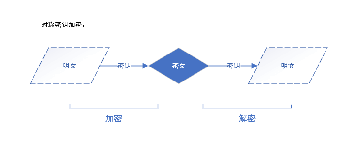
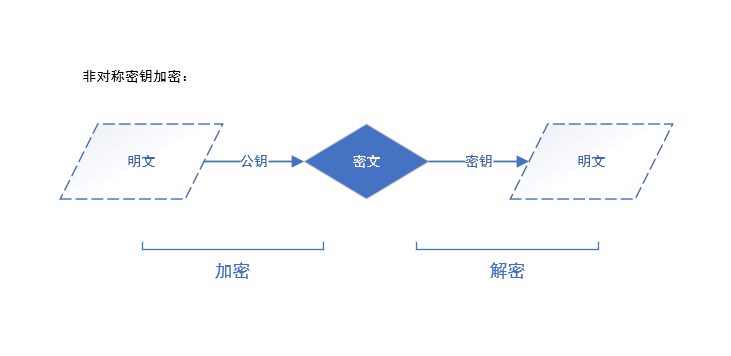

# 加密算法的认识及常用加密算法

## 前言

> 数据加密，是一门历史悠久的技术，指通过加密算法和加密密钥将明文转变为密文，而解密则是通过解密算法和解密密钥将密文恢复为明文。

数据加密仍是计算机系统对信息进行保护的一种最可靠的办法。它利用密码技术对信息进行加密，实现信息隐蔽，从而起到保护信息的安全的作用。

本文将分别从加密算法的分类，具体的内容，以及前端代码的实现作为切入口，下面让我们一起来学习一下。

## 一、加密算法

### 1. 加密算法的分类

- 需要密钥
  - 对称密钥加密
  - 非对称密钥加密
- 不需要密钥（或称：散列算法）

### 2. 名词解读

- **公钥、密钥**：是一种参数，两者均是在明文转换为密文或将密文转换为明文的算法中输入的参数。

- **对称密钥加密**：对称密钥加密又叫专用密钥加密或共享密钥加密，即发送和接收数据的双方必使用**相同的密钥**对明文进行加密和解密运算。对称密钥加密算法主要包括：`DES、3DES、IDEA、RC5、RC6`等。



- **非对称密钥加密**：非对称加密算法**需要两个密钥**：公开密钥（`publickey`）和私有密钥（privatekey:简称私钥）。公钥与私钥是一对，如果用公钥对数据进行加密，只有用对应的私钥才能解密。非对称密钥加密算法主要包括：`RSA「最广泛」、Elgamal、背包算法、Rabin、D-H、ECC（椭圆曲线加密算法）`等。



「 公钥-密钥：互相作用 」

- 使用公钥进行加密的时候，必须使用对应的密钥进行解密。
- 使用密钥进行加密的时候，必须使用同等对应的公钥来解密。

- **散列算法**：散列算法（`Secure Hash Algorithm`）是一个**密码散列函数家族**，是 FIPS 所认证的安全散列算法。能计算出一个数字消息所对应到的，长度固定的字符串（又称消息摘要）的算法。且若输入的消息不同，它们对应到不同字符串的机率很高。散列算法主要包括：`SHA家族（SHA-1、SHA-224、SHA-256、SHA-384，和SHA-512）、MD5`等。

## 二、常见加密算法实现

### 1. ASE「对称密钥加密」

AES 高级加密标准（`Advanced Encryption Standard`），这个标准用来替代原先的 DES（Data Encryption Standard），AES 的区块长度固定为 128 位，密钥长度则可以是 128，192 或 256 位。

[👉 crypto-js.js github 仓库](https://github.com/brix/crypto-js)

[👉 crypto-js.js BootCDN](https://www.bootcdn.cn/crypto-js/)

```html
<script src="https://cdn.bootcdn.net/ajax/libs/crypto-js/4.0.0/crypto-js.min.js"></script>
<script>
  let str = "value"; // 需要加密的内容
  let secretKey = "secret-key"; // 密钥

  // Encrypt
  var ciphertext = CryptoJS.AES.encrypt(str, secretKey).toString();
  console.log("Encrypt:" + ciphertext); // 'U2FsdGVkX19f+yy4jSDE6ZVtam6BWzx+MiKzHKx7bsI='

  // Decrypt
  var bytes = CryptoJS.AES.decrypt(ciphertext, secretKey);
  var originalText = bytes.toString(CryptoJS.enc.Utf8);
  console.log("Decrypt:" + originalText); // 'value'
</script>
```

### 2. RSA「非对称密钥加密」

RSA 公开密钥密码体制是一种使用不同的加密密钥与解密密钥，“由已知加密密钥推导出解密密钥在计算上是不可行的”密码体制。

[👉 jsencrypt 官网](http://travistidwell.com/jsencrypt/)

[👉 jsencrypt BootCDN](https://www.bootcdn.cn/jsencrypt/)

### 3. MD5「散列算法」

MD5 信息摘要算法（`Message-Digest Algorithm`），一种被广泛使用的密码散列函数，可以产生出一个 128 位（16 字节）的散列值（hash value），用于确保信息传输完整一致。

[👉 blueimp-md5.js 教程](https://www.javascriptcn.com/post/34190)

[👉 blueimp-md5.js BootCDN](https://www.bootcdn.cn/blueimp-md5/)

```html
<!-- blueimp-md5 -->
<script src="https://cdn.bootcdn.net/ajax/libs/blueimp-md5/2.18.0/js/md5.js"></script>
<script>
  let str = "value"; // 需要加密的内容
  /**
   * Calculates MD5 value for a given string.
   * If a key is provided, calculates the HMAC-MD5 value.
   * Returns a Hex encoded string unless the raw argument is given.
   *
   * @param {string} string Input string
   * @param {string} [key] HMAC key
   * @param {boolean} [raw] Raw output switch
   * @returns {string} MD5 output
   */
  console.log(`加密前：${str}`); // 加密前：value
  console.log(`直接加密结果：${md5(str)}`); // index.html:49 直接加密结果：2063c1608d6e0baf80249c42e2be5804
  console.log(`添加HMAC Key，加密结果：${md5(str, "key")}`); // index.html:50 添加HMAC Key，加密结果：01433efd5f16327ea4b31144572c67f6
  console.log(`原始输出，加密结果：${md5(str, null, true)}`); // index.html:51 原始输出，加密结果： cÁ`n¯€$œBâ¾X
</script>
```

## 总结

以上便是今天的全部内容，通过本文我们认识到了加密算法的分类，以及一些常见的加密算法，通过插件形式快速地实现了简单的数据加密功能。

<br />
<br />
<br />

`最后，如果您有更好的方法，欢迎在留言区中分享；或者实际操作中遇到什么问题均可留言或者私信我，感谢您的观看！`

参考 blog：

[浅谈常见的七种加密算法及实现-零壹技术栈](https://blog.csdn.net/baidu_22254181/article/details/82594072)

[常见加密算法的 JS 实现-1ndex](https://www.cnblogs.com/wjrblogs/p/13730128.html)
