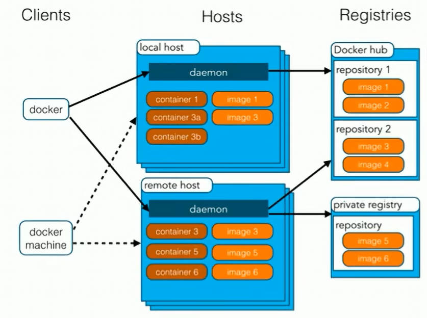
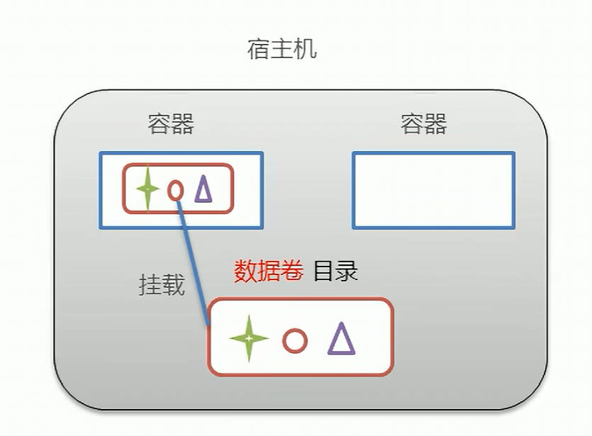
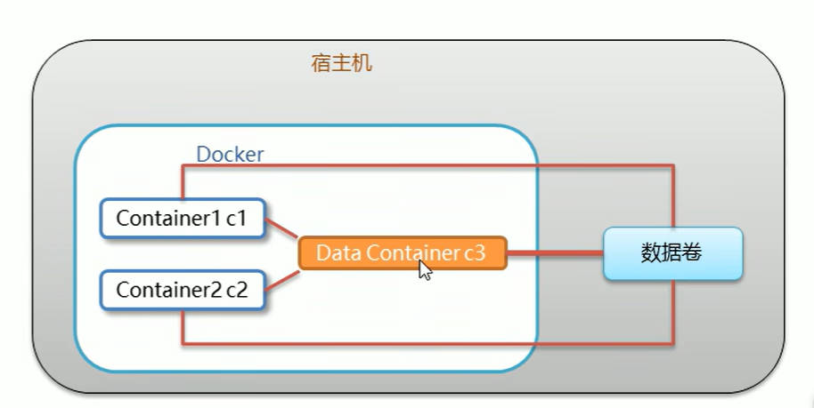
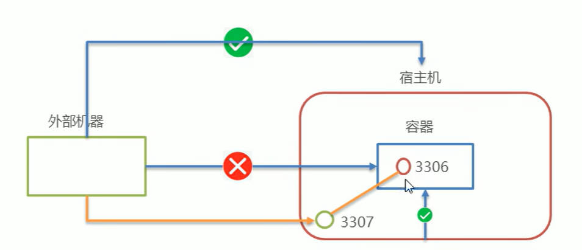
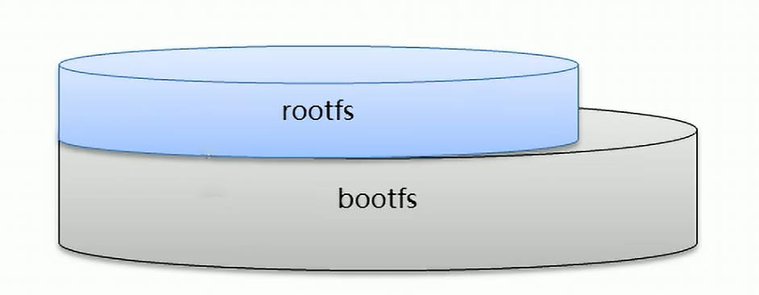
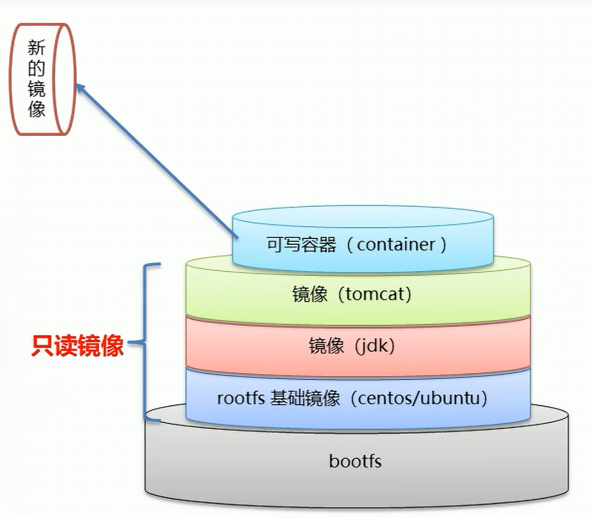
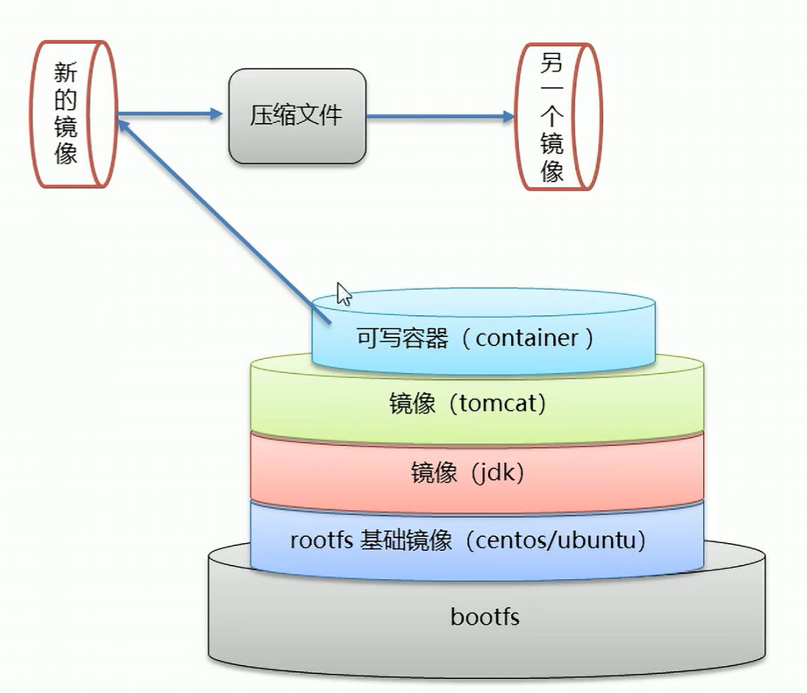
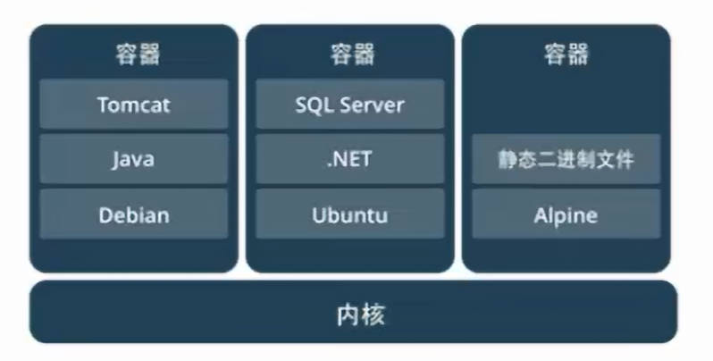
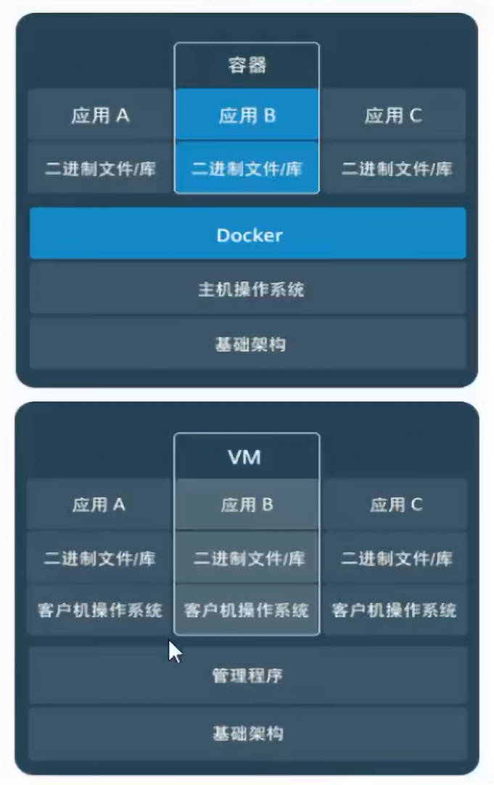

# Docker 学习笔记

## 初识

### 概述

> 在项目生命周期中，我们编写的代码会接触几个环境：开发环境、测试环境和生产环境。当软件跨环境迁移运行时，可能会出现`代码水土不服`。

- Docker 是一个开源的`应用容器引擎`；
- 诞生于 2013 年，基于 `Go 语言`实现，dotCloud 公司出品（后改名为 Docker Inc.）
- Docker 可以让开发者打包他们的应用以及依赖包到一个`轻量级、可移植的`容器中，然后发布到任何流行的 Linux 机器上；
- 容器时完全使用`沙箱机制`，且`互相隔离`；
- 容器性能`开销极低`。
- Docker 从 17.03 版本之后分为 CE(Community Edition: 社区版)和 EE(Enterprise Edition: 企业版)

`Docker 是一种容器技术，解决软件跨环境迁移的问题。`

### 安装

Docker 可以运行在 MAC、Linux、Windows 等操作系统上。（视频教程将于 CentOS 7 进行演示）

```shell
# 1 yum 包更新到最新
yum update

# 2 安装需要的软件包
# yum-util 提供 yum-config-manager 命令，
# device-mapper-persistent-data 和 lvm2 是 devicemapper 驱动依赖
yum install -y yum-utils vice-mapper-persistent-data lvm2

# 3 设置 yum 源
yum-config-manager --add-repo http://download.docker.com/docker-ce/linux/centos/docker-ce.repo

# 4 安装 docker，出现输入的界面都按 y
yum install -y docker-ce

# 5 查看 docker 版本，验证是否安装成功
docker -v
```

### 架构



- 镜像（Image）： Docker 镜像，相当于是一个 root 文件系统。比如官方镜像 ubuntu:16.04 就包含了完整的 一套 Ubuntu16.04 最小系统的 root 文件系统。
- 容器（Container）：镜像和容器的关系，就像是面向对象程序设计中的类和对象一样，镜像是静态的定义，容器时镜像运行时的实体。容器可以被创建、启动、停止、删除、暂停等。
- 仓库（Repository）：仓库可以看成是一个代码控制中心，用来保存镜像。

### 配置镜像加速

默认情况下：从 [Docker Hub](https://hub.docker.com/)上下载 docker 镜像比较慢。一般都会配置镜像加速器。

- USTC 中科大镜像加速器：https://docker.mirrors.ustc.edu.cn/
- 阿里云：略。[查询 👉](https://cr.console.aliyun.com/cn-hangzhou/instances/mirrors)
- 网易云：略
- 腾讯云：略

## 命令

### 安装相关

:::tip
跳到 [安装](./docker#安装)。
:::

### 服务相关

- **启动**
- **停止**
- **重启**
- **查看状态**
- **开机启动**

```shell
# 启动 docker
systemctl start docker

# 停止 docker
systemctl stop docker

# 重启 docker
systemctl restart docker

# 查看 docker 状态
systemctl status docker

# 开机启动 docker
systemctl enable docker
```

:::tip 系统命令

1. ubuntu - server
2. mac - launchctl
3. centos - systemctl

:::

### 镜像相关

**查看镜像**：查看本地所有的镜像

```shell
# 查看所有镜像
docker images

# 查看所有镜像id
docker images -q
```

**搜索镜像**：从网络中查找需要的镜像

```shell
# 搜索镜像
docker search [镜像名]
```

**拉取镜像**：从 Docker 仓库下载镜像到本地，镜像名称格式为 `名称:版本号`，如果版本号不指定则是`最新的版本（latest）`。如果不知道镜像版本，可以去 `docker hub` 上查看。

```shell
# 拉取镜像
docker pull [镜像名]

# 拉取镜像，指定版本号
docker pull [镜像名]:[版本号]
```

**删除镜像**：删除本地镜像

```shell
# 删除指定本地镜像，方式一
docker rmi [镜像名]:[版本号]
# 删除指定本地镜像，方式二
docker rmi [镜像id]

# 删除所有本地镜像
docker rmi `docker images -q`
```

### 容器相关

**查看容器**

```shell
# 查看正在运行的容器
docker ps

# 查看所有容器
# STATUS：镜像状态，UP：正在运行，Exited：已经退出
docker ps -a
```

**创建容器**

```shell
docker run [参数]
```

:::tip 参数说明

**-i**：保持容器运行。同城与 `-t` 同时使用。加入 it 这两个参数后，容器创建后会自动进入容器中，`退出容器后，容器会自动关闭`。

**-t**：为容器重新分配一个伪输入终端，通常与 `-i` 同时使用。

**-d**：以守护（后台）模式运行容器。创建一个容器在后台运行，需要使用 docker exec 进入容器。`退出容器后，不会关闭`。

**-it** 和 **-id** 的区别： `-it` 创建的容器一般称为`交互式容器`， `-id` 创建的容器一般称为`守护式容器`。

**--name**：为创建的容器命名。

```shell
# 示例：
docker run -it --name:c1 centos:7 # 创建一个 centos 版本为 7 的交互式容器，并命名为 c1

docker run -id --name:c2 centos:7 # 创建一个 centos 版本为 7 的守护式容器，并命名为 c2
```

:::

**进入和退出容器**

```shell
# 进入容器
docker exec -it [容器名] bash

# 退出容器
exit
```

**停止容器**

```shell
docker stop [容器名]|[容器id]
```

**启动容器**

```shell
docker start [容器名]|[容器id]
```

**删除容器**：如果容器是运行状态则删除失败，需要停止容器后才能删除。

```shell
docker rm [容器名]|[容器id]
```

:::tip

```shell
# 查看所有容器的id
docker ps -a -q

# 删除全部容器
docker rm `docker ps -a -q`
```

:::

**查看容器信息**

```shell
docker inspect [容器名]|[容器id]
```

## 容器的数据卷

### 数据卷概念及作用

:::warning 思考

Docker 容器删除后，在容器中产生的数据也会随之销毁吗？

Docker 容器和外部机器可以直接交换文件吗？

容器之间如何进行数据交互？

:::

数据卷：

- 是宿主机中的一个目录或文件。
- 当容器目录和数据卷目录绑定后，对方的修改会立即同步。
- 一个数据卷可以被多个容器同时挂载。
- 一个容器也可以被挂载多个数据卷。

数据卷作用：

- 容器数据持久化。
- 外部机器和容器间接通讯。
- 容器之间数据交换。



### 配置数据卷

创建启动容器时，使用 -v 参数来配置数据卷。

```shell
docker run -[参数] --name:[容器名] [镜像名]:[镜像版本] -v [宿主机目录(文件)]:[容器内目录(文件)]
```

:::warning 注意事项

1. 目录必须是绝对路径。
2. 如果目录不存在，将会自动创建。
3. 可以挂载多个数据卷。

:::

:::tip 示例

```shell
# 配置一个数据卷
docker run -it --name:c1 centos:7 -v /root/data:/root/data

# 配置多个数据卷
docker run -it --name:c2 centos:7 -v /root/data2:/root/data2 -v /root/data3:/root/data3


# 一个数据卷，挂载给不同的容器
docker run -it --name:c3 centos:7 -v /root/data:/root/data -v /root/data:/root/data
docker run -it --name:c4 centos:7 -v /root/data:/root/data -v /root/data:/root/data
```

:::

### 配置数据卷容器

多容器进行数据交换的方式：

1. 多个容器挂载同一个数据卷
2. `数据卷容器`



```shell
# 1. 创建启动 c3 数据卷容器，使用 -v 参数，设置数据卷
docker run -it --name:c3 centos:7 -v /volume

# 2. 创建启动 c1 c2 容器，使用 --volumes-form 参数，设置数据卷
docker run -it --name:c1 centos:7 --volumes-from c3
docker run -it --name:c2 centos:7 --volumes-from c3
```

:::tip 小结

1. 数据卷概念：宿主机的一个目录或文件。
2. 数据卷作用：
   - 容器数据持久化。
   - 客户端和容器数据交换。
   - 容器间数据交换。
3. 数据卷容器：
   - 创建一个容器，挂载一个目录，让其他容器继承自该容器（--volumes-from）。
   - 通过简单方式实现数据卷配置。
   - **作用**：`实现解构，快速复制容器的数据卷配置`

:::

## 应用部署

### mysql

> MySQL 是一个开源的关系型数据库管理系统（RDBMS）。简单点说，就是一种用来存储、管理和查询数据的软件。

需求：在 Docker 容器中部署 MySQL，并通过外部 mysql 客户端操作 MySQL Server。

实现步骤：

1. 搜索 mysql 镜像
2. 拉去 mysql 镜像
3. 创建容器
4. 操作容器中的 mysql

[详细操作实现 👉](https://www.bilibili.com/video/BV1CJ411T7BK/)

:::tip



- 容器内的网络服务和外部机器不能直接通讯。
- 外部机器和宿主机可以直接通讯。
- 宿主机和容器可以直接通讯。
- 当容器中的网络服务需要被外部机器访问时，可以将容器中提供服务的端口映射到宿主机的端口号上。外部机器访问宿主机的该端口，从而间接访问容器的服务。
- 这种操作称为：`端口映射`。

:::

### tomcat

> Tomcat 是一个轻量级的 Web 服务器 + Servlet 容器，主要是用来运行 Java Web 应用的。

略

### nginx

> Nginx 是一个高性能的 Web 服务器、反向代理服务器和负载均衡器。

略

### redis

> Redis 是一个开源的、基于内存的、高性能键值（key-value）数据库。

略

## Dockerfile

**镜像原理**

:::warning 思考

Docker 镜像本质是什么？

Docker 中一个 centos 镜像为什么只有 200MB，而一个 centos 操作系统的 iso 文件有几个 G?

Docker 中一个 tomcat 镜像为什么有 500MB，而一个 tomcat 安装包只有 70 多 MB?

:::

操作系统组成部分：

- 进程调度子系统
- 进程通讯子系统
- 内存管理子系统
- 设备管理子系统
- `文件管理子系统`
- 网络通讯子系统
- 作业控制子系统

Linux 文件系统由 bootfs 和 rootfs 两部分组成：

- bootfs：包含 bootloader（引导加载程序）和 kernel（内核）。
- rootfs：root 文件系统，包含的就是典型 Linux 系统中的/dev，/proc，/bin，/etc 等标准目录和文件。
- 不同的 linux 发行版，bootfs 基本一样，而 rootfs 不同，如 ubuntu、centos 等。



### Docker 镜像

- Docker 镜像是由特殊的文件系统叠加而成。
- 最底端是 bootfs，并使用过宿主机的 bootfs。
- 第二层是 root 文件系统 rootfs，称为 base image。
- 然后再往上可以叠加其他的镜像文件。
- 统一文件系统（Union File System）技术能够将不同的层整合成一个文件系统，为这些层提供了一个统一的视角，这样就隐藏了多层的存在，在用户的角度看来，只存在一个文件系统。
- 一个镜像可以放在另一个镜像的上面，位于下面的镜像称为父镜像，最底部的镜像称为基础镜像。
- 当从一个镜像启动容器时，Docker 会在最顶层加载一个读写文件系统作为容器。



:::tip 思考答案

Docker 镜像本质是什么？

- 是一个分层文件系统。

Docker 中一个 centos 镜像为什么只有 200MB，而一个 centos 操作系统的 iso 文件有几个 G?

- Centos 的 iso 镜像文件包含 bootfs 和 rootfs，而 docker 的 centos 镜像复用操作系统的 bootfs，只有 rootfs 和其他镜像层。

Docker 中一个 tomcat 镜像为什么有 500MB，而一个 tomcat 安装包只有 70 多 MB?

- 鱿鱼 docker 中镜像是分层的，tomcat 虽然只有 70 多 MB，但他需要依赖于父镜像和基础镜像，所以整个对外暴露的 tomcat 镜像大小有 500MB。

:::

### Docker 镜像制作

**1. 容器转为镜像**

```shell
# 容器转为镜像
docker commit [容器id] [镜像名称]:[版本号]

# 镜像转为压缩文件
docker save -o [压缩文件名称] [镜像名称]:[版本号]

# 压缩文件转为镜像
docker load -i [压缩文件名称]
```



**2. Dockerfile**

Dockerfile 概念：

- Dockerfile 是一个文本文件。
- 包含了一条条的指令。
- 每一条指令构建一层，基于基础镜像，最终构建出一个新的镜像。
- 对于开发人员：可以为开发团队提供一个完全一致的开发环境。
- 对于测试人员：可以直接拿开发时所构建的镜像或者通过 Dockerfile 文件，构建一个新的镜像，从而开展测试工作。
- 对于运维人员：在部署时，可以实现应用的无缝移植。

:::details Dockerfile 示例

[docker-node/23/alpine3.20/Dockerfile 👉](https://github.com/nodejs/docker-node/blob/f6908ff3eb35a5d0c8fc60086fd29ae16e3abdba/23/alpine3.20/Dockerfile)

```Dockerfile
FROM alpine:3.20

ENV NODE_VERSION 23.11.0

RUN addgroup -g 1000 node \
    && adduser -u 1000 -G node -s /bin/sh -D node \
    && apk add --no-cache \
        libstdc++ \
    && apk add --no-cache --virtual .build-deps \
        curl \
    && ARCH= OPENSSL_ARCH='linux*' && alpineArch="$(apk --print-arch)" \
      && case "${alpineArch##*-}" in \
        x86_64) ARCH='x64' CHECKSUM="d267e68a33036c2f3803adaf79b7191bcf45219cc12246f61c48b891bb70e943" OPENSSL_ARCH=linux-x86_64;; \
        x86) OPENSSL_ARCH=linux-elf;; \
        aarch64) OPENSSL_ARCH=linux-aarch64;; \
        arm*) OPENSSL_ARCH=linux-armv4;; \
        ppc64le) OPENSSL_ARCH=linux-ppc64le;; \
        s390x) OPENSSL_ARCH=linux-s390x;; \
        *) ;; \
      esac \
  && if [ -n "${CHECKSUM}" ]; then \
    set -eu; \
    curl -fsSLO --compressed "https://unofficial-builds.nodejs.org/download/release/v$NODE_VERSION/node-v$NODE_VERSION-linux-$ARCH-musl.tar.xz"; \
    echo "$CHECKSUM  node-v$NODE_VERSION-linux-$ARCH-musl.tar.xz" | sha256sum -c - \
      && tar -xJf "node-v$NODE_VERSION-linux-$ARCH-musl.tar.xz" -C /usr/local --strip-components=1 --no-same-owner \
      && ln -s /usr/local/bin/node /usr/local/bin/nodejs; \
  else \
    echo "Building from source" \
    # backup build
    && apk add --no-cache --virtual .build-deps-full \
        binutils-gold \
        g++ \
        gcc \
        gnupg \
        libgcc \
        linux-headers \
        make \
        python3 \
        py-setuptools \
    # use pre-existing gpg directory, see https://github.com/nodejs/docker-node/pull/1895#issuecomment-1550389150
    && export GNUPGHOME="$(mktemp -d)" \
    # gpg keys listed at https://github.com/nodejs/node#release-keys
    && for key in \
      C0D6248439F1D5604AAFFB4021D900FFDB233756 \
      DD792F5973C6DE52C432CBDAC77ABFA00DDBF2B7 \
      CC68F5A3106FF448322E48ED27F5E38D5B0A215F \
      8FCCA13FEF1D0C2E91008E09770F7A9A5AE15600 \
      890C08DB8579162FEE0DF9DB8BEAB4DFCF555EF4 \
      C82FA3AE1CBEDC6BE46B9360C43CEC45C17AB93C \
      108F52B48DB57BB0CC439B2997B01419BD92F80A \
      A363A499291CBBC940DD62E41F10027AF002F8B0 \
    ; do \
      gpg --batch --keyserver hkps://keys.openpgp.org --recv-keys "$key" || \
      gpg --batch --keyserver keyserver.ubuntu.com --recv-keys "$key" ; \
    done \
    && curl -fsSLO --compressed "https://nodejs.org/dist/v$NODE_VERSION/node-v$NODE_VERSION.tar.xz" \
    && curl -fsSLO --compressed "https://nodejs.org/dist/v$NODE_VERSION/SHASUMS256.txt.asc" \
    && gpg --batch --decrypt --output SHASUMS256.txt SHASUMS256.txt.asc \
    && gpgconf --kill all \
    && rm -rf "$GNUPGHOME" \
    && grep " node-v$NODE_VERSION.tar.xz\$" SHASUMS256.txt | sha256sum -c - \
    && tar -xf "node-v$NODE_VERSION.tar.xz" \
    && cd "node-v$NODE_VERSION" \
    && ./configure \
    && make -j$(getconf _NPROCESSORS_ONLN) V= \
    && make install \
    && apk del .build-deps-full \
    && cd .. \
    && rm -Rf "node-v$NODE_VERSION" \
    && rm "node-v$NODE_VERSION.tar.xz" SHASUMS256.txt.asc SHASUMS256.txt; \
  fi \
  && rm -f "node-v$NODE_VERSION-linux-$ARCH-musl.tar.xz" \
  # Remove unused OpenSSL headers to save ~34MB. See this NodeJS issue: https://github.com/nodejs/node/issues/46451
  && find /usr/local/include/node/openssl/archs -mindepth 1 -maxdepth 1 ! -name "$OPENSSL_ARCH" -exec rm -rf {} \; \
  && apk del .build-deps \
  # smoke tests
  && node --version \
  && npm --version

ENV YARN_VERSION 1.22.22

RUN apk add --no-cache --virtual .build-deps-yarn curl gnupg tar \
  # use pre-existing gpg directory, see https://github.com/nodejs/docker-node/pull/1895#issuecomment-1550389150
  && export GNUPGHOME="$(mktemp -d)" \
  && for key in \
    6A010C5166006599AA17F08146C2130DFD2497F5 \
  ; do \
    gpg --batch --keyserver hkps://keys.openpgp.org --recv-keys "$key" || \
    gpg --batch --keyserver keyserver.ubuntu.com --recv-keys "$key" ; \
  done \
  && curl -fsSLO --compressed "https://yarnpkg.com/downloads/$YARN_VERSION/yarn-v$YARN_VERSION.tar.gz" \
  && curl -fsSLO --compressed "https://yarnpkg.com/downloads/$YARN_VERSION/yarn-v$YARN_VERSION.tar.gz.asc" \
  && gpg --batch --verify yarn-v$YARN_VERSION.tar.gz.asc yarn-v$YARN_VERSION.tar.gz \
  && gpgconf --kill all \
  && rm -rf "$GNUPGHOME" \
  && mkdir -p /opt \
  && tar -xzf yarn-v$YARN_VERSION.tar.gz -C /opt/ \
  && ln -s /opt/yarn-v$YARN_VERSION/bin/yarn /usr/local/bin/yarn \
  && ln -s /opt/yarn-v$YARN_VERSION/bin/yarnpkg /usr/local/bin/yarnpkg \
  && rm yarn-v$YARN_VERSION.tar.gz.asc yarn-v$YARN_VERSION.tar.gz \
  && apk del .build-deps-yarn \
  # smoke test
  && yarn --version \
  && rm -rf /tmp/*

COPY docker-entrypoint.sh /usr/local/bin/
ENTRYPOINT ["docker-entrypoint.sh"]

CMD [ "node" ]
```

:::

**Dockerfile 关键字**：

|   关键字    |           作用           |                                                               备注                                                                |
| :---------: | :----------------------: | :-------------------------------------------------------------------------------------------------------------------------------: |
|    FROM     |        指定父镜像        |                                               指定 dockerfile 基于那个 image 构建。                                               |
| MAINTAINER  |         作者信息         |                                                 用来标明这个 dockerfile 谁写的。                                                  |
|    LABEL    |           标签           |              用来标明 dockerfile 的标签，可以使用 Label 代香 Maintainer 最终都是在 docker image 基本信息中可以查看。              |
|     RUN     |         执行命令         |                       执行一段命令默认是/bin/sh 格式:RUN command 或者 RUN ["command", "param1","param2"]。                        |
|     CMD     |       容器启动命令       |    提供启动容器时候的默认命令，和 ENTRYPOINT 配合使用.格式 CMD command param1 param2 或者 CMD ["command","paramr","param2"]。     |
| ENTRYPOINT  |           入口           |                                             一般在制作一些执行就关闭的容器中会使用。                                              |
|    COPY     |         复制文件         |                                                 build 的时候复制文件到 image 中。                                                 |
|     ADD     |         添加文件         |                        build 的时候添加文件到 image 中，不仅仅局限于当前 build 上下文可以来源于远程服务。                         |
|     ENV     |         环境变量         |                         指定 build 时候的环境变量，可以在启动的容器的时候通过-e 覆盖格式 ENV name=value。                         |
|     ARG     |         构建参数         |                     构建参数只在构建的时候使用的参数如果有 ENV，那么 ENV 的相同名字的值始终覆盖 arg 的参数。                      |
|   VOLUME    | 定义外部可以挂载的数据卷 |            指定 build 的 image 那些目录可以启动的时候挂载到文件系统中，启动容器的时候使用-V 绑定格式 VOLUME["目录"]。             |
|   EXPOSE    |         暴露端口         |               定义容器运行的时候监听的端口启动容器的使用-p 来绑定暴露端口，格式：EXPOSE 8080 或者 EXPOSE 8080/udp。               |
|   WORKDIR   |         工作目录         | 指定容器内部的工作目录，如果没有创建则自动创建，如果指定/使用的是绝对地址，如果不是/开头那么是在上一条 workdir 的路径的相对路径。 |
|    USER     |       指定执行用户       |                               指定 build 或者启动的时候用户在 RUN CMD ENTRYPONT 执行的时候的用户。                                |
| HEALTHCHECK |         健康检查         |                        指定监测当前容器的健康监测的命令，基本上没用因为很多时候，应用本身有健康监测机制。                         |
|   ONBUILD   |          触发器          | 当存在 ONBUILD 关键字的镜像作为基础镜像的时候，当执行 FROM 完成之后，会执行 ONBUILD 的命令，但是不影响当前镜像，用处也不怎么大。  |
| STOPSIGNAL  |    发送信号量到宿主机    |                                     该 STOPSIGNAL 指令设置将发送到容器的系统调用信号以退出。                                      |
|    SHELL    |   指定执行脚本的 shell   |                                       指定 RUN CMD ENTRYPOINT 执行命令的时候使用的 shell。                                        |

### 案例

#### 自定义 centos

略

#### 部署 spring boot 项目

略

## 服务编排

> 微服务架构的应用系统中一般包含若干个微服务，每个微服务一般都会部署多个实例，如果每个微服务都要手动启停，维护的工作量会很大。
>
> - 要从 Dockerfile build image 或者去 dockerhub 拉去 image
> - 要创建多个 container
> - 要管理这些 container（启动停止删除）

`服务编排`：按照一当的业务规则批量管理容器。

Docker Compose 是一个编排多容器分布式部署的工具，提供命令集管理容器化应用的完整开发周期，包括服务构建，启动和停止。使用步骤：

1. 利用 Dockerfile 定义运行环境镜像。
2. 使用 docker-compose.yml 定义组成应用的各服务。
3. 运行 docker-compose up 启动容器。

### 命令

安装相关

```shell
# Compose 目前已经完全支持 Linux、macOS、Windows，在安装 Compose 之前，需要先安装 Docker。下面我们以编译好的二进制包方式安装在 Linux 系统为例。
curl -L https://github.com/docker/compose/releases/download/1.22.0/docker-compose-`uname -s`-`uname -m` -o /usr/local/bin/docker-compose

# 设置文件可执行权限
chmod +x /usr/local/bin/docker-compose

# 查看版本信息
docker-compose -version
```

卸载相关

```shell
# 二进制包方式安装的，删除二进制文件即可
rm /usr/local/bin/docker-compose
```

### 使用 Docker Compose 编排 nginx + spring boot 项目

略

## 私有仓库

Docker 官方的 Docker Hub （https://hub.docker.com）是一个用于管理公共镜像的仓库，我们可以从上面拉去镜像到本地，也可以把我们自己的镜像推送上去。但是，有时候我们的服务器无法访问互联网，或者你不希望将自己的镜像放到公网当中，那么我们就需要搭建自己的私有仓库来存储和管理自己的镜像。

### 搭建

私有仓库搭建

```shell
# 1 拉去私有仓库镜像
docker pull registry

# 2 启动私有仓库容器
docker run -id --name registry -p 5000:5000 registry

# 3 打开浏览器 访问 http://[私有仓库服务器ip]:5000/v2/_catalog，可以看到 {"repositories":[]} 表示私有仓库搭建成功。

# 4 修改 daemon.json
vim /etc/docker/daemon.json
# 在上述文件中添加一个 key，并保存退出。此步骤用于让 docker 信任私有仓库地址；注意将私有仓库服务器 ip 修改为自己私有仓库服务器的真实 ip。
{"insecure-registries":["[私有仓库服务器ip]:5000"]}

# 5 重启 docker 服务
systemctl restart docker
docker start registry
```

### 上传

将镜像上传至私有仓库

```shell
# 1 标记镜像为私有仓库的镜像
docker tag [镜像id] [私有仓库服务器ip]:5000/[镜像名称]
# 例如 docker tag centos:7 [私有仓库服务器ip]:5000/centos:7

# 2 上传标记的镜像
docker push [私有仓库服务器ip]:5000/[镜像名称]
# 例如 docker push [私有仓库服务器ip]:5000/centos:7
```

### 拉取

从私有仓库拉取镜像

```shell
docker pull [私有仓库服务器ip]:5000/[镜像名称]
# 例如 docker pull [私有仓库服务器ip]:5000/centos:7
```

## 相关概念

容器就是将软件打包成标准化单元，以用于开发、交付和部署。

- 容器镜像是轻量的，可执行的独立软件包，包含软件运行所需的所有内容：代码、运行时环境、系统工具、系统库和设置。
- 容器化软件在任何环境中都能够始终如一地运行。
- 容器赋予了软件独立性，使其免受外在环境差异的影响，从而有助于减少团队间在相同基础设施上运行不同软件时的冲突。



### `docker 容器虚拟化`与 `传统虚拟机` 比较

相同：

- 容器和虚拟机具有相似的资源隔离和分配优势。

不同：

- 容器虚拟化的是操作系统，虚拟机虚拟化的是硬件。
- 传统虚拟机可以运行不同的操作系统，容器只能运行同一类操作系统。

|    特性    |        容器        |   虚拟机   |
| :--------: | :----------------: | :--------: |
|    启动    |        秒级        |   分钟级   |
|  硬盘使用  |     一般为 MB      | 一般为 GB  |
|    性能    |      接近原生      |    弱于    |
| 系统支持量 | 单机支持上千个容器 | 一般几十个 |



## 参考

- [Docker 官方文档 👉](https://www.docker.com/)
- [黑马程序员 Docker 容器化技术，从零学会 Docker 教程 - 黑马程序员 👉](https://www.bilibili.com/video/BV1CJ411T7BK/)
