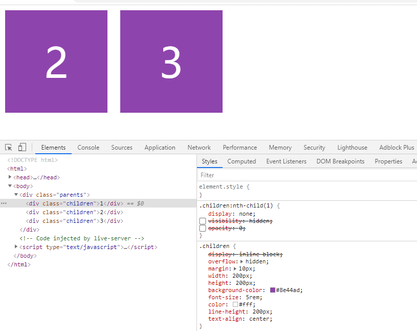
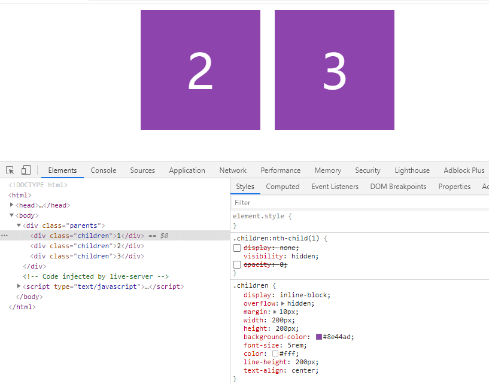
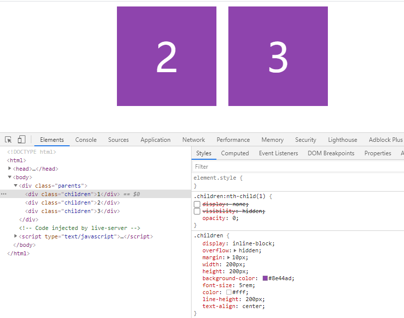

# CSS 中实现隐藏

## 前言

display: none; visibility: hidden; opacity: 0; 均是 css 中控制元素在页面中隐藏的属性值，但是它们之间隐藏的方式效果及性能又有所不同，下面我们将一起来探讨探讨。

## 一、display: none



1.  DOM 结构：浏览器不会渲染 display 属性为 none 的元素，`不占据空间`；
2.  事件监听：无法进行 DOM 事件监听；
3.  性 能：动态改变此属性时会引起`重排`，性能较差；
4.  继 承：不会被子元素继承，毕竟子类也不会被渲染；
5.  transition：transition 不支持 display。

## 二、visibility: hidden



1.  DOM 结构：元素被隐藏，但是会被渲染不会消失，`占据空间`；
2.  事件监听：无法进行 DOM 事件监听；
3.  性 能：动态改变此属性时会引起`重绘`，性能较高；
4.  继 承：会被子元素继承，`子元素可以`通过设置 visibility: visible; 来取消隐藏；
5.  transition：visibility 会立即显示，隐藏时会延时。

## 三、opactiy: 0



1.  DOM 结构：透明度为 100%，元素隐藏，`占据空间`；
2.  事件监听：可以进行 DOM 事件监听；
3.  性 能：提升为合成层，`不会触发重绘`，性能较高；
4.  继 承：会被子元素继承,且，子元素并不能通过 opacity: 1 来取消隐藏；
5.  transition：opacity 可以延时显示和隐藏。

## 四、测试代码

上面所做的案例测试，使用的是此段代码，刚兴趣的小伙伴可以复制到浏览器控制台上进行逐一测试。

```javascript
<!DOCTYPE html>
<html>
  <head>
    <meta charset="UTF-8" />
    <title>Demo</title>
    <style>
      body {
        margin: 0;
        padding: 0;
        font-size: 16px;
      }
      .parents {
        width: 100vw;
        height: 100vh;
      }
      .children {
        display: inline-block;
        overflow: hidden;
        margin: 10px;
        width: 200px;
        height: 200px;
        background-color: #8e44ad;
        font-size: 5rem;
        color: #fff;
        line-height: 200px;
        text-align: center;
      }
      .children:nth-child(1) {
        display: none;
        /* visibility: hidden; */
        /* opacity: 0; */
      }
    </style>
  </head>
  <body>
    <div class="parents">
      <div class="children">1</div>
      <div class="children">2</div>
      <div class="children">3</div>
    </div>
  </body>
</html>
```

## 总结

以上就是今天要讲的内容，本文介绍了元素隐藏的方式，由于它们的动态修改性能和 transition 展示不同，所以需要进行合适的选择。
