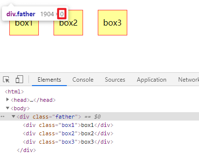

# 浮动清除的四大主要方式

## 前言

浮动布局（float）和定位布局（position）为 css 中布局的常用的两种布局方式，在 css3 中虽然出现了弹性布局（flex），但毕竟是新出的属性对于早期的浏览器兼容并不是很理想`IE11才开始兼容`。

浮动布局主要是通过 float 属性控制元素向左或向右移动，使周围的元素也会重新排列。

由于浮动元素将不再占用原文档流的位置，使用浮动时会影响后面相邻的固定元素。`常见的形式有父盒子高度坍塌、浮动盒子与非浮动盒子重叠等`，这时候，如果要避免浮动对其他元素的影响，就需要清除浮动。

## 一、clear 属性

上面说到 float 属性，它主要是控制元素的浮动位置的；在 css 样式中有一个叫 clear 的属性，它是 css 内置清除浮动效果的属性。

float 常用属性值：

| 属性值 | 描述                           |
| ------ | ------------------------------ |
| left   | 允许元素向左侧浮动。           |
| right  | 允许元素向右侧浮动。           |
| none   | 默认值，不指定元素浮动的方向。 |

clear 常用属性值：

| 属性值 | 描述                                           |
| ------ | ---------------------------------------------- |
| left   | 不允许左侧有浮动元素（清除左侧浮动的影响）。   |
| right  | 不允许右侧有浮动给元素（清除右侧浮动的影响）。 |
| both   | 同时清除左右两侧浮动的影响 。                  |

```html
<!-- 代码 1.1 -->
<!DOCTYPE html>
<html>
  <head>
    <meta charset="UTF-8" />
    <title>clear属性</title>
    <style>
      .father {
        /* 没有为父盒子设置高度 */
        background: #ccc;
        border: 1px dashed #999;
      }

      .box1,
      .box2,
      .box3 {
        margin: 15px;
        padding: 0 10px;
        height: 50px;
        line-height: 50px;
        background: #ff9;
        border: 1px solid #f33;
        float: left; /* box1、box2、box3产生左浮动 */
      }

      p {
        margin: 15px;
        padding: 0 10px;
        background: #fcf;
        border: 1px dashed #f33;
        clear: left; /* 为box后面的元素清除左浮动 */
      }
    </style>
  </head>
  <body>
    <div class="father">
      <div class="box1">box1</div>
      <div class="box2">box2</div>
      <div class="box3">box3</div>
      <p>
        这里是浮动盒子外围的段落文本，这里是浮动盒子外围的段落文本，
        这里是浮动盒子外围的段落文本，这里是浮动盒子外围的段落文本，
        这里是浮动盒子外围的段落文本，这里是浮动盒子外围的段落文本，
        这里是浮动盒子外围的段落文本，这里是浮动盒子外围的段落文本。
      </p>
    </div>
  </body>
</html>
```

需要注意的是，clear 属性只能清除元素左右两侧浮动的影响，`如果没有为父盒子（div.father）设置高度时，父盒子的高度会出现坍塌`。例如：

```html
<!-- 代码 1.2 -->
<!DOCTYPE html>
<html>
  <head>
    <meta charset="UTF-8" />
    <title>clear属性需要设置父盒子高度</title>
    <style>
      .father {
        /* 需要为父盒子设置高度 */
        background: #ccc;
        border: 1px dashed #999;
      }

      .box1,
      .box2,
      .box3 {
        margin: 15px;
        padding: 0 10px;
        height: 50px;
        line-height: 50px;
        background: #ff9;
        border: 1px solid #f33;
        float: left; /* box1、box2、box3产生左浮动 */
      }
    </style>
  </head>
  <body>
    <div class="father">
      <div class="box1">box1</div>
      <div class="box2">box2</div>
      <div class="box3">box3</div>
    </div>
  </body>
</html>
```

在这里，我们用到了代码 1.1 继续举例。首先，去掉 p 标签及相关样式，在浏览器中运行查看时，可以看出父盒子（div.father）高度坍塌为 0 了。所以在这里如果仅使用到 clear 属性时，记得别忘了给父盒子定义高度。



## 二、空标记

空标记顾名思义就是使用一些`没有子元素的标签`放在浮动元素的后面，通过为空标记设置 clear: both; 样式实现浮动清除，这里的原理和代码 1.1 类似。空标记可以使用 div、p、hr 等任何标记。

```html
<!-- 代码 2.1 -->
<!DOCTYPE html>
<html>
  <head>
    <meta charset="UTF-8" />
    <title>空标记</title>
    <style>
      .father {
        /* 没有为父盒子设置高度 */
        background: #ccc;
        border: 1px dashed #999;
      }

      .box1,
      .box2,
      .box3 {
        margin: 15px;
        padding: 0 10px;
        height: 50px;
        line-height: 50px;
        background: #ff9;
        border: 1px solid #f33;
        float: left; /* box1、box2、box3产生左浮动 */
      }

      .null {
        clear: both;
      }
    </style>
  </head>
  <body>
    <div class="father">
      <div class="box1">box1</div>
      <div class="box2">box2</div>
      <div class="box3">box3</div>
      <div class="null"></div>
      <!-- 空标记 -->
    </div>
  </body>
</html>
```

`弊端`：虽然可以成功地撑起父盒子的高度，但是增加空标记，会在无形中增加毫无意义的结构元素。

## 三、overflow 属性

css overflow 属性可以起到控制内容溢出元素框时在对应的元素区间内添加滚动条。

overflow 常用属性值：

| 属性值  | 描述                                                     |
| ------- | -------------------------------------------------------- |
| visible | 默认值。内容不会被修剪，会呈现在元素框之外。             |
| hidden  | 内容会被修建，并且其余内容是不可见的。                   |
| scroll  | 内容会被修建，但是浏览器会显示滚动条以便查看其余的内容。 |
| auto    | 如果内容被修建，则浏览器会显示滚动条以便查看其余的内容。 |
| inherit | 规定应该从父元素继承 overflow 属性的值。                 |

在这里，通过为父盒子添加 overflow: hidden; 样式后父盒子的实际高度就可以根据子盒子内的高度自由适应，和设置父盒子的高度同理但可以自适应，更灵活一些。

```html
<!-- 代码 3.1 -->
<!DOCTYPE html>
<html>
  <head>
    <meta charset="UTF-8" />
    <title>使用overflow属性来清除浮动</title>
    <style>
      .father {
        /* 没有为父盒子设置高度 */
        overflow: hidden; /* 防止父盒子因子盒子浮动带来的坍塌 */
        background: #ccc;
        border: 1px dashed #999;
      }

      .box1,
      .box2,
      .box3 {
        margin: 15px;
        padding: 0 10px;
        height: 50px;
        line-height: 50px;
        background: #ff9;
        border: 1px solid #f33;
        float: left; /* box1、box2、box3产生左浮动 */
      }
    </style>
  </head>
  <body>
    <div class="father">
      <div class="box1">box1</div>
      <div class="box2">box2</div>
      <div class="box3">box3</div>
    </div>
  </body>
</html>
```

## 四、伪类

使用 ::after 和 ::before 伪类也可以清除浮动，但是需要在 IE8 及以上的浏览器和其它非 IE 浏览器才可运行。

清除浮动的伪类：

| 属性值   | 描述                  |
| -------- | --------------------- |
| ::before | 在元素之前插入内容。  |
| ::after  | 在元素之前插入内容 。 |

```html
<!-- 代码 4.1 -->
<!DOCTYPE html>
<html>
  <head>
    <meta charset="UTF-8" />
    <title>使用overflow属性来清除浮动</title>
    <style>
      .father {
        /* 没有为父盒子设置高度 */
        overflow: hidden; /* 防止父盒子因子盒子浮动带来的坍塌 */
        background: #ccc;
        border: 1px dashed #999;
      }

      .father::after {
        /* 这里使用 ::before也可以 */
        display: block; /* 将当前伪类设置块元素，不然设置不了宽高值 */
        height: 0; /* 必须为需要清除浮动的元素伪对象设置高度为0，否则该元素会比其实际高度高出若干像素 */
        visibility: hidden;
        clear: both; /* 清除浮动，防止父盒子塌陷 */
        content: ""; /* 必要属性！不然伪类无法显示出来 */
      }

      .box1,
      .box2,
      .box3 {
        margin: 15px;
        padding: 0 10px;
        height: 50px;
        line-height: 50px;
        background: #ff9;
        border: 1px solid #f33;
        float: left; /* box1、box2、box3产生左浮动 */
      }
    </style>
  </head>
  <body>
    <div class="father">
      <div class="box1">box1</div>
      <div class="box2">box2</div>
      <div class="box3">box3</div>
    </div>
  </body>
</html>
```

## 总结

以上便是浮动清除的四大主要方式，通过五个案例不难发现除了使用 overflow 属性方式是最简洁的，并且也可以自适应子盒子高度，所以在清除浮动时推荐使用 overflow 属性。

`最后，如果您有更好的方法，欢迎在留言区中分享；或者实际操作中遇到什么问题均可留言或者私信我，`
