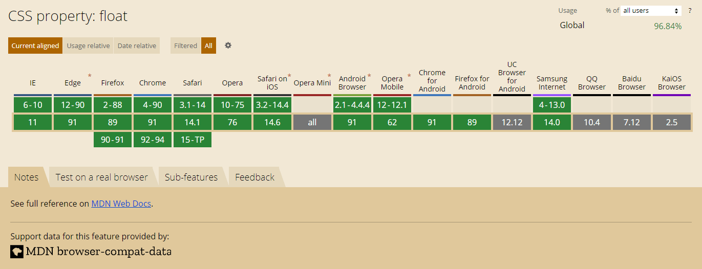
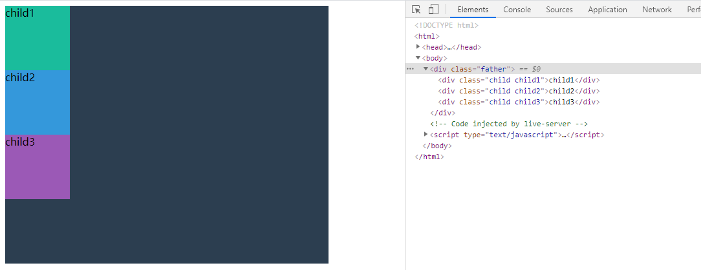
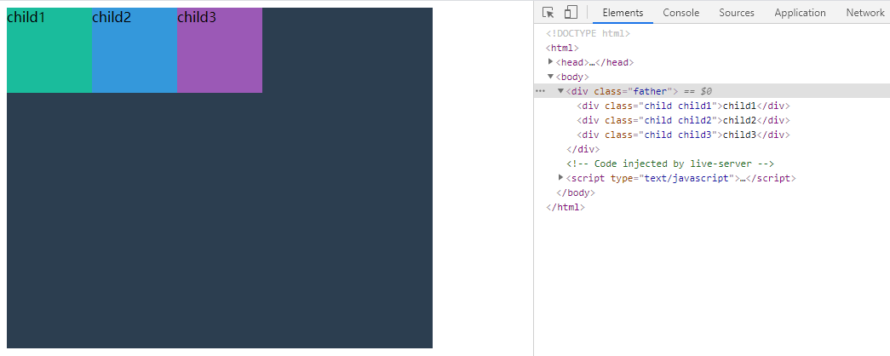

# CSS Float 浮动布局

## 前言

在页面开发的过程中，CSS 页面布局技术允许我们拾取网页中的元素，并且控制它们相对正常布局流、周边元素、父容器或者主视口/窗口的位置。
当前主要的布局方式有：浮动布局(Float)、定位布局(Position)、弹性布局(Flex)、网格布局(Grid)等，本文将从浮动布局开始学习。

## 一、Float 布局

把一个元素“浮动”(float)起来，会改变该元素本身和在正常布局流（normal flow）中跟随它的其他元素的行为。这一元素会浮动到左侧或右侧，并且从正常布局流(normal flow)中移除，这时候其他的周围内容就会在这个被设置浮动(float)的元素周围环绕。

当一个元素浮动之后，它会被移出正常的文档流，然后向左或者向右平移，一直平移直到碰到了所处的容器的边框，或者碰到另外一个浮动的元素。

在 css 中，我们可以通过定义 float 属性实现浮动布局。

## 二、属性值

|    属性值    |                                             描述                                             |
| :----------: | :------------------------------------------------------------------------------------------: |
|     left     |                        表明元素必须浮动在其所在的块容器左侧的关键字。                        |
|    right     |                        表明元素必须浮动在其所在的块容器右侧的关键字。                        |
|     none     |                                 表明元素不进行浮动的关键字。                                 |
| inline-start | 关键字，表明元素必须浮动在其所在块容器的开始一侧，在 ltr 脚本中是左侧，在 rtl 脚本中是右侧。 |
|  inline-end  | 关键字，表明元素必须浮动在其所在块容器的结束一侧，在 ltr 脚本中是右侧，在 rtl 脚本中是左侧。 |

浏览器兼容情况：


## 三、代码实现

- 首先，定义一个父盒子，宽高分别是 500px\*400px 的。
- 然后，分别定义三个子盒子，宽高均为 100px\*100px 的。

```html
<!-- 基本结构 -->
<style>
  .father {
    width: 500px;
    height: 400px;
    background-color: #2c3e50;
  }
  .child {
    width: 100px;
    height: 100px;
    /* float: left; */ /* 左浮动 */
    /* float: right; */ /* 右浮动 */
  }
  .child1 {
    background-color: #1abc9c;
  }
  .child2 {
    background-color: #3498db;
  }
  .child3 {
    background-color: #9b59b6;
  }
</style>
<body>
  <div class="father">
    <div class="child child1">child1</div>
    <div class="child child2">child2</div>
    <div class="child child3">child3</div>
  </div>
</body>
```



当给 child 选择器设置 float:left 属性的时候，child 盒子脱离文档流，实现左侧浮动。


### clear 清除浮动

与 float 属性有一个相对的属性：clear 属性。其的作用主要是为当前标签清除浮动所带来的影响。

案例继续：

- 在上述原有的代码上，给父盒子添加一个 p 标签，并设置文本。

```html
<div class="father">
  <div class="child child1">child1</div>
  <div class="child child2">child2</div>
  <div class="child child3">child3</div>
  <!-- 测试文本 -->
  <p class="text-style">
    Lorem ipsum dolor sit amet, consectetur adipisicing elit. Quasi quo, tempora ipsa excepturi culpa quis possimus
    nisi, sed at hic assumenda. Quaerat possimus voluptas veritatis laboriosam minus inventore tempore similique!
  </p>
</div>
```


不难看出，即便 p 标签没有设置浮动属性，但是依然受前面 child 盒子的影响，这个时候我们可以为 p 标签添加 clear 清除浮动属性，即可不跟着换行。

```html
<style>
  .text-style {
    clear: left;
  }
</style>
```


### clear 属性值

| 属性值  |                描述                 |
| :-----: | :---------------------------------: |
|  left   |        在左侧不允许浮动元素         |
|  right  |        在右侧不允许浮动元素         |
|  both   |     在左右两侧均不允许浮动元素      |
| inherit | 规定应该从父元素中继承 clear 属性值 |
|  none   |   默认值。允许浮动元素出现在两侧    |

## 三、Float 设计初衷与不足

float 设计的初衷其实并不是用来布局的，其本意仅仅是实现图片文字环绕效果，即图片左浮动，文字环绕图片。（如上面添加 p 标签后的效果）

### 不足

在 float 快速实现分栏布局的背景下，常常会导致`父盒子高度坍塌、浮动盒子与非浮动盒子重叠`等问题，对此感兴趣的小伙伴，可以查阅曾经分享过的文章：[浮动清除的四大主要方式](https://blog.csdn.net/weixin_44808483/article/details/111594867)

## 总结

以上便是今天所介绍的 float 全部内容，分别从实现浮动布局和如何简单清除浮动效果介绍。希望本文能够对你有所帮助。

<br />
<br />
<br />

`最后，如果您有更好的方法，欢迎在留言区中分享；或者实际操作中遇到什么问题均可留言或者私信我，感谢您的观看！`

参考文献：

[MDN Web Docs - float](https://developer.mozilla.org/zh-CN/docs/Web/CSS/float)

[深入理解 css 之 float](https://segmentfault.com/a/1190000016153055)
