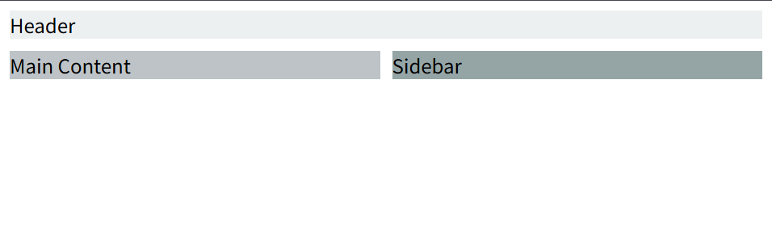
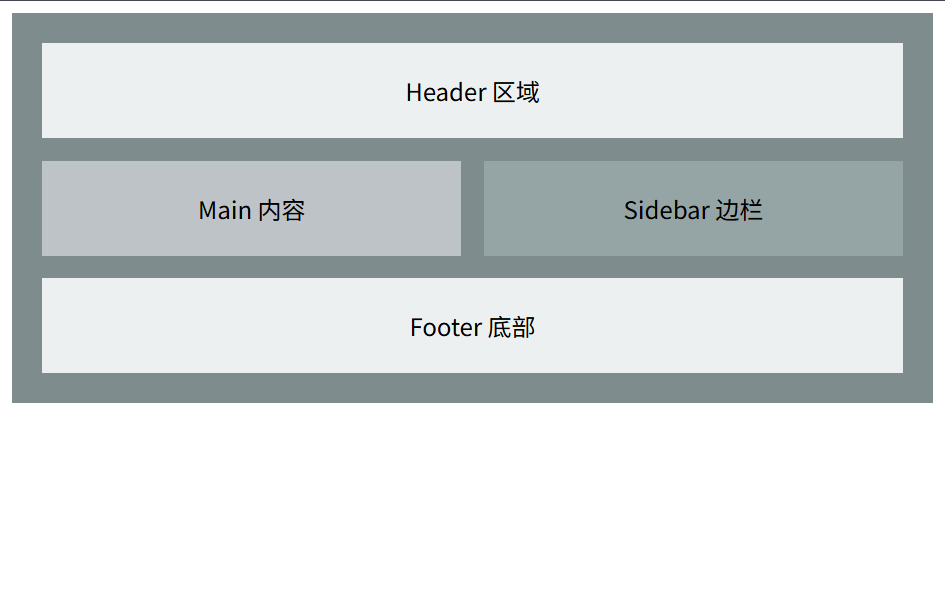

# CSS Grid 网格布局

## 前言 😊

在现代网页设计中，除了传统的浮动布局和弹性布局之外，`CSS Grid` 网格布局作为一种强大的二维布局方案也越来越受到重视。它不仅可以在行和列两个维度上对页面元素进行精确控制，还能轻松实现复杂的布局需求。本文将深入探讨 CSS Grid 的基本概念、专业名词以及常用属性，并通过实例代码演示如何使用网格布局实现灵活、高效的设计。

## Grid 📐

CSS Grid 网格布局是一种专门针对`二维布局（行和列）`的布局系统。与 Flex 布局侧重于单一轴向的排列不同，Grid 允许你同时定义`行`和`列`，通过指定`网格的结构`来安排和对齐子元素。它极大地简化了传统布局中经常遇到的间隔计算和元素定位问题，适用于`构建复杂页面结构`。

## 专业名词 🔍

### 网格容器（Grid Container）

将一个 HTML 元素的 `display` 属性设置为 `grid` 或 `inline-grid`，该元素便成为网格容器。网格容器的直接子元素则自动成为 网格项目（Grid Item）。

### 网格线（Grid Line）

网格布局中的`虚拟分隔线`，`水平和垂直`方向都有相应的网格线。它们用于定义`网格单元的边界`，通过编号或命名来帮助定位网格项目。

### 网格单元（Grid Cell）

网格容器中两个`相邻网格线形成的矩形区域`称为网格单元。每个网格项目默认位于一个或多个网格单元中。

### 网格区（Grid Area）

若一个网格项目`跨越多行或多列`，可以认为它占据了一个网格区域。可以通过命名网格区域的方式来简化布局。

### 轨道（Track）

指网格容器中分隔`行或列的带状区域`，即行轨道或列轨道。设置行高或列宽即是对轨道进行定义。

### 间隙（Gutters/Gap）

在`相邻网格轨道之间的间隙`，可通过 row-gap、column-gap 或简写 gap 属性设定。

## 定义 Grid 布局 🛠️

```css [.css]
.container {
  /* 定义为块级网格容器 */
  display: grid;
  /* 或者使用行内网格容器 */
  /* display: inline-grid; */
}
```

```html [.html]
<body>
  <div class="container">
    <div class="item item1">item1</div>
    <div class="item item2">item2</div>
    <div class="item item3">item3</div>
    <div class="item item4">item4</div>
    <div class="item item5">item5</div>
    <div class="item item6">item6</div>
  </div>
</body>
```

## 常用属性解析 📚

### 1. 定义网格结构 🧩

#### grid-template-columns / grid-template-rows

用于定义网格容器中列和行的大小和数量。可用值有长度单位、百分比、`fr` 单位或关键字 `auto` 等。

```css [.css]
.container {
  display: grid;
  /* 定义三列，每列宽度平均分配剩余空间 */
  grid-template-columns: repeat(3, 1fr);
  /* 定义两行，高度分别为 100px 和自动 */
  grid-template-rows: 100px auto;
}
```

#### grid-template-areas

通过命名方式定义网格区域，使布局更加直观。先在容器中定义网格区域的布局，再在子元素中通过 `grid-area` 指定所属区域。

```css [.css]
.container {
  display: grid;
  grid-template-columns: 1fr 1fr;
  grid-template-rows: auto auto;
  grid-template-areas:
    "header header"
    "main sidebar";
  gap: 10px;
}

.header {
  grid-area: header;
  background: #ecf0f1;
}
.main {
  grid-area: main;
  background: #bdc3c7;
}
.sidebar {
  grid-area: sidebar;
  background: #95a5a6;
}
```

```html [.html]
<body>
  <div class="container">
    <div class="header">Header</div>
    <div class="main">Main Content</div>
    <div class="sidebar">Sidebar</div>
  </div>
</body>
```



#### gap / row-gap / column-gap

用于设置网格中行与列之间的间隙，使版面更加整齐美观。

```css [.css]
.container {
  display: grid;
  grid-template-columns: repeat(3, 1fr);
  gap: 15px; /* 同时设置行和列的间隙 */
}
```

### 2. 网格项目定位 📍

#### grid-column 与 grid-row

用于定义网格项目所占的列或行范围，通过指定起始与结束网格线的编号或名称，实现跨列、跨行效果。

```css [.css]
.item1 {
  /* 从第一条垂直网格线开始，到第三条网格线结束，即跨两列 */
  grid-column: 1 / 3;
}

.item2 {
  /* 占据第二行 */
  grid-row: 2;
}
```

#### grid-area

可用于直接指定网格区域，同时作为子元素的命名标识，用于配合 `grid-template-areas` 使用。

```css [.css]
.item3 {
  grid-area: main; /* 与 container 定义的区域名称对应 */
}
```

### 3. 自动布局相关属性 🤖

#### grid-auto-rows / grid-auto-columns

当网格项目数量超出已定义的网格轨道时，CSS Grid 会自动生成新的行或列。可通过这两个属性指定自动生成行或列的尺寸。

```css [.css]
.container {
  display: grid;
  grid-template-columns: repeat(3, 1fr);
  grid-auto-rows: 150px; /* 超出部分的行高统一为 150px */
  gap: 10px;
}
```

#### grid-auto-flow

定义网格中项目的自动排列顺序。其可选值包括：

- row（默认）：按行添加。
- column：按列添加。
- dense：启用紧密填充模式，尽可能填补空隙。

```css [.css]
.container {
  display: grid;
  grid-template-columns: repeat(3, 1fr);
  grid-auto-flow: row dense;
  gap: 10px;
}
```

### 4. 对齐属性 🔧

#### justify-items 与 align-items

用于设置每个网格项目在其所在网格单元内的水平（justify）和垂直（align）对齐方式。常用取值包括 `start`、`end`、`center` 和 `stretch`（默认）。

```css [.css]
.container {
  display: grid;
  grid-template-columns: repeat(3, 1fr);
  gap: 10px;
  /* 设置所有项目在单元格内水平居中 */
  justify-items: center;
  /* 设置所有项目在单元格内垂直居中 */
  align-items: center;
}
```

#### justify-content 与 align-content

用于设置整个网格容器内所有网格轨道的对齐方式。当容器尺寸大于网格尺寸时，这两个属性决定了网格整体在容器内的位置分布。

```css [.css]
.container {
  display: grid;
  grid-template-columns: repeat(3, 1fr);
  gap: 10px;
  /* 水平方向上网格整体居中 */
  justify-content: center;
  /* 垂直方向上网格整体分布 */
  align-content: space-around;
}
```

## 实战示例 🚀

下面是一个综合示例，展示如何使用 CSS Grid 布局构建简单的页面结构。示例中通过 `grid-template-areas` 对各区域进行明确分割，同时结合 `gap` 属性让页面层次更加分明。

```html [.html]
<!DOCTYPE html>
<html lang="zh-CN">
  <head>
    <meta charset="UTF-8" />
    <title>CSS Grid 网格布局示例</title>
    <style>
      .container {
        display: grid;
        grid-template-columns: 1fr 1fr;
        grid-template-rows: auto auto auto;
        grid-template-areas:
          "header header"
          "main sidebar"
          "footer footer";
        gap: 15px;
        background-color: #7f8c8d;
        padding: 20px;
      }
      .header {
        grid-area: header;
        background: #ecf0f1;
        text-align: center;
        padding: 20px;
      }
      .main {
        grid-area: main;
        background: #bdc3c7;
        text-align: center;
        padding: 20px;
      }
      .sidebar {
        grid-area: sidebar;
        background: #95a5a6;
        text-align: center;
        padding: 20px;
      }
      .footer {
        grid-area: footer;
        background: #ecf0f1;
        text-align: center;
        padding: 20px;
      }
    </style>
  </head>
  <body>
    <div class="container">
      <div class="header">Header 区域</div>
      <div class="main">Main 内容</div>
      <div class="sidebar">Sidebar 边栏</div>
      <div class="footer">Footer 底部</div>
    </div>
  </body>
</html>
```



## 总结 🏁

CSS Grid 网格布局作为现代网页设计中一项强大的二维布局技术，提供了对行与列双重结构的精准控制。本文从基本概念、专业名词，到常用属性（包括网格结构设置、自动布局和对齐属性）进行了详细讲解，并通过实战示例展示了如何快速构建响应式页面结构。

与 Flex 布局相比，Grid 更适合处理结构性、复杂度较高的页面布局。在实际项目中，根据具体需求，还可将二者结合使用，以发挥各自优势。

如果你有更好的使用方法或在开发中遇到问题，欢迎在评论区分享你的实践经验，共同提升前端布局技能！ 🎉
