# Canvas 学习笔记

## 属性方法大集合

### 一、 图形绘制

#### 1. 矩形

| 属性、方法                      | 说明                                                                                                                   |
| ------------------------------- | ---------------------------------------------------------------------------------------------------------------------- |
| fillRect(x, y, width, height)   | 绘制一个填充的矩形                                                                                                     |
| strokeRect(x, y, width, height) | 绘制一个矩形的边框                                                                                                     |
| clearRect(x, y, width, height)  | 清除指定矩形区域，让清除部分完全透明。                                                                                 |
| rect(x, y, width, height)       | 绘制一个左上角坐标为（x,y），宽高为 width 以及 height 的矩形。(画完之后是空白的，没有边框显示，需要配合 stroke() 使用) |

#### 2. 路径

| 方法        | 说明                                                         |
| ----------- | ------------------------------------------------------------ |
| beginPath() | 新建一条路径，生成之后，图形绘制命令被指向到路径上生成路径。 |
| closePath() | 闭合路径之后图形绘制命令又重新指向到上下文中。               |
| stroke()    | 通过线条来绘制图形轮廓。                                     |
| fill()      | 通过填充路径的内容区域生成实心的图形。                       |

#### 3. 移动笔触

| 方法         | 说明                                 |
| ------------ | ------------------------------------ |
| moveTo(x, y) | 将笔触移动到指定的坐标 x 以及 y 上。 |

#### 4. 直线

| 方法         | 说明                                           |
| ------------ | ---------------------------------------------- |
| lineTo(x, y) | 绘制一条从当前位置到指定 x 以及 y 位置的直线。 |

#### 5. 圆

| 方法                                                   | 说明                                                                                                                                           |
| ------------------------------------------------------ | ---------------------------------------------------------------------------------------------------------------------------------------------- |
| arc(x, y, radius, startAngle, endAngle, anticlockwise) | 画一个以（x,y）为圆心的以 radius 为半径的圆弧（圆），从 startAngle 开始到 endAngle 结束，按照 anticlockwise 给定的方向（默认为顺时针）来生成。 |
| arcTo(x1, y1, x2, y2, radius)                          | 根据给定的控制点和半径画一段圆弧，再以直线连接两个控制点。                                                                                     |

#### 6. 贝塞尔曲线

| 方法                                        | 说明                                                                           |
| ------------------------------------------- | ------------------------------------------------------------------------------ |
| quadraticCurveTo(cp1x, cp1y, x, y)          | 绘制二次贝塞尔曲线，cp1x,cp1y 为一个控制点，x,y 为结束点。                     |
| bezierCurveTo(cp1x, cp1y, cp2x, cp2y, x, y) | 绘制三次贝塞尔曲线，cp1x,cp1y 为控制点一，cp2x,cp2y 为控制点二，x,y 为结束点。 |

#### 7. Path2D 对象

| 方法                                | 说明                                                 |
| ----------------------------------- | ---------------------------------------------------- |
| Path2D.addPath(path [, transform])​ | 添加了一条路径到当前路径（可能添加了一个变换矩阵）。 |

### 二、 样式颜色

#### 1. 颜色

| 方法                | 说明                 |
| ------------------- | -------------------- |
| fillStyle = color   | 设置图形的填充颜色。 |
| strokeStyle = color | 设置图形轮廓的颜色。 |

#### 2. 透明度

| 方法                            | 描述                                                                                                        |
| ------------------------------- | ----------------------------------------------------------------------------------------------------------- |
| globalAlpha = transparencyValue | 这个属性影响到 canvas 里所有图形的透明度，有效的值范围是 0.0 （完全透明）到 1.0（完全不透明），默认是 1.0。 |

#### 3. 线形

| 方法、属性             | 描述                                                                                                 |
| ---------------------- | ---------------------------------------------------------------------------------------------------- |
| lineWidth = value      | 设置线条宽度。                                                                                       |
| lineCap = type         | 设置线条末端样式。                                                                                   |
| lineJoin = type        | 设定线条与线条间接合处的样式。                                                                       |
| miterLimit = value     | 限制当两条线相交时交接处最大长度；所谓交接处长度（斜接长度）是指线条交接处内角顶点到外角顶点的长度。 |
| lineDashOffset = value | 设置虚线样式的起始偏移量。                                                                           |
| getLineDash()          | 返回一个包含当前虚线样式，长度为非负偶数的数组。                                                     |
| setLineDash(segments)  | 设置当前虚线样式。                                                                                   |

#### 4. 渐变

| 方法                                         | 说明                                                                                                                                                                                                                    |
| -------------------------------------------- | ----------------------------------------------------------------------------------------------------------------------------------------------------------------------------------------------------------------------- |
| createLinearGradient(x1, y1, x2, y2)         | createLinearGradient 方法接受 4 个参数，表示渐变的起点 (x1,y1) 与终点 (x2,y2)。                                                                                                                                         |
| createRadialGradient(x1, y1, r1, x2, y2, r2) | createRadialGradient 方法接受 6 个参数，前三个定义一个以 (x1,y1) 为原点，半径为 r1 的圆，后三个参数则定义另一个以 (x2,y2) 为原点，半径为 r2 的圆。                                                                      |
| gradient.addColorStop(position, color)       | addColorStop 方法接受 2 个参数，position 参数必须是一个 0.0 与 1.0 之间的数值，表示渐变中颜色所在的相对位置。例如，0.5 表示颜色会出现在正中间。color 参数必须是一个有效的 CSS 颜色值（如 #FFF， rgba(0,0,0,1)，等等）。 |

#### 5. 图案样式

| 方法                       | 描述                                                                                                                                                    |
| -------------------------- | ------------------------------------------------------------------------------------------------------------------------------------------------------- |
| createPattern(image, type) | 该方法接受两个参数。Image 可以是一个 Image 对象的引用，或者另一个 canvas 对象。Type 必须是下面的字符串值之一：repeat，repeat-x，repeat-y 和 no-repeat。 |

#### 6. 阴影

| 属性                  | 描述                                                                                                                                                                  |
| --------------------- | --------------------------------------------------------------------------------------------------------------------------------------------------------------------- |
| shadowOffsetX = float | shadowOffsetX 和 shadowOffsetY 用来设定阴影在 X 和 Y 轴的延伸距离，它们是不受变换矩阵所影响的。负值表示阴影会往上或左延伸，正值则表示会往下或右延伸，它们默认都为 0。 |
| shadowOffsetY = float | shadowOffsetX 和 shadowOffsetY 用来设定阴影在 X 和 Y 轴的延伸距离，它们是不受变换矩阵所影响的。负值表示阴影会往上或左延伸，正值则表示会往下或右延伸，它们默认都为 0。 |
| shadowBlur = float    | shadowBlur 用于设定阴影的模糊程度，其数值并不跟像素数量挂钩，也不受变换矩阵的影响，默认为 0。                                                                         |
| shadowColor = color   | shadowColor 是标准的 CSS 颜色值，用于设定阴影颜色效果，默认是全透明的黑色。                                                                                           |

### 三、绘制文本

#### 1. 绘制文本

| 方法                                | 描述                                                     |
| ----------------------------------- | -------------------------------------------------------- |
| fillText(text, x, y [, maxWidth])   | 在指定的(x,y)位置填充指定的文本，绘制的最大宽度是可选的. |
| strokeText(text, x, y [, maxWidth]) | 在指定的(x,y)位置绘制文本边框，绘制的最大宽度是可选的.   |

#### 2. 文本样式

| 方法                 | 描述                                                                                                                                                     |
| -------------------- | -------------------------------------------------------------------------------------------------------------------------------------------------------- |
| font = value         | 当前我们用来绘制文本的样式. 这个字符串使用和 CSS font 属性相同的语法. 默认的字体是 10px sans-serif。                                                     |
| textAlign = value    | 文本对齐选项. 可选的值包括：start, end, left, right or center. 默认值是 start。                                                                          |
| textBaseline = value | 基线对齐选项. 可选的值包括：top（顶部）, hanging（垂下）, middle（中间）, alphabetic（字母）, ideographic（表意）, bottom（底部）。默认值是 alphabetic。 |
| direction = value    | 文本方向。可能的值包括：ltr, rtl, inherit。默认值是 inherit。                                                                                            |

#### 3. 预测量文本宽度

| 方法          | 描述                                                                  |
| ------------- | --------------------------------------------------------------------- |
| measureText() | 将返回一个 TextMetrics 对象的宽度、所在像素，这些体现文本特性的属性。 |

### 四、使用图像

#### 1. 获取图片

| 方法、属性        | 描述                                                                               |
| ----------------- | ---------------------------------------------------------------------------------- |
| HTMLImageElement  | 这些图片是由 Image()函数构造出来的，或者任何的\元素                          |
| HTMLVideoElement  | 用一个 HTML 的 \<video\>元素作为你的图片源，可以从视频中抓取当前帧作为一个图像     |
| HTMLCanvasElement | 可以使用另一个 \<canvas\> 元素作为你的图片源。                                     |
| ImageBitmap       | 这是一个高性能的位图，可以低延迟地绘制，它可以从上述的所有源以及其它几种源中生成。 |

#### 2. 绘制、缩放、切片图片

| 方法                                                               | 描述                                                                                                                                             |
| ------------------------------------------------------------------ | ------------------------------------------------------------------------------------------------------------------------------------------------ |
| drawImage(image, x, y)                                             | 其中 image 是 image 或者 canvas 对象，x 和 y 是其在目标 canvas 里的起始坐标。                                                                    |
| drawImage(image, x, y, width, height)                              | 这个方法多了 2 个参数：width 和 height，这两个参数用来控制 当向 canvas 画入时应该缩放的大小。                                                    |
| drawImage(image, sx, sy, sWidth, sHeight, dx, dy, dWidth, dHeight) | 第一个参数和其它的是相同的，都是一个图像或者另一个 canvas 的引用。前 4 个是定义图像源的切片位置和大小，后 4 个则是定义切片的目标显示位置和大小。 |

### 五、变形

#### 1. 保存、恢复状态

| 方法      | 描述                                                                                                                      |
| --------- | ------------------------------------------------------------------------------------------------------------------------- |
| save()    | 保存画布(canvas)的所有状态                                                                                                |
| restore() | save 和 restore 方法是用来保存和恢复 canvas 状态的，都没有参数。Canvas 的状态就是当前画面应用的所有样式和变形的一个快照。 |

#### 2. 移动

| 方法            | 描述                                                         |
| --------------- | ------------------------------------------------------------ |
| translate(x, y) | translate 方法接受两个参数。x 是左右偏移量，y 是上下偏移量。 |

#### 3. 旋转

| 方法          | 描述                                                                            |
| ------------- | ------------------------------------------------------------------------------- |
| rotate(angle) | 这个方法只接受一个参数：旋转的角度(angle)，它是顺时针方向的，以弧度为单位的值。 |

#### 4. 缩放

| 方法        | 描述                                                                                                                                                                                   |
| ----------- | -------------------------------------------------------------------------------------------------------------------------------------------------------------------------------------- |
| scale(x, y) | scale 方法可以缩放画布的水平和垂直的单位。两个参数都是实数，可以为负数，x 为水平缩放因子，y 为垂直缩放因子，如果比 1 小，会缩小图形， 如果比 1 大会放大图形。默认值为 1， 为实际大小。 |

#### 5. 变形

| 方法                           | 描述                                                                                                                                                                                                                            |
| ------------------------------ | ------------------------------------------------------------------------------------------------------------------------------------------------------------------------------------------------------------------------------- |
| transform(a, b, c, d, e, f)    | 这个方法是将当前的变形矩阵乘上一个基于自身参数的矩阵                                                                                                                                                                            |
| setTransform(a, b, c, d, e, f) | 这个方法会将当前的变形矩阵重置为单位矩阵，然后用相同的参数调用 transform 方法。如果任意一个参数是无限大，那么变形矩阵也必须被标记为无限大，否则会抛出异常。从根本上来说，该方法是取消了当前变形,然后设置为指定的变形,一步完成。 |
| resetTransform()               | 重置当前变形为单位矩阵，它和调用以下语句是一样的：ctx.setTransform(1, 0, 0, 1, 0, 0);                                                                                                                                           |

### 六、合成与动画

#### 1. 合成

| 属性                            | 描述                                                                             |
| ------------------------------- | -------------------------------------------------------------------------------- |
| globalCompositeOperation = type | 这个属性设定了在画新图形时采用的遮盖策略，其值是一个标识 12 种遮盖方式的字符串。 |

#### 2. 裁剪

| 方法   | 描述                                       |
| ------ | ------------------------------------------ |
| clip() | 将当前正在构建的路径转换为当前的裁剪路径。 |

#### 3. 动画

| 方法                            | 描述                                                                                 |
| ------------------------------- | ------------------------------------------------------------------------------------ |
| setInterval(function, delay)    | 当设定好间隔时间后，function 会定期执行。                                            |
| setTimeout(function, delay)     | 在设定好的时间之后执行函数                                                           |
| requestAnimationFrame(callback) | 告诉浏览器你希望执行一个动画，并在重绘之前，请求浏览器执行一个特定的函数来更新动画。 |

## 图形的绘制

### 一、替换内容

```html
<!-- 当前浏览器如果不支持 canvas 标签时，会打印 canvas 内部的html标签 -->
<canvas id="stockGraph" width="150" height="150"> current stock price: $3.15 +0.15 </canvas>

<canvas id="clock" width="150" height="150">
  
</canvas>
```

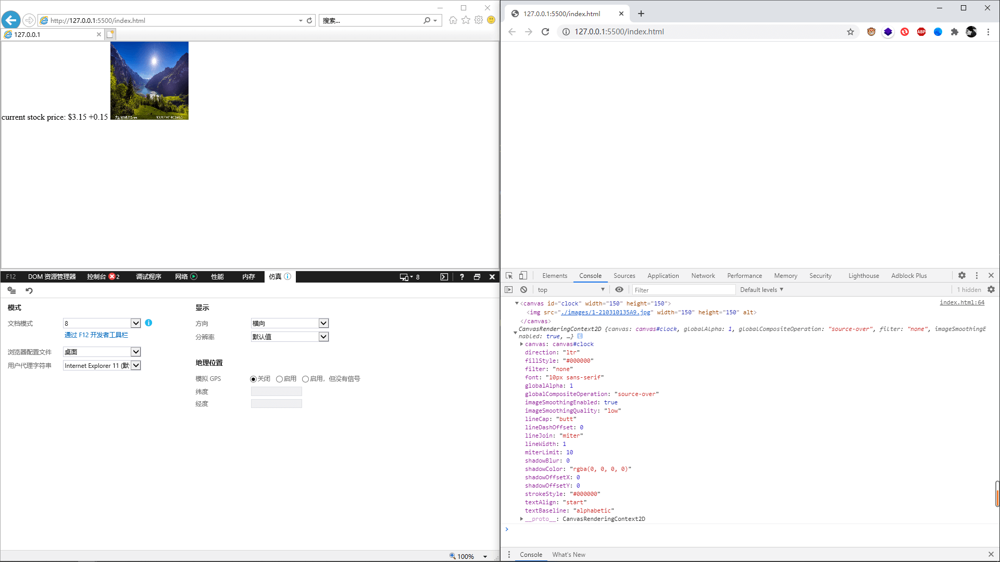
（左图：IE8，右图：谷歌 89.0.0）

### 二、渲染上下文

- getContext()，只有一个参数，上下文的格式‘2d’
- CanvasRenderingContext2D，2D 图像处理

### 三、检查支持性

```js
if (canvas.getContext) {
  var ctx = canvas.getContext("2d");
}
```

模板骨架

```html
<!DOCTYPE html>
<html>
  <head>
    <meta charset="UTF-8" />
    <meta name="viewport" content="width=device-width, initial-scale=1.0" />
    <title>Canvas学习笔记</title>
    <style>
      canvas {
        border: 1px solid black;
      }
    </style>
  </head>
  <body onload="draw()">
    <canvas id="canvas" width="150" height="150"></canvas>
  </body>
  <script>
    function draw() {
      var canvas = document.getElementById("canvas");

      if (canvas.getContext) {
        var ctx = canvas.getContext("2d");

        // 代码编写
      }
    }
  </script>
</html>
```

### 四、属性与方法

#### 1. 绘制矩形

| 属性、方法                      | 说明                                                                                                                   |
| ------------------------------- | ---------------------------------------------------------------------------------------------------------------------- |
| fillRect(x, y, width, height)   | 绘制一个填充的矩形                                                                                                     |
| strokeRect(x, y, width, height) | 绘制一个矩形的边框                                                                                                     |
| clearRect(x, y, width, height)  | 清除指定矩形区域，让清除部分完全透明。                                                                                 |
| rect(x, y, width, height)       | 绘制一个左上角坐标为（x,y），宽高为 width 以及 height 的矩形。(画完之后是空白的，没有边框显示，需要配合 stroke() 使用) |

```js
draw = () => {
  var canvas = document.getElementById("canvas");

  if (canvas.getContext) {
    var ctx = canvas.getContext("2d");

    ctx.fillRect(25, 25, 100, 100);
    ctx.clearRect(35, 35, 40, 40);
    ctx.strokeRect(45, 45, 20, 20);
    ctx.clearRect(75, 75, 40, 40);
    ctx.strokeRect(85, 85, 20, 20);
  }
};
```

#### 2. 绘制路径

1. 首先，你需要创建路径起始点。
2. 然后你使用画图命令去画出路径。
3. 之后你把路径封闭。
4. 一旦路径生成，你就能通过描边或填充路径区域来渲染图形。

> 注意：当前路径为空，即调用 beginPath()之后，或者 canvas 刚建的时候，第一条路径构造命令通常被视为是 moveTo（），无论实际上是什么。出于这个原因，你几乎总是要在设置路径之后专门指定你的起始位置。

| 方法        | 说明                                                         |
| ----------- | ------------------------------------------------------------ |
| beginPath() | 新建一条路径，生成之后，图形绘制命令被指向到路径上生成路径。 |
| closePath() | 闭合路径之后图形绘制命令又重新指向到上下文中。               |
| stroke()    | 通过线条来绘制图形轮廓。                                     |
| fill()      | 通过填充路径的内容区域生成实心的图形。                       |

```js
// 绘制一个三角形
draw = () => {
  var canvas = document.getElementById("canvas");

  if (canvas.getContext) {
    var ctx = canvas.getContext("2d");

    ctx.beginPath();
    ctx.moveTo(25, 25);
    ctx.lineTo(25, 100);
    ctx.lineTo(125, 100);
    ctx.fill();
  }
};
```

#### 3. 移动笔触

一个非常有用的函数，而这个函数实际上并不能画出任何东西，也是上面所描述的路径列表的一部分，这个函数就是 moveTo()。或者你可以想象一下在纸上作业，一支钢笔或者铅笔的笔尖从一个点到另一个点的移动过程。

| 方法         | 说明                                 |
| ------------ | ------------------------------------ |
| moveTo(x, y) | 将笔触移动到指定的坐标 x 以及 y 上。 |

```js
// 画一个笑脸
draw = () => {
  var canvas = document.getElementById("canvas");

  if (canvas.getContext) {
    var ctx = canvas.getContext("2d");

    ctx.beginPath();
    ctx.arc(75, 75, 50, 0, Math.PI * 2, true);
    ctx.moveTo(115, 75);
    ctx.arc(75, 75, 40, 0, Math.PI, false);
    ctx.moveTo(70, 60);
    ctx.arc(60, 60, 10, 0, Math.PI * 2, true);
    ctx.moveTo(100, 60);
    ctx.arc(90, 60, 10, 0, Math.PI * 2, true);

    ctx.stroke();
  }
};
```

效果图如下：前者没有使用 moverTo 属性，后者则是使用了。


#### 4. 线

| 方法         | 说明                                           |
| ------------ | ---------------------------------------------- |
| lineTo(x, y) | 绘制一条从当前位置到指定 x 以及 y 位置的直线。 |

```js
draw = () => {
  var canvas = document.getElementById("canvas");

  if (canvas.getContext) {
    var ctx = canvas.getContext("2d");
    // 填充三角形
    ctx.beginPath();
    ctx.moveTo(25, 25);
    ctx.lineTo(25, 75);
    ctx.lineTo(60, 50);
    ctx.fill(); // 填充图形，可以直接使用fill方法，路径会自动闭合。

    // 描边三角形
    ctx.beginPath();
    ctx.moveTo(100, 80);
    ctx.lineTo(100, 130);
    ctx.lineTo(50, 105);
    ctx.closePath(); // 描边图形，需要手动闭合路径，否则边框会缺失。
    ctx.stroke();
  }
};
```

#### 5. 圆

| 方法                                                   | 说明                                                                                                                                           |
| ------------------------------------------------------ | ---------------------------------------------------------------------------------------------------------------------------------------------- |
| arc(x, y, radius, startAngle, endAngle, anticlockwise) | 画一个以（x,y）为圆心的以 radius 为半径的圆弧（圆），从 startAngle 开始到 endAngle 结束，按照 anticlockwise 给定的方向（默认为顺时针）来生成。 |
| arcTo(x1, y1, x2, y2, radius)                          | 根据给定的控制点和半径画一段圆弧，再以直线连接两个控制点。                                                                                     |

这里详细介绍一下 arc 方法，该方法有六个参数：x,y 为绘制圆弧所在圆上的圆心坐标。radius 为半径。startAngle 以及 endAngle 参数用弧度定义了开始以及结束的弧度。这些都是`以x轴为基准`。`参数anticlockwise为一个布尔值。为true时，是逆时针方向，否则顺时针方向`。

> 注意：arc()函数中表示角的单位是弧度，不是角度。角度与弧度的 js 表达式: 弧度=(Math.PI/180)\*角度。1 弧度约等于 57 度。

```js
draw = () => {
  let canvas = document.getElementById("canvas");

  if (canvas.getContext) {
    let ctx = canvas.getContext("2d");
    for (var i = 0; i < 4; i++) {
      for (var j = 0; j < 3; j++) {
        ctx.beginPath();
        var x = 25 + j * 50; // x 坐标值
        var y = 25 + i * 50; // y 坐标值
        var radius = 20; // 圆弧半径
        var startAngle = 0; // 开始点
        var endAngle = Math.PI + (Math.PI * j) / 2; // 结束点
        var anticlockwise = i % 2 == 0 ? false : true; // 顺时针或逆时针

        ctx.arc(x, y, radius, startAngle, endAngle, anticlockwise);

        if (i > 1) {
          ctx.fill();
        } else {
          ctx.stroke();
        }
      }
    }
  }
};
```

#### 6. 贝塞尔曲线

| 方法                                        | 说明                                                                           |
| ------------------------------------------- | ------------------------------------------------------------------------------ |
| quadraticCurveTo(cp1x, cp1y, x, y)          | 绘制二次贝塞尔曲线，cp1x,cp1y 为一个控制点，x,y 为结束点。                     |
| bezierCurveTo(cp1x, cp1y, cp2x, cp2y, x, y) | 绘制三次贝塞尔曲线，cp1x,cp1y 为控制点一，cp2x,cp2y 为控制点二，x,y 为结束点。 |

二次贝塞尔曲线及三次贝塞尔曲线的关系：二次贝塞尔曲线有一个开始点（蓝色）、一个结束点（蓝色）以及一个控制点（红色），而三次贝塞尔曲线有两个控制点。


```js
// 聊天气泡 二次贝塞尔曲线
function draw() {
  var canvas = document.getElementById("canvas");
  if (canvas.getContext) {
    var ctx = canvas.getContext("2d");

    ctx.beginPath();
    ctx.moveTo(75, 25);
    ctx.quadraticCurveTo(25, 25, 25, 62.5);
    ctx.quadraticCurveTo(25, 100, 50, 100);
    ctx.quadraticCurveTo(50, 120, 30, 125);
    ctx.quadraticCurveTo(60, 120, 65, 100);
    ctx.quadraticCurveTo(125, 100, 125, 62.5);
    ctx.quadraticCurveTo(125, 25, 75, 25);
    ctx.stroke();
  }
}

// 填充心形 三次贝塞尔曲线
function draw() {
  var canvas = document.getElementById("canvas");
  if (canvas.getContext) {
    var ctx = canvas.getContext("2d");

    ctx.beginPath();
    ctx.moveTo(75, 40);
    ctx.bezierCurveTo(75, 37, 70, 25, 50, 25);
    ctx.bezierCurveTo(20, 25, 20, 62.5, 20, 62.5);
    ctx.bezierCurveTo(20, 80, 40, 102, 75, 120);
    ctx.bezierCurveTo(110, 102, 130, 80, 130, 62.5);
    ctx.bezierCurveTo(130, 62.5, 130, 25, 100, 25);
    ctx.bezierCurveTo(85, 25, 75, 37, 75, 40);
    ctx.fill();
  }
}
```

### 五、Path2D 对象

正如我们在前面例子中看到的，你可以使用一系列的路径和绘画命令来把对象“画”在画布上。为了简化代码和提高性能，Path2D 对象已可以在较新版本的浏览器中使用，用来缓存或记录绘画命令，这样你将能快速地回顾路径。
Path2D()会返回一个新初始化的 Path2D 对象（可能将某一个路径作为变量——创建一个它的副本，或者将一个包含 SVG path 数据的字符串作为变量）。

| 方法                                | 说明                                                 |
| ----------------------------------- | ---------------------------------------------------- |
| Path2D.addPath(path [, transform])​ | 添加了一条路径到当前路径（可能添加了一个变换矩阵）。 |

```js
function draw() {
  var canvas = document.getElementById("canvas");
  if (canvas.getContext) {
    var ctx = canvas.getContext("2d");

    var rectangle = new Path2D();
    rectangle.rect(10, 10, 50, 50);

    var circle = new Path2D();
    circle.moveTo(125, 35);
    circle.arc(100, 35, 25, 0, 2 * Math.PI);

    ctx.stroke(rectangle);
    ctx.fill(circle);
  }
}
```

#### 使用 SVG paths

新的 Path2D API 有另一个强大的特点，就是使用 SVG path data 来初始化 canvas 上的路径。这将使你获取路径时可以以 SVG 或 canvas 的方式来重用它们。

这条路径将先移动到点 (M10 10) 然后再水平移动 80 个单位(h 80)，然后下移 80 个单位 (v 80)，接着左移 80 个单位 (h -80)，再回到起点处 (z)。你可以在 Path2D constructor 查看这个例子。

```js
var p = new Path2D("M10 10 h 80 v 80 h -80 Z");
```

## 样式和颜色

### 一、颜色 Colors

| 方法                | 说明                 |
| ------------------- | -------------------- |
| fillStyle = color   | 设置图形的填充颜色。 |
| strokeStyle = color | 设置图形轮廓的颜色。 |

```html
<!DOCTYPE html>
<html>
  <head>
    <meta charset="UTF-8" />
    <meta name="viewport" content="width=device-width, initial-scale=1.0" />
    <title>Canvas学习笔记</title>
    <style>
      canvas {
        border: 1px solid black;
      }
    </style>
  </head>
  <body onload="draw()">
    <canvas id="canvas" width="500" height="500"></canvas>
  </body>
  <script>
    // function draw () {}
  </script>
</html>
```

```js
// fillStyle()
function draw() {
  var canvas = document.getElementById("canvas");
  var mappings = [0, 1, 2, 3, 4, 5, 6, 7, 8, 9, "a", "b", "c", "d", "e", "f"]; // 关于颜色值之间的映射，方便提取值。

  if (canvas.getContext) {
    var ctx = canvas.getContext("2d");
    for (let i = 0; i < mappings.length; i++) {
      for (let j = 0; j < mappings.length; j++) {
        ctx.fillStyle = `###${mappings[i]}0${mappings[j]}`; // 颜色使用的是16进制的三位数字表示如：###000，可以适当调整参数改变效果。
        ctx.fillRect(i * 30, j * 30, 30, 30);
      }
    }
  }
}

// strokeStyle()
function draw() {
  var canvas = document.getElementById("canvas");
  var mappings = [0, 1, 2, 3, 4, 5, 6, 7, 8, 9, "a", "b", "c", "d", "e", "f"];

  if (canvas.getContext) {
    var ctx = canvas.getContext("2d");
    for (let i = 0; i < mappings.length; i++) {
      for (let j = 0; j < mappings.length; j++) {
        ctx.beginPath();
        ctx.strokeStyle = `###${mappings[j]}0${mappings[i]}`;

        ctx.arc(i * 30 + 15, j * 30 + 15, 15, 0, Math.PI * 2);
        ctx.stroke();
      }
    }
  }
}
```

### 二、透明度 Transparency

除了可以绘制实色图形，我们还可以用 canvas 来绘制半透明的图形。通过设置 globalAlpha 属性或者使用一个半透明颜色作为轮廓或填充的样式。

| 方法                            | 描述                                                                                                        |
| ------------------------------- | ----------------------------------------------------------------------------------------------------------- |
| globalAlpha = transparencyValue | 这个属性影响到 canvas 里所有图形的透明度，有效的值范围是 0.0 （完全透明）到 1.0（完全不透明），默认是 1.0。 |

当然，可以也可以使用 rgba() 色值实现透明度。

```js
function draw() {
  var canvas = document.getElementById("canvas");

  if (canvas.getContext) {
    var ctx = canvas.getContext("2d");

    ctx.fillStyle = "#dd5044";
    ctx.fillRect(0, 0, 250, 250);
    ctx.fillStyle = "#1b9e5f";
    ctx.fillRect(250, 0, 250, 250);
    ctx.fillStyle = "#4a8af4";
    ctx.fillRect(0, 250, 250, 250);
    ctx.fillStyle = "#ffcd41";
    ctx.fillRect(250, 250, 250, 250);

    // 透明方式 一、
    ctx.fillStyle = "#fff";
    ctx.globalAlpha = 0.05;

    // 透明方式 二、
    // ctx.fillStyle = '###ffffff0f';

    for (let i = 0; i < 15; i++) {
      ctx.beginPath();
      ctx.arc(250, 250, 20 * i, 0, Math.PI * 2);
      ctx.fill();
    }
  }
}
```


```js
// 方式二 HEX 色值扩展
function draw() {
  var canvas = document.getElementById("canvas");
  var mappings = [4, 5, 6, 7, 8, 9, "a", "b", "c"];

  if (canvas.getContext) {
    var ctx = canvas.getContext("2d");

    ctx.fillStyle = "#dd5044";
    ctx.fillRect(0, 0, 500, 125);
    ctx.fillStyle = "#1b9e5f";
    ctx.fillRect(0, 125, 500, 125);
    ctx.fillStyle = "#4a8af4";
    ctx.fillRect(0, 250, 500, 125);
    ctx.fillStyle = "#ffcd41";
    ctx.fillRect(0, 375, 500, 125);

    // 控制位置
    for (let i = 0; i < 4; i++) {
      // 控制透明度
      for (let j = 0; j < mappings.length; j++) {
        ctx.fillStyle = `###fff${mappings[j]}`;
        // x , y 所加的值为起始位置的比例，w , h 已经固定
        ctx.fillRect(j * 46 + 46, i * 125 + 15, 46, 95);
      }
    }
  }
}
```


### 三、线形 Line styles

| 方法、属性             | 描述                                                                                                 |
| ---------------------- | ---------------------------------------------------------------------------------------------------- |
| lineWidth = value      | 设置线条宽度。                                                                                       |
| lineCap = type         | 设置线条末端样式。                                                                                   |
| lineJoin = type        | 设定线条与线条间接合处的样式。                                                                       |
| miterLimit = value     | 限制当两条线相交时交接处最大长度；所谓交接处长度（斜接长度）是指线条交接处内角顶点到外角顶点的长度。 |
| lineDashOffset = value | 设置虚线样式的起始偏移量。                                                                           |
| getLineDash()          | 返回一个包含当前虚线样式，长度为非负偶数的数组。                                                     |
| setLineDash(segments)  | 设置当前虚线样式。                                                                                   |

#### 1. lineWidth 属性

这个属性设置当前绘线的粗细。属性值必须为正数。默认值是 1.0。
线宽是指给定路径的中心到两边的粗细。换句话说就是在路径的两边各绘制线宽的一半。因为画布的坐标并不和像素直接对应，当需要获得精确的水平或垂直线的时候要特别注意。

```js
function draw() {
  var canvas = document.getElementById("canvas");

  if (canvas.getContext) {
    var ctx = canvas.getContext("2d");
    for (let i = 0; i < 10; i++) {
      ctx.lineWidth = i;
      ctx.beginPath();
      ctx.moveTo(i * 42 + 50, 50);
      ctx.lineTo(i * 42 + 50, 450);
      ctx.stroke();
    }
  }
}
```

#### 2. lineCap 属性

属性 lineCap 的值决定了线段端点显示的样子。它可以为下面的三种的其中之一：butt，round 和 square。默认是 butt。
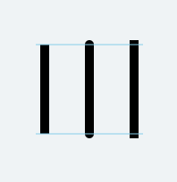

```js
function draw() {
  var canvas = document.getElementById("canvas");

  if (canvas.getContext) {
    var lineCap = ["butt", "round", "square"];
    var ctx = canvas.getContext("2d");

    for (let i = 0; i < lineCap.length; i++) {
      ctx.beginPath();
      ctx.lineWidth = 10;
      ctx.lineCap = lineCap[i];
      ctx.moveTo(i * 50 + 50, 50);
      ctx.lineTo(i * 50 + 50, 150);
      ctx.stroke();
    }

    // 辅助线
    ctx.beginPath();
    ctx.lineWidth = 1;
    ctx.strokeStyle = "skyblue";
    ctx.moveTo(40, 50);
    ctx.lineTo(160, 50);
    ctx.moveTo(40, 150);
    ctx.lineTo(160, 150);
    ctx.stroke();
  }
}
```

#### 3. lineJoin 属性

lineJoin 的属性值决定了图形中两线段连接处所显示的样子。它可以是这三种之一：round, bevel 和 miter。默认是 miter。

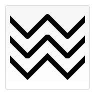

```js
function draw() {
  var ctx = document.getElementById("canvas").getContext("2d");
  var lineJoin = ["round", "bevel", "miter"];
  ctx.lineWidth = 10;
  for (let i = 0; i < lineJoin.length; i++) {
    ctx.lineJoin = lineJoin[i];
    ctx.beginPath();
    ctx.moveTo(-5, 5 + i * 40);
    ctx.lineTo(35, 45 + i * 40);
    ctx.lineTo(75, 5 + i * 40);
    ctx.lineTo(115, 45 + i * 40);
    ctx.lineTo(155, 5 + i * 40);
    ctx.stroke();
  }
}
```

#### 4. miterLimit 属性

就如上一个例子所见的应用 miter 的效果，线段的外侧边缘会被延伸交汇于一点上。线段之间夹角比较大时，交点不会太远，但随着夹角变小，交点距离会呈指数级增大。

miterLimit 属性就是用来设定外延交点与连接点的最大距离，如果交点距离大于此值，连接效果会变成了 bevel。注意，最大斜接长度（即交点距离）是当前坐标系测量线宽与此 miterLimit 属性值（HTML \<canvas\>默认为 10.0）的乘积，所以 miterLimit 可以单独设置，不受显示比例改变或任何仿射变换的影响：它只影响线条边缘的有效绘制形状。

#### 5、虚线

| 方法、属性     | 说明                                   |
| -------------- | -------------------------------------- |
| setLineDash()  | 接受一个数组，来指定线段与间隙的交替。 |
| lineDashOffset | 设置起始偏移量。                       |

```js
// 实现蚂蚁线，并让它动起来。
var canvas = document.getElementById("canvas");
var ctx = canvas.getContext("2d");
var offset = 0;

// 绘制蚂蚁线
function draw() {
  ctx.clearRect(0, 0, canvas.width, canvas.height);
  ctx.setLineDash([5, 3]);
  ctx.lineDashOffset = -offset;
  ctx.strokeRect(20, 20, 460, 460);
}

// 通过改变offset值，实现动画
function march() {
  offset++;
  if (offset > 10) {
    offset = 0;
  }
  draw();
  setTimeout(march, 10);
}
march();
```

### 四、渐变 Gradients

就好像一般的绘图软件一样，我们可以用线性或者径向的渐变来填充或描边。我们用下面的方法新建一个 canvasGradient 对象，并且赋给图形的 fillStyle 或 strokeStyle 属性。

| 方法                                         | 说明                                                                                                                                                                                                                      |
| -------------------------------------------- | ------------------------------------------------------------------------------------------------------------------------------------------------------------------------------------------------------------------------- |
| createLinearGradient(x1, y1, x2, y2)         | createLinearGradient 方法接受 4 个参数，表示渐变的起点 (x1,y1) 与终点 (x2,y2)。                                                                                                                                           |
| createRadialGradient(x1, y1, r1, x2, y2, r2) | createRadialGradient 方法接受 6 个参数，前三个定义一个以 (x1,y1) 为原点，半径为 r1 的圆，后三个参数则定义另一个以 (x2,y2) 为原点，半径为 r2 的圆。                                                                        |
| gradient.addColorStop(position, color)       | addColorStop 方法接受 2 个参数，position 参数必须是一个 0.0 与 1.0 之间的数值，表示渐变中颜色所在的相对位置。例如，0.5 表示颜色会出现在正中间。color 参数必须是一个有效的 CSS 颜色值（如 ###FFF， rgba(0,0,0,1)，等等）。 |

###### 1. 线性渐变

```js
function draw() {
  var ctx = document.getElementById("canvas").getContext("2d");

  // 定义一个颜色容器，设置起始终点的位置。
  var lineargradient = ctx.createLinearGradient(250, 0, 250, 500);
  lineargradient.addColorStop(0, "white"); // 按照0-1的区间，设置颜色的比例
  lineargradient.addColorStop(1, "black");

  // 将设置好的颜色赋值，绘画出的矩形
  ctx.fillStyle = lineargradient;
  ctx.fillRect(10, 10, 480, 480);
}
```

###### 2. 径向渐变


```js
function draw() {
  var ctx = document.getElementById("canvas").getContext("2d");

  var radgrad = ctx.createRadialGradient(180, 300, 20, 180, 380, 150);
  radgrad.addColorStop(0, "#a7d30c");
  radgrad.addColorStop(0.9, "#05a05e");
  radgrad.addColorStop(1, "#05a05e00");
  var radgrad1 = ctx.createRadialGradient(310, 350, 10, 350, 400, 100);
  radgrad1.addColorStop(0, "#01caff");
  radgrad1.addColorStop(0.9, "#00b6e3");
  radgrad1.addColorStop(1, "#00b6e300");

  ctx.fillStyle = radgrad;
  ctx.fillRect(0, 0, 500, 500);
  ctx.fillStyle = radgrad1;
  ctx.fillRect(0, 0, 500, 500);
}
```

### 五、图案样式 Patterns

| 方法                       | 描述                                                                                                                                                    |
| -------------------------- | ------------------------------------------------------------------------------------------------------------------------------------------------------- |
| createPattern(image, type) | 该方法接受两个参数。Image 可以是一个 Image 对象的引用，或者另一个 canvas 对象。Type 必须是下面的字符串值之一：repeat，repeat-x，repeat-y 和 no-repeat。 |

图案的应用跟渐变很类似的，创建出一个 pattern 之后，赋给 fillStyle 或 strokeStyle 属性即可。

```js
function draw() {
  var ctx = document.getElementById("canvas").getContext("2d");

  var img = new Image();
  img.src = "https://mdn.mozillademos.org/files/222/Canvas_createpattern.png";
  // img加载完成执行
  img.onload = function () {
    // 定义需要填充的图片
    var ptrn = ctx.createPattern(img, "repeat");

    ctx.fillStyle = ptrn;
    ctx.fillRect(10, 10, 480, 480);
  };
}
```

### 六、阴影 Shadows

| 属性                  | 描述                                                                                                                                                                  |
| --------------------- | --------------------------------------------------------------------------------------------------------------------------------------------------------------------- |
| shadowOffsetX = float | shadowOffsetX 和 shadowOffsetY 用来设定阴影在 X 和 Y 轴的延伸距离，它们是不受变换矩阵所影响的。负值表示阴影会往上或左延伸，正值则表示会往下或右延伸，它们默认都为 0。 |
| shadowOffsetY = float | shadowOffsetX 和 shadowOffsetY 用来设定阴影在 X 和 Y 轴的延伸距离，它们是不受变换矩阵所影响的。负值表示阴影会往上或左延伸，正值则表示会往下或右延伸，它们默认都为 0。 |
| shadowBlur = float    | shadowBlur 用于设定阴影的模糊程度，其数值并不跟像素数量挂钩，也不受变换矩阵的影响，默认为 0。                                                                         |
| shadowColor = color   | shadowColor 是标准的 CSS 颜色值，用于设定阴影颜色效果，默认是全透明的黑色。                                                                                           |

```js
function draw() {
  var ctx = document.getElementById("canvas").getContext("2d");

  ctx.shadowOffsetX = 5;
  ctx.shadowOffsetY = 5;
  ctx.shadowBlur = 2;
  ctx.shadowColor = "#0008";

  // 设置字体大小、字体类型
  ctx.font = "80px Times New Roman";
  ctx.fillStyle = "skyblue";
  ctx.fillText("Hello Canvas!", 20, 80); // 显示文本内容：文本内容，起始x轴，起始y轴
}
```

### 七、Canvas 填充规则

当我们用到 fill（或者 clip 和 isPointinPath ）你可以选择一个填充规则，该填充规则根据某处在路径的外面或者里面来决定该处是否被填充，这对于自己与自己路径相交或者路径被嵌套的时候是有用的。

两个可能的值：
"nonzero": non-zero winding rule, 默认值.
"evenodd": even-odd winding rule, 交替填充

```js
function draw() {
  var ctx = document.getElementById("canvas").getContext("2d");
  ctx.beginPath();
  ctx.arc(250, 250, 50, 0, Math.PI * 2, true);
  ctx.arc(250, 250, 150, 0, Math.PI * 2, true);
  ctx.arc(250, 250, 10, 0, Math.PI * 2, true);
  ctx.fill("evenodd");
}
```

## 绘制文本

### 一、 绘制文本

| 方法                                | 描述                                                     |
| ----------------------------------- | -------------------------------------------------------- |
| fillText(text, x, y [, maxWidth])   | 在指定的(x,y)位置填充指定的文本，绘制的最大宽度是可选的. |
| strokeText(text, x, y [, maxWidth]) | 在指定的(x,y)位置绘制文本边框，绘制的最大宽度是可选的.   |

```html
<!DOCTYPE html>
<html>
  <head>
    <meta charset="UTF-8" />
    <meta name="viewport" content="width=device-width, initial-scale=1.0" />
    <title>Canvas学习笔记</title>
    <style>
      body {
        background-color: #eff3f5;
      }
      canvas {
        border: 1px solid black;
      }
    </style>
  </head>
  <body onload="draw()">
    <canvas id="canvas" width="500" height="500"></canvas>
  </body>
  <script>
    ...
    相关的canvas代码写在这里
    ...
  </script>
</html>
```

```js
function draw() {
  var ctx = document.getElementById("canvas").getContext("2d");
  // 文字样式
  ctx.font = "80px Times New Roman";
  ctx.fillText("Hello Canvas!", 20, 100);
  ctx.strokeText("Hello Canvas!", 20, 200);
}
```


### 二、样式设置

| 方法                 | 描述                                                                                                                                                     |
| -------------------- | -------------------------------------------------------------------------------------------------------------------------------------------------------- |
| font = value         | 当前我们用来绘制文本的样式. 这个字符串使用和 CSS font 属性相同的语法. 默认的字体是 10px sans-serif。                                                     |
| textAlign = value    | 文本对齐选项. 可选的值包括：start, end, left, right or center. 默认值是 start。                                                                          |
| textBaseline = value | 基线对齐选项. 可选的值包括：top（顶部）, hanging（垂下）, middle（中间）, alphabetic（字母）, ideographic（表意）, bottom（底部）。默认值是 alphabetic。 |
| direction = value    | 文本方向。可能的值包括：ltr, rtl, inherit。默认值是 inherit。                                                                                            |

#### 1. textBaseline 属性


```js
function draw() {
  var ctx = document.getElementById("canvas").getContext("2d");

  ctx.beginPath();
  // 参考线
  ctx.strokeStyle = "blue";
  ctx.moveTo(15, 46);
  ctx.lineTo(480, 46);
  ctx.moveTo(15, 100);
  ctx.lineTo(480, 100);
  ctx.stroke();

  // 文字样式
  ctx.textBaseline = "alphabetic";
  ctx.font = "80px Times New Roman";
  ctx.fillText("Hello Canvas!", 20, 100);
}
```


#### 2. direction 属性

```js
function draw() {
  var ctx = document.getElementById("canvas").getContext("2d");

  ctx.beginPath();
  // 参考线
  ctx.strokeStyle = "blue";
  ctx.moveTo(15, 46);
  ctx.lineTo(480, 46);
  ctx.moveTo(15, 100);
  ctx.lineTo(480, 100);
  ctx.stroke();

  // 文字样式
  ctx.direction = "rtl"; // 文本方向
  ctx.font = "80px Times New Roman";
  ctx.fillText("Hello Canvas!", 480, 100);
}
```


### 三、预测量文本宽度

| 方法          | 描述                                                                  |
| ------------- | --------------------------------------------------------------------- |
| measureText() | 将返回一个 TextMetrics 对象的宽度、所在像素，这些体现文本特性的属性。 |

```js
function draw() {
  var ctx = document.getElementById("canvas").getContext("2d");
  ctx.font = "80px Times New Roman";
  let textInfo = ctx.measureText("Hello Canvas!"); // 如果前面设置了字体的样式，即会返回添加样式之后的字体信息
  console.log(textInfo);
  console.log(textInfo.width);
}
```


## 使用图像

canvas 更有意思的一项特性就是图像操作能力。可以用于动态的图像合成或者作为图形的背景，以及游戏界面（Sprites）等等。浏览器支持的任意格式的外部图片都可以使用，比如 PNG、GIF 或者 JPEG。 你甚至可以将同一个页面中其他 canvas 元素生成的图片作为图片源。

引入图像到 canvas 里需要以下两步基本操作：

- 获得一个指向 HTMLImageElement 的对象或者另一个 canvas 元素的引用作为源，也可以通过提供一个 URL 的方式来使用图片（参见例子）
- 使用 drawImage()函数将图片绘制到画布上

### 一、获得需要绘制的图片

可以获取图片源的 API：

| 方法、属性        | 描述                                                                               |
| ----------------- | ---------------------------------------------------------------------------------- |
| HTMLImageElement  | 这些图片是由 Image()函数构造出来的，或者任何的\元素                          |
| HTMLVideoElement  | 用一个 HTML 的 \<video\>元素作为你的图片源，可以从视频中抓取当前帧作为一个图像     |
| HTMLCanvasElement | 可以使用另一个 \<canvas\> 元素作为你的图片源。                                     |
| ImageBitmap       | 这是一个高性能的位图，可以低延迟地绘制，它可以从上述的所有源以及其它几种源中生成。 |

这些源统一由 CanvasImageSource 类型来引用。

#### 1. 使用相同页面内的图片

- document.images 集合
- document.getElementsByTagName()方法
- 如果你知道你想使用的指定图片的 ID，你可以用 document.getElementById()获得这个图片

#### 2. 使用其它域名下的图片

在 HTMLImageElement 上使用 crossOrigin 属性，你可以请求加载其它域名上的图片。如果图片的服务器允许跨域访问这个图片，那么你可以使用这个图片而不污染 canvas，否则，使用这个图片将会污染 canvas。

#### 3. 使用其它 canvas 元素

和引用页面内的图片类似地，用 document.getElementsByTagName 或 document.getElementById 方法来获取其它 canvas 元素。但你引入的应该是**已经准备好的** canvas。

#### 4. 从零创建图像

```js
var img = new Image();
img.src = "image.png"; // 图片源地址
```

#### 5. data: url 方式嵌入

Data urls 允许用一串 Base64 编码的字符串的方式来定义一个图片。
其优点就是图片内容即时可用，无须再到服务器兜一圈。（还有一个优点是，可以将 CSS，JavaScript，HTML 和 图片全部封装在一起，迁移起来十分方便。）缺点就是图像没法缓存，图片大的话内嵌的 url 数据会相当的长：

#### 6. 使用视频帧

你还可以使用\<video\> 中的视频帧（即便视频是不可见的）。例如，如果你有一个 ID 为“myvideo”的\<video\> 元素，你可以这样做：

```js
function getMyVideo() {
  var canvas = document.getElementById("canvas");
  if (canvas.getContext) {
    var ctx = canvas.getContext("2d");
    return document.getElementById("myvideo");
  }
}
```

### 二、绘制图片

| 方法                   | 描述                                                                          |
| ---------------------- | ----------------------------------------------------------------------------- |
| drawImage(image, x, y) | 其中 image 是 image 或者 canvas 对象，x 和 y 是其在目标 canvas 里的起始坐标。 |

> SVG 图像必须在 \<svg\> 根指定元素的宽度和高度。

```js
// 通过使用img图片作为背景图，减少不必要的作图。
function draw() {
  var ctx = document.getElementById("canvas").getContext("2d");
  var img = new Image();
  img.onload = function () {
    ctx.drawImage(img, 0, 0, 500, 400);
    ctx.strokeStyle = "skyblue";
    ctx.lineWidth = 2;
    ctx.moveTo(80, 300);
    ctx.lineTo(110, 280);
    ctx.lineTo(130, 250);
    ctx.lineTo(170, 100);
    ctx.lineTo(200, 140);
    ctx.lineTo(250, 100);
    ctx.lineTo(330, 280);
    ctx.lineTo(400, 150);
    ctx.lineTo(470, 280);
    ctx.stroke();
  };
  img.src = "https://mdn.mozillademos.org/files/5395/backdrop.png";
}
```


### 三、缩放

| 方法                                  | 描述                                                                                          |
| ------------------------------------- | --------------------------------------------------------------------------------------------- |
| drawImage(image, x, y, width, height) | 这个方法多了 2 个参数：width 和 height，这两个参数用来控制 当向 canvas 画入时应该缩放的大小。 |

```js
function draw() {
  var ctx = document.getElementById("canvas").getContext("2d");
  var img = new Image();
  img.onload = function () {
    for (let i = 0; i < 5; i++) {
      for (let j = 0; j < 5; j++) {
        ctx.drawImage(img, i * 96 + 10, j * 96 + 10, 96, 96);
      }
    }
  };
  img.src = "https://ss0.bdstatic.com/70cFuHSh_Q1YnxGkpoWK1HF6hhy/it/u=2789413579,2948231443&fm=26&gp=0.jpg";
}
```

根据 drawImage() 的缩放参数实现缩放，然后再通过 for 循环进行行列的平铺，效果如下：
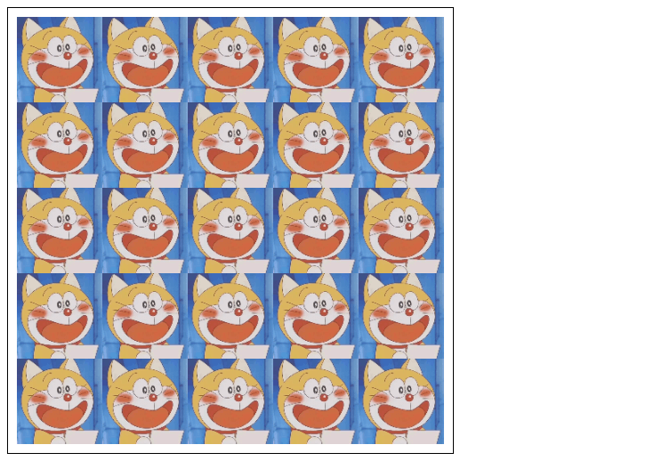

### 四、切片 Slicing

这次的功能也仍是 drawImage() 所实现的：

| 方法                                                               | 描述                                                                                                                                             |
| ------------------------------------------------------------------ | ------------------------------------------------------------------------------------------------------------------------------------------------ |
| drawImage(image, sx, sy, sWidth, sHeight, dx, dy, dWidth, dHeight) | 第一个参数和其它的是相同的，都是一个图像或者另一个 canvas 的引用。前 4 个是定义图像源的切片位置和大小，后 4 个则是定义切片的目标显示位置和大小。 |

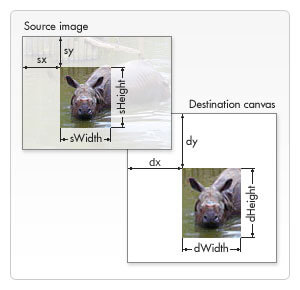

```js
function draw() {
  var ctx = document.getElementById("canvas").getContext("2d");
  var img = new Image(); // 犀牛
  img.onload = function () {
    // 前面四个参数切取的位置以及切取大小，后面四个参数设置切图后摆放的位置及尺寸。
    ctx.drawImage(img, 200, 100, 100, 150, 0, 0, 200, 250);
  };
  img.src = "https://ss0.bdstatic.com/70cFuHSh_Q1YnxGkpoWK1HF6hhy/it/u=2789413579,2948231443&fm=26&gp=0.jpg";
}
```

- 画框（MDN 案例），[示例：画廊 Art gallery example](https://developer.mozilla.org/zh-CN/docs/Web/API/Canvas_API/Tutorial/Using_images#art_gallery_example)

```html
<html>
  <body onload="draw();">
    <canvas id="canvas" width="150" height="150"></canvas>
    <div style="display:none;">
      
      
    </div>
  </body>
</html>
```

```js
function draw() {
  var canvas = document.getElementById("canvas");
  var ctx = canvas.getContext("2d");

  // Draw slice
  ctx.drawImage(document.getElementById("source"), 33, 71, 104, 124, 21, 20, 87, 104);

  // Draw frame
  ctx.drawImage(document.getElementById("frame"), 0, 0);
}
```

### 五、控制图像的缩放行为 Controlling image scaling behavior

过度缩放图像可能会导致图像模糊或像素化。您可以通过使用绘图环境的 imageSmoothingEnabled 属性来控制是否在缩放图像时使用平滑算法。默认值为 true，即启用平滑缩放。同时也可以像这样禁用此功能：

```js
// Gecko内核
ctx.mozImageSmoothingEnabled = false;
// WebKit内核
ctx.webkitImageSmoothingEnabled = false;
// Trident内核
ctx.msImageSmoothingEnabled = false;
// 标准
ctx.imageSmoothingEnabled = false;
```

## 变形 Transformations

### 一 、状态的保存和恢复 Saving and restoring state

Canvas 状态存储在栈中，每当 save()方法被调用后，当前的状态就被推送到栈中保存。可以调用任意多次 save 方法。每一次调用 restore 方法，上一个保存的状态就从栈中弹出，所有设定都恢复。
其中绘画状态包括如下：

- 当前应用的变形（即移动，旋转和缩放）
- 以及下面这些属性：strokeStyle, fillStyle, globalAlpha, lineWidth, lineCap, lineJoin, miterLimit, lineDashOffset, shadowOffsetX, shadowOffsetY, shadowBlur, shadowColor, globalCompositeOperation, font, textAlign, textBaseline, direction, imageSmoothingEnabled
- 当前的裁切路径（clipping path）

| 方法      | 描述                                                                                                                      |
| --------- | ------------------------------------------------------------------------------------------------------------------------- |
| save()    | 保存画布(canvas)的所有状态                                                                                                |
| restore() | save 和 restore 方法是用来保存和恢复 canvas 状态的，都没有参数。Canvas 的状态就是当前画面应用的所有样式和变形的一个快照。 |

#### save 和 restore 的结合使用

```js
function draw() {
  var ctx = document.getElementById("canvas").getContext("2d");

  ctx.fillRect(10, 10, 480, 480);
  ctx.save(); // 保存一

  ctx.fillStyle = "#87ceeb";
  ctx.fillRect(50, 50, 400, 400);
  ctx.save(); // 保存二

  ctx.fillStyle = "#3498dbaa";
  ctx.fillRect(100, 100, 300, 300);

  ctx.restore(); // 恢复保存二
  ctx.fillRect(150, 150, 200, 200);

  ctx.restore(); // 恢复保存一
  ctx.fillRect(220, 220, 60, 60);
}
```

### 二、移动 Translating

用来移动 canvas 和它的原点到一个不同的位置。translate 方法同时让我们可以任意放置这些图案，而不需要在 fillRect() 方法中手工调整坐标值。

> 在做变形之前先保存状态是一个良好的习惯。大多数情况下，调用 restore 方法比手动恢复原先的状态要简单得多。

| 方法            | 描述                                                         |
| --------------- | ------------------------------------------------------------ |
| translate(x, y) | translate 方法接受两个参数。x 是左右偏移量，y 是上下偏移量。 |

```js
function draw() {
  var ctx = document.getElementById("canvas").getContext("2d");
  for (let i = 0; i < 4; i++) {
    for (let j = 0; j < 4; j++) {
      ctx.save(); // 在translate移动之前进行保存，目的是可以回到初始的状态，重新绘制下一个。
      ctx.fillStyle = `#${j}${i}5`;
      ctx.fillText(`${j}${i}`, j * 100 + 100, i * 100 + 100);
      ctx.translate(j * 100 + 10, i * 100 + 10);
      ctx.fillRect(10, 10, 80, 80);
      ctx.restore();
    }
  }
}
```


### 三、旋转 Rotating

它用于以原点为中心旋转 canvas。

| 方法          | 描述                                                                            |
| ------------- | ------------------------------------------------------------------------------- |
| rotate(angle) | 这个方法只接受一个参数：旋转的角度(angle)，它是顺时针方向的，以弧度为单位的值。 |

```js
function draw() {
  var ctx = document.getElementById("canvas").getContext("2d");
  ctx.translate(250, 250);

  for (var i = 1; i < 6; i++) {
    ctx.save();
    ctx.fillStyle = "rgb(" + 51 * i + "," + (255 - 51 * i) + ",255)";

    for (var j = 0; j < i * 6; j++) {
      ctx.rotate((Math.PI * 2) / (i * 6));
      ctx.beginPath();
      ctx.arc(0, i * 30, 10, 0, Math.PI * 2, true);
      ctx.fill();
    }

    ctx.restore();
  }
}
```

### 四、缩放 Scaling

用它来增减图形在 canvas 中的像素数目，对形状，位图进行缩小或者放大。
画布初始情况下， 是以左上角坐标为原点的第一象限。如果参数为负实数， 相当于以 x 或 y 轴作为对称轴镜像反转（例如， 使用 translate(0,canvas.height); scale(1,-1); 以 y 轴作为对称轴镜像反转， 就可得到著名的笛卡尔坐标系，左下角为原点）。

| 方法        | 描述                                                                                                                                                                                   |
| ----------- | -------------------------------------------------------------------------------------------------------------------------------------------------------------------------------------- |
| scale(x, y) | scale 方法可以缩放画布的水平和垂直的单位。两个参数都是实数，可以为负数，x 为水平缩放因子，y 为垂直缩放因子，如果比 1 小，会缩小图形， 如果比 1 大会放大图形。默认值为 1， 为实际大小。 |

```js
function draw() {
  var ctx = document.getElementById("canvas").getContext("2d");
  ctx.font = "80px Times New Roman";
  ctx.save();
  ctx.scale(-1, 1);
  ctx.fillText("Canvas", -300, 100);
  ctx.restore();
}
```


### 五、变形 Transforms

这个方法允许对变形矩阵直接修改。

| 方法                           | 描述                                                                                                                                                                                                                            |
| ------------------------------ | ------------------------------------------------------------------------------------------------------------------------------------------------------------------------------------------------------------------------------- |
| transform(a, b, c, d, e, f)    | 这个方法是将当前的变形矩阵乘上一个基于自身参数的矩阵                                                                                                                                                                            |
| setTransform(a, b, c, d, e, f) | 这个方法会将当前的变形矩阵重置为单位矩阵，然后用相同的参数调用 transform 方法。如果任意一个参数是无限大，那么变形矩阵也必须被标记为无限大，否则会抛出异常。从根本上来说，该方法是取消了当前变形,然后设置为指定的变形,一步完成。 |
| resetTransform()               | 重置当前变形为单位矩阵，它和调用以下语句是一样的：ctx.setTransform(1, 0, 0, 1, 0, 0);                                                                                                                                           |

参数说明：

- a (m11)：水平方向的缩放
- b(m12)：竖直方向的倾斜偏移
- c(m21)：水平方向的倾斜偏移
- d(m22)：竖直方向的缩放
- e(dx)：水平方向的移动
- f(dy)：竖直方向的移动

```js
function draw() {
  var ctx = document.getElementById("canvas").getContext("2d");

  var sin = Math.sin(Math.PI / 6);
  var cos = Math.cos(Math.PI / 6);
  ctx.translate(100, 100);
  var c = 0;
  for (var i = 0; i <= 12; i++) {
    // 控制渲染几瓣
    c = Math.floor((255 / 12) * i);
    ctx.fillStyle = "rgb(" + c + "," + c + "," + c + ")";
    ctx.fillRect(0, 0, 100, 10);
    ctx.transform(cos, sin, -sin, cos, 0, 0);
  }

  ctx.setTransform(-1, 0, 0, 1, 100, 100);
  ctx.fillStyle = "rgba(255, 128, 255, 0.5)";
  ctx.fillRect(0, 50, 100, 100);
}
```

## 合成裁剪与动画

在此之前，总是将一个图形画在另一个之上，对于其他更多的情况，仅仅这样是远远不够的。比如，对合成的图形来说，绘制顺序会有限制。不过，我们可以利用 globalCompositeOperation 属性来改变这种状况。此外, clip 属性允许我们隐藏不想看到的部分图形。

### 一、globalCompositeOperation

通过 globalCompositeOperation 属性，不仅可以在已有图形后面再画新图形，还可以用来遮盖指定区域，清除画布中的某些部分（清除区域不仅限于矩形，像 clearRect()方法做的那样）以及更多其他操作。

| 属性                            | 描述                                                                             |
| ------------------------------- | -------------------------------------------------------------------------------- |
| globalCompositeOperation = type | 这个属性设定了在画新图形时采用的遮盖策略，其值是一个标识 12 种遮盖方式的字符串。 |

type 参数：

#### source-over

这是默认设置，并在现有画布上下文之上绘制新图形。
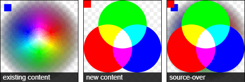

#### source-in

新图形只在新图形和目标画布重叠的地方绘制。其他的都是透明的。
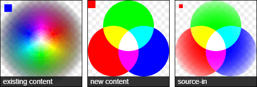

#### source-out

在不与现有画布内容重叠的地方绘制新图形。
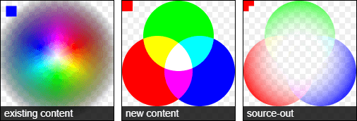

#### source-atop

新图形只在与现有画布内容重叠的地方绘制。


#### destination-over

在现有的画布内容后面绘制新的图形。
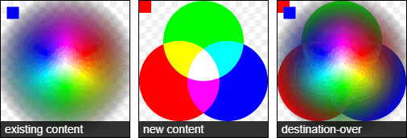

#### destination-in

现有的画布内容保持在新图形和现有画布内容重叠的位置。其他的都是透明的。
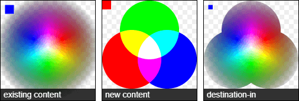

#### destination-out

现有内容保持在新图形不重叠的地方。
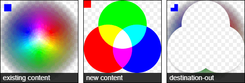

#### destination-atop

现有的画布只保留与新图形重叠的部分，新的图形是在画布内容后面绘制的。


#### lighter

两个重叠图形的颜色是通过颜色值相加来确定的。


#### copy

只显示新图形。


#### xor

图像中，那些重叠和正常绘制之外的其他地方是透明的。
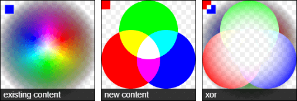

#### multiply

将顶层像素与底层相应像素相乘，结果是一幅更黑暗的图片。


#### screen

像素被倒转，相乘，再倒转，结果是一幅更明亮的图片。


#### overlay

multiply 和 screen 的结合，原本暗的地方更暗，原本亮的地方更亮。


#### darken

保留两个图层中最暗的像素。


#### lighten

保留两个图层中最亮的像素。
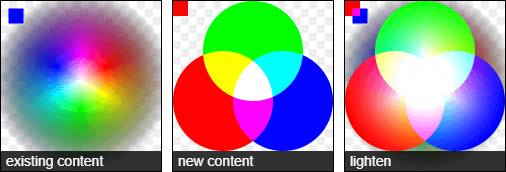

#### color-dodge

将底层除以顶层的反置。


#### color-burn

将反置的底层除以顶层，然后将结果反过来。
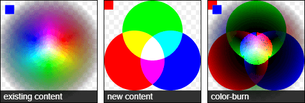

#### hard-light

屏幕相乘（A combination of multiply and screen）类似于叠加，但上下图层互换了。


#### soft-light

用顶层减去底层或者相反来得到一个正值。


#### difference

一个柔和版本的强光（hard-light）。纯黑或纯白不会导致纯黑或纯白。
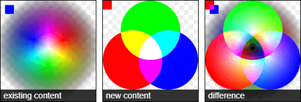

#### exclusion

和 difference 相似，但对比度较低。


#### hue

保留了底层的亮度（luma）和色度（chroma），同时采用了顶层的色调（hue）。
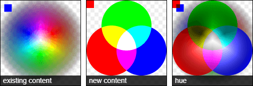

#### saturation

保留底层的亮度（luma）和色调（hue），同时采用顶层的色度（chroma）。
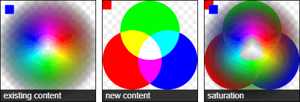

#### color

保留了底层的亮度（luma），同时采用了顶层的色调(hue)和色度(chroma)。


#### luminosity

保持底层的色调（hue）和色度（chroma），同时采用顶层的亮度（luma）。
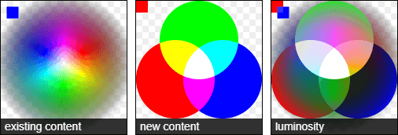

### 二、裁切路径

裁切路径和普通的 canvas 图形差不多，不同的是它的作用是遮罩，用来隐藏不需要的部分。和上面介绍的 globalCompositeOperation 属性作一比较，它可以实现与 source-in 和 source-atop 差不多的效果。最重要的区别是裁切路径不会在 canvas 上绘制东西，而且它永远不受新图形的影响。这些特性使得它在特定区域里绘制图形时相当好用。

| 方法   | 描述                                       |
| ------ | ------------------------------------------ |
| clip() | 将当前正在构建的路径转换为当前的裁剪路径。 |

### 三、实现动画的步骤

1. 清空 canvas
   除非接下来要画的内容会完全充满 canvas （例如背景图），否则你需要清空所有。最简单的做法就是用 clearRect 方法。
2. 保存 canvas 状态
   如果你要改变一些会改变 canvas 状态的设置（样式，变形之类的），又要在每画一帧之时都是原始状态的话，你需要先保存一下。
3. 绘制动画图形（animated shapes）
   这一步才是重绘动画帧。
4. 恢复 canvas 状态
   如果已经保存了 canvas 的状态，可以先恢复它，然后重绘下一帧。

### 四、操控动画 Controlling an animation

| 方法                            | 描述                                                                                 |
| ------------------------------- | ------------------------------------------------------------------------------------ |
| setInterval(function, delay)    | 当设定好间隔时间后，function 会定期执行。                                            |
| setTimeout(function, delay)     | 在设定好的时间之后执行函数                                                           |
| requestAnimationFrame(callback) | 告诉浏览器你希望执行一个动画，并在重绘之前，请求浏览器执行一个特定的函数来更新动画。 |

### 总结

<font color=#999AAA > 
以上全部学习笔记便是关于Canvas的相关操作方法，感兴趣的小伙伙伴可以自行查阅以及联系。
</font>

<br />
<br />
<br />

`最后，如果您有更好的方法，欢迎在留言区中分享；或者实际操作中遇到什么问题均可留言或者私信我，感谢您的观看！`

参考文档：[Canvas - Web API 接口参考 | MDN](https://developer.mozilla.org/zh-CN/docs/Web/API/Canvas_API)
