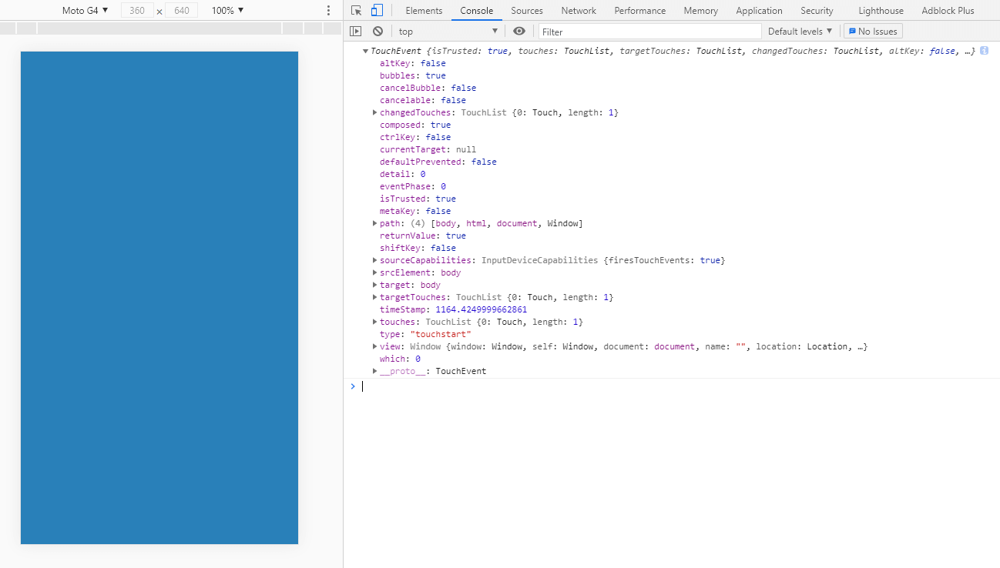

# touch 触摸事件以及常用触摸功能

## 前言

为了给基于触摸的用户界面提供高质量的支持，触摸事件提供了在触摸屏或触控板上解释手指（或触控笔）活动的能力。我们可以通过触摸事件监听用户的操作，从而响应用户。

## 一、触摸事件

触摸事件主要有三种，一种是触摸开始，一种是触摸并且滑动，还有一种是触摸结束：

- touchstart: 开始触摸.
- touchmove: 触摸滑动.
- touchend: 触摸结束.

## 二、 事件对象 event

我们先绑定一个开始触摸事件给 body 来查看一下回调函数中的 event 对象。注意，需要打开浏览器的移动设备调试。

```html
<style>
  * {
    margin: 0;
    padding: 0;
  }
  body {
    width: 100vw;
    height: 100vh;
    background-color: #2c3e50;
  }
</style>
<body></body>
<script>
  let body = document.getElementsByTagName("body")[0];
  body.addEventListener("touchstart", function (e) {
    console.log(e);
  });
</script>
```



重要参数：

- touches: TouchList 列表，只读。会列出所有当前在`与触摸表面接触`的 Touch 对象，不管触摸点是否已经改变或其目标元素是在处于 touchstart 阶段。
- targetTouches: TouchList 列表，只读。包含`仍与触摸面接触`的所有触摸点的 Touch 对象。
- changedTouches: 这个 TouchList 对象列出了`和这个触摸事件对应`的 Touch 对象。
  - 对于 touchstart 事件, 这个 TouchList 对象列出在此次事件中新增加的触点。
  - 对于 touchmove 事件，列出和上一次事件相比较，发生了变化的触点。
  - 对于 touchend 事件，changedTouches 是已经从触摸面的离开的触点的集合（也就是说，手指已经离开了屏幕/触摸面）。


## 三、 功能案例

### 1. 检测滑动方向

```js
// html、style 结构同上
function directionMonitor() {
  let body = document.getElementsByTagName("body")[0];
  let startX, startY, endX, endY;
  body.addEventListener("touchstart", function (e) {
    startX = e.targetTouches[0].pageX;
    startY = e.targetTouches[0].pageY;
  });
  body.addEventListener("touchend", function (e) {
    endX = e.changedTouches[0].pageX;
    endY = e.changedTouches[0].pageY;

    let horizontalStatus = endX > startX ? "向右滑动" : "向左滑动";
    let verticalStatus = endY > startY ? "向下滑动" : "向上滑动";

    console.log(`当前的操作：${horizontalStatus},${verticalStatus}`);
  });
}
```

### 2. 实现元素拖拽

在实现这个功能的时候，一直找不到怎么获取相对位置，幸好小硅壳博主相关文章介绍，[点击跳转](https://blog.csdn.net/weixin_50794208/article/details/113858299)

实现关键，获取触控点位于触控元素上的位置。


```html
<style>
  * {
    margin: 0;
    padding: 0;
  }

  body,
  .touch {
    width: 100vw;
    height: 100vh;
    background-color: #2c3e50;
    overflow: hidden;
  }

  .touch .touch-item {
    position: absolute;
    width: 100px;
    height: 100px;
    background-color: #2980b9;
  }
</style>
<div class="touch">
  <div class="touch-item"></div>
</div>
<script>
  function dragMonitor(dragDom) {
    let touchItem = document.querySelector(dragDom);
    let relativeX = 0;
    let relativeY = 0;

    touchItem.addEventListener("touchstart", function (eStart) {
      relativeX = eStart.targetTouches[0].pageX - this.offsetLeft;
      relativeY = eStart.targetTouches[0].pageY - this.offsetTop;
    });

    touchItem.addEventListener("touchmove", function (eMove) {
      let moveX = eMove.targetTouches[0].pageX - relativeX;
      let moveY = eMove.targetTouches[0].pageY - relativeY;

      this.style.left = moveX + "px";
      this.style.top = moveY + "px";
    });
  }
  dragMonitor(".touch-item");
</script>
```


### 3. 实现元素旋转

实现关键：方位角，其是计算两点间的偏移角度。返回弧度单位值。

```js
// 在javascript中提供了Math.atan2()函数
Math.atan2(终点y - 起点y, 终点x - 起点x);
```


```js
function rotateMonitor(dragDom) {
  let touchItem = document.querySelector(dragDom);
  let startX, startY;

  touchItem.addEventListener("touchstart", function (eStart) {
    startX = eStart.targetTouches[0].pageX;
    startY = eStart.targetTouches[0].pageY;
  });

  touchItem.addEventListener("touchmove", function (eMove) {
    let moveX = eMove.targetTouches[0].pageX,
      moveY = eMove.targetTouches[0].pageY;

    this.style.transform = `rotate(${getAngle(startX, startY, moveX, moveY)}deg)`;
  });

  function getAngle(p1X, p1Y, p2X, p2Y) {
    let x = p2X - p1X,
      y = p2Y - p1Y;
    return (Math.atan2(y, x) / Math.PI) * 180;
  }
}
dragMonitor(".touch-item");
```


原文：http://blog.sina.com.cn/s/blog_468530a60102wzkw.html
出处：https://www.cnblogs.com/mengff/p/6005516.html

盒子拖拽效果：https://blog.csdn.net/weixin_50794208/article/details/113858299

## 总结

综上，便是今天所介绍的全部内容，在触摸事件中，需要区分 touches、targetTouches、changedTouches，三个 TouchList 列表。感兴趣的可以拷贝 demo 运行查看结果。

<br />
<br />
<br />

`最后，如果您有更好的方法，欢迎在留言区中分享；或者实际操作中遇到什么问题均可留言或者私信我，感谢您的观看！`

参考博客：

[等风来 - touch 事件中的 touches、targetTouches 和 changedTouches 详解](https://www.cnblogs.com/mengff/p/6005516.html)

[小硅壳 - 原生 js 小案例：移动端触屏拖动元素](https://blog.csdn.net/weixin_50794208/article/details/113858299)
