# DeepSeek 本地部署

> 随着 DeepSeek 的爆火，以及官方网站的响应时间越来越长，甚至提示服务器繁忙。于是萌生了本地部署的想法。

会学到什么：

1. 了解 DeepSeek 的各个版本的运行要求
2. 借助 Ollama 部署 DeepSeek（将安装 R1 1.5b 版本）
3. 常见的 WebUI

## 运行要求

不同版本模型硬件要求

|     模型版本     | 参数量  |                   显存需求（FP16）                   |           推荐 GPU（单卡）           | 多卡支持 | 量化支持 |                                 适用场景                                 |
| :--------------: | :-----: | :--------------------------------------------------: | :----------------------------------: | :------: | :------: | :----------------------------------------------------------------------: |
| DeepSeek-R1-1.5B |  15 亿  |                         3GB                          |         GTX 1650（4GB 显存）         |   无需   |   支持   |      低资源设备部署（树莓派、旧款笔记本）、实时文本生成、嵌入式系统      |
|  DeepSeek-R1-7B  |  70 亿  |                         14GB                         |      RTX 3070/4060（8GB 显存）       |   可选   |   支持   |           中等复杂度任务（文本摘要、翻译）、轻量级多轮对话系统           |
|  DeepSeek-R1-8B  |  80 亿  |                         16GB                         |        RTX 4070（12GB 显存）         |   可选   |   支持   |               需更高精度的轻量级任务（代码生成、逻辑推理）               |
| DeepSeek-R1-14B  | 140 亿  |                         32GB                         |     RTX 4090/A5000（16GB 显存）      |   推荐   |   支持   |          企业级复杂任务（合同分析、报告生成）、长文本理解与生成          |
| DeepSeek-R1-32B  | 320 亿  |                         64GB                         |        A100 40GB（24GB 显存）        |   推荐   |   支持   |          高精度专业领域任务（医疗/法律咨询）、多模态任务预处理           |
| DeepSeek-R1-70B  | 700 亿  |                        140GB                         | 2x A100 80GB/4x RTX 4090（多卡并行） |   必需   |   支持   |     科研机构/大型企业（金融预测、大规模数据分析）、高复杂度生成任务      |
|  DeepSeek-671B   | 6710 亿 | 512GB+（单卡显存需求极高，通常需要多节点分布式训练） |      8x A100/H100（服务器集群）      |   必需   |   支持   | 国家级/超大规模 AI 研究（气候建模、基因组分析）、通用人工智能（AGI）探索 |

## 安装 Ollama

`ollama` 是一个用于本地运行和管理 大语言模型（LLMs） 的开源工具，可以通过它在本地轻松下载、运行和交互各种 AI 语言模型，而不依赖云端 API，提高了数据隐私性和响应速度。

下载：[ollama](https://ollama.com/)

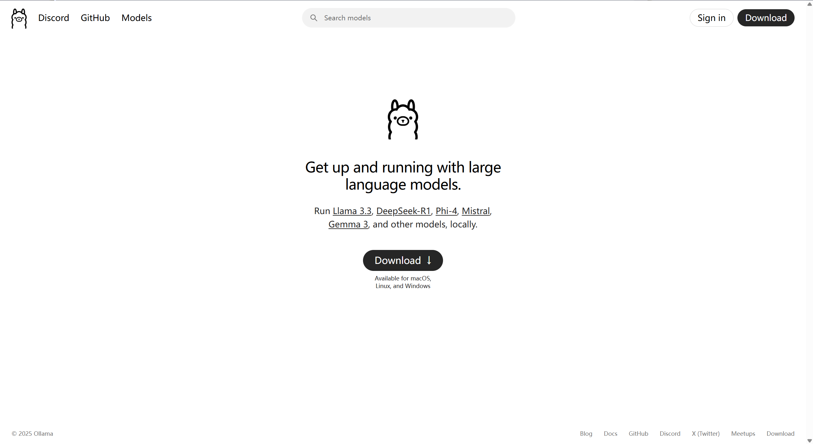

安装：

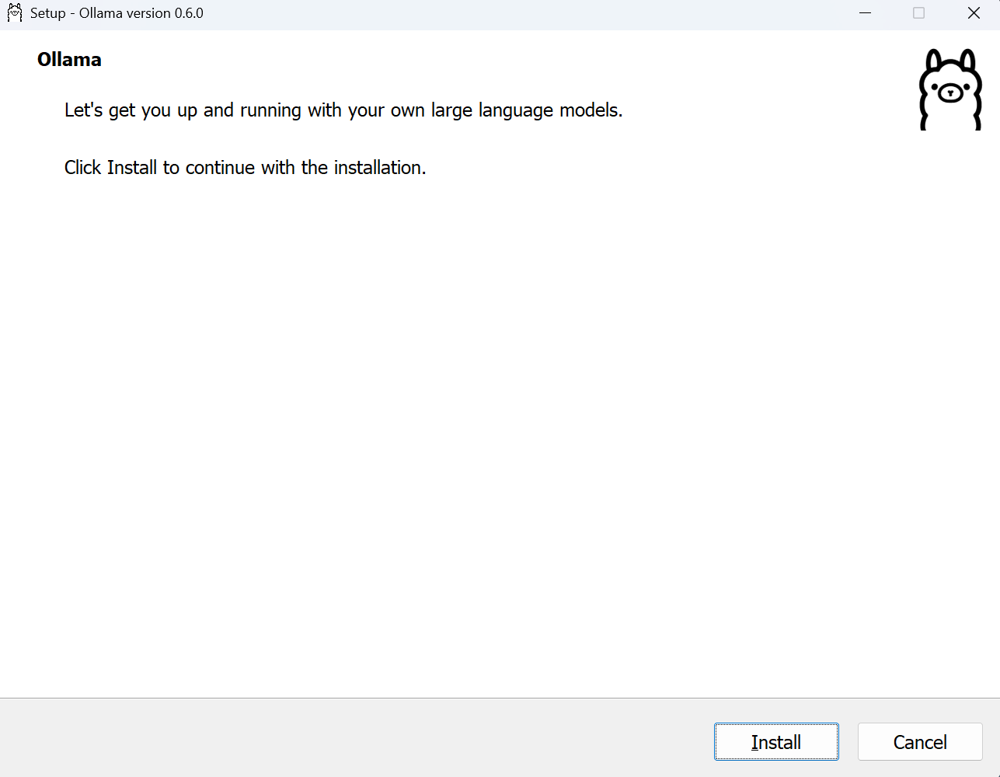

安装完成后，可通过终端检验 ollama 是否安装成功。如输出 `ollama version is 0.6.0` 等字样，说明已经安装成功。

```shell
ollama -v
```

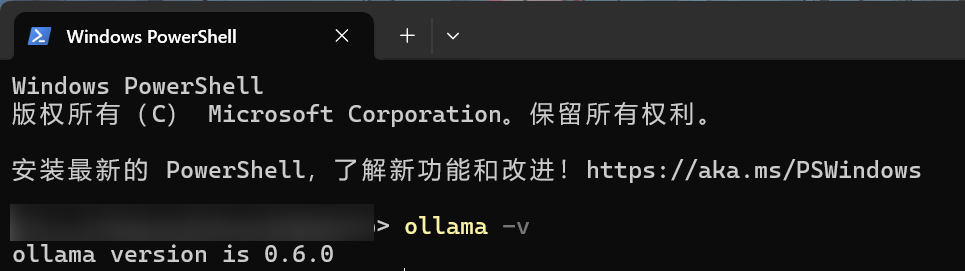

## 安装并运行 DeepSeek

在上一步中，我们已经完成了 ollama 的安装，且在终端执行验证了 ollama 的指令。随后开始对 deepseek 的安装。

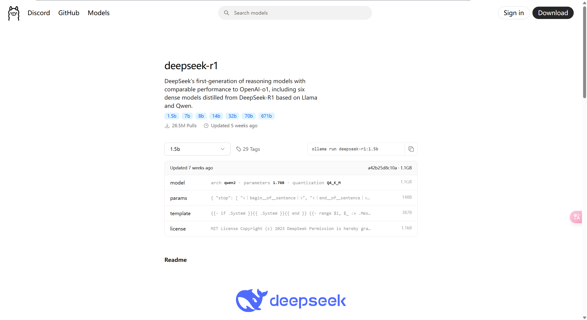

```shell
# 运行 deepseek-r1 1.5b 模型
# 初次运行该模型时，会自动下载
# 指令参数详情：https://ollama.com/library/deepseek-r1:1.5b
ollama run deepseek-r1:1.5b
```

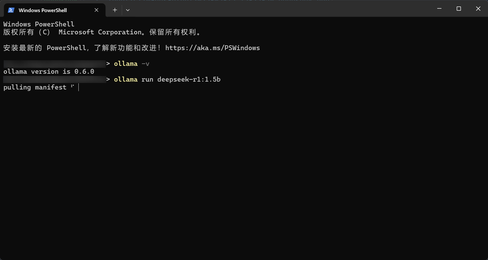

:::warning 可能遇到的问题

```shell
Error: pull model manifest: Get "https://registry.ollama.ai/v2/library/deepseek-r1/manifests/1.5b": net/http: TLS handshake timeout
```

安装 deepseek 时，如出现超时情况，可能是因为代理的问题，尝试关闭代理并重新执行安装命令即可。
:::

运行成功后，会出现 `Send a message` 字样，说明已经成功在本地运行 deepseek。

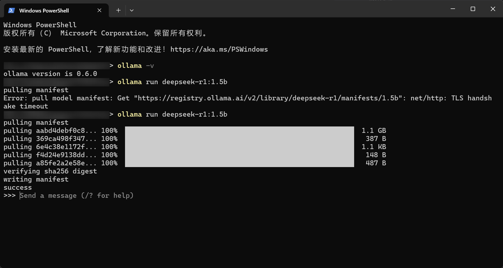

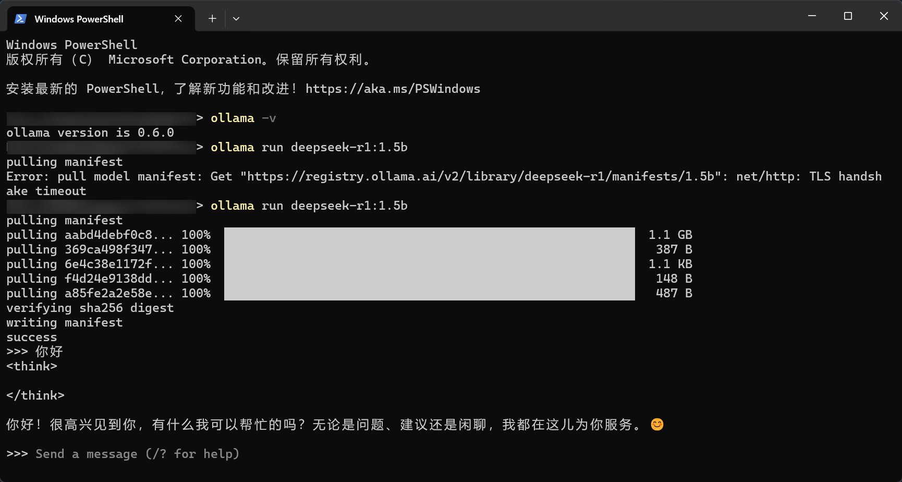

截至，已经完成了 deepseek 本地部署操作，但不难发现直接再终端上交互，体验感并不好。

## WebUI

为了优化交互体验，市面上有两个工具结合使用，可以根据各自的爱好自行选择一个即可。

### Page Assit

这是一个浏览器插件。

[Page Assit 安装 👉](https://chromewebstore.google.com/detail/page-assist-%E6%9C%AC%E5%9C%B0-ai-%E6%A8%A1%E5%9E%8B%E7%9A%84-web/jfgfiigpkhlkbnfnbobbkinehhfdhndo?hl=zh-cn)

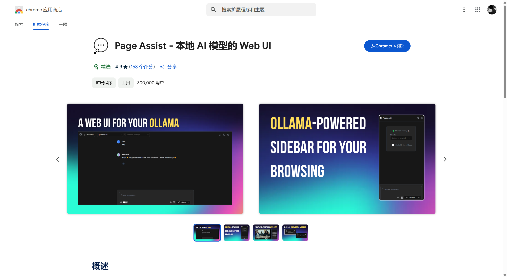

安装成功后，点击浏览器插件的 Page Assit 图标，将自动打开一个界面。

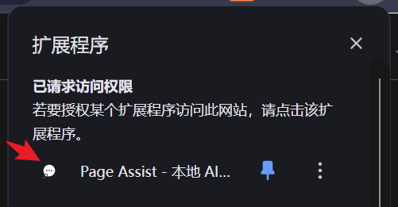

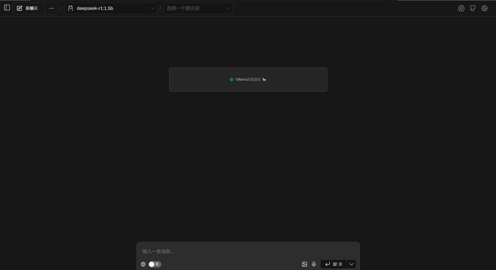

输入内容，提交即可。

### Chatbox

这是一个客户端程序。

[Chatbox 官网 👉](https://chatboxai.app/zh)

下载、安装、打开。

选择“使用自己的 API Key 或本地模型”，选择 ollama API，选择 deepseek-r1:1.5b 模型保存，即可使用。


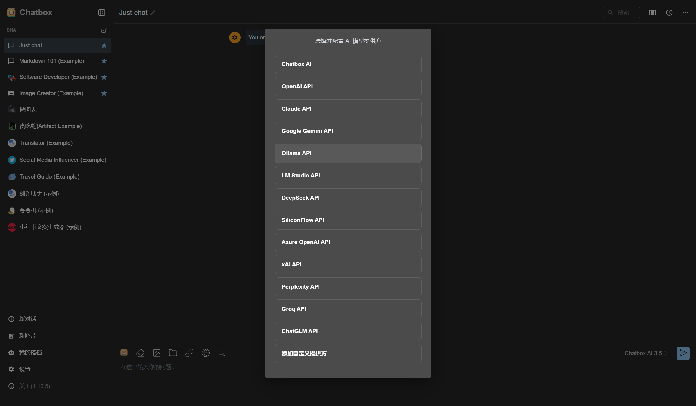

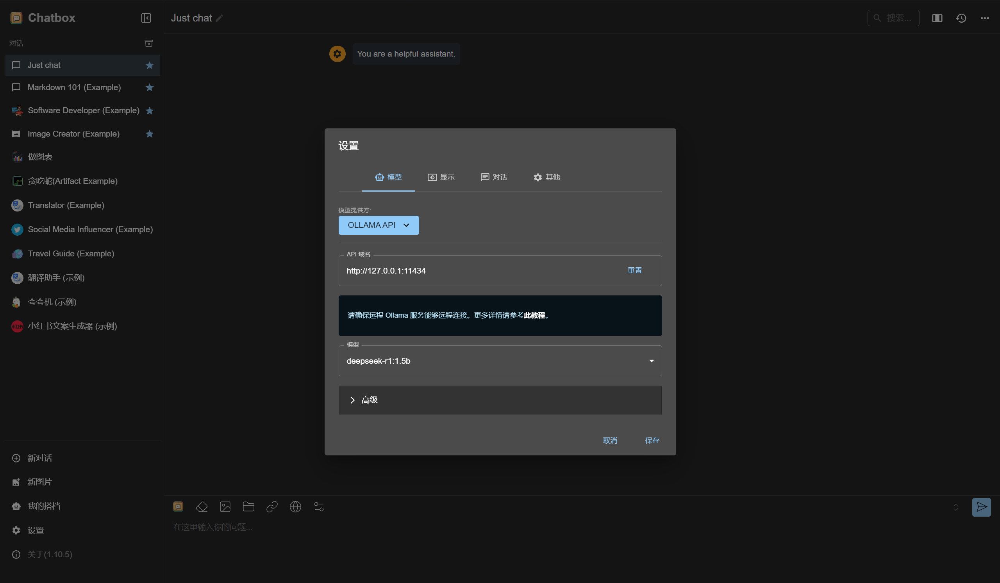

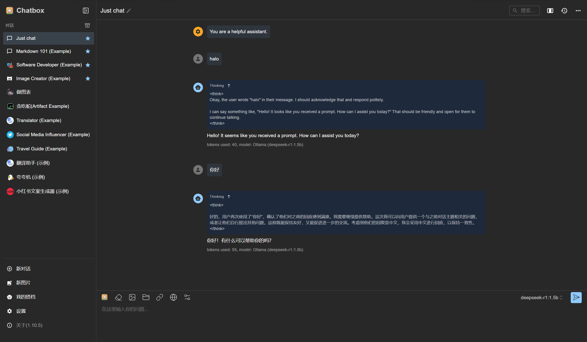

## 参考资料

1. [本地部署 DeepSeek：小白也能轻松搞定！](https://www.cnblogs.com/xiezhr/p/18712410)

2. [最简洁 DeepSeek 本地部署教程](https://deepseek.csdn.net/67abf83159bcf8384ab65a7a.html)
