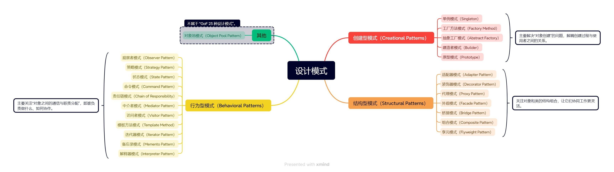

# 设计模式

设计模式是软件开发中常用的一种解决特定问题的**可复用解决方案**，它总结了很多前人经验，让程序结构更清晰、可维护性更强。

设计模式大致可以分为三类（GoF 设计模式）：

- 创建型模式：主要解决“对象的创建”问题。
- 结构型模式：主要关注“类和对象的组合结构”。
- 行为型模式：主要关注“对象之间的通信和职责划分”。



## 🎯 创建型模式（Creational Patterns）

> 主要解决“对象创建”的问题，解耦创建过程与使用者之间的关系。

### 1️⃣ 单例模式（Singleton）

✅ 定义：保证一个类只有一个实例，并提供全局访问点。

🎯 应用场景

- 全局状态管理（如 Vuex、Redux）
- 配置管理、日志管理器、全局缓存等

⚙️ 前端示例（配置管理器）

```typescript
class ConfigManager {
  private static instance: ConfigManager;
  private config: Record<string, any> = {};

  private constructor() {}

  static getInstance() {
    if (!ConfigManager.instance) {
      ConfigManager.instance = new ConfigManager();
    }
    return ConfigManager.instance;
  }

  set(key: string, value: any) {
    this.config[key] = value;
  }

  get(key: string) {
    return this.config[key];
  }
}

// 使用
const config1 = ConfigManager.getInstance();
const config2 = ConfigManager.getInstance();
console.log(config1 === config2); // true
```

⚙️ 前端示例（全局事件总线 / 配置管理器）

场景：比如你在 Vue 项目中需要一个全局的 event bus 来处理组件通信。

```typescript
// EventBus.ts
class EventBus {
  private static instance: EventBus;
  private listeners = new Map<string, Function[]>();

  private constructor() {}

  static getInstance() {
    if (!EventBus.instance) {
      EventBus.instance = new EventBus();
    }
    return EventBus.instance;
  }

  on(event: string, handler: Function) {
    const handlers = this.listeners.get(event) || [];
    handlers.push(handler);
    this.listeners.set(event, handlers);
  }

  emit(event: string, data: any) {
    this.listeners.get(event)?.forEach((fn) => fn(data));
  }
}
```

👍 优点

- 控制实例个数，节省资源
- 提供全局访问点

👎 缺点

- 不利于测试（难以 mock）
- 可能隐藏依赖关系（全局状态污染）

### 2️⃣ 工厂方法模式（Factory Method）

✅ 定义：定义一个用于创建对象的接口，由子类决定实例化哪一个类。

🎯 应用场景

- 创建同一类型但不同细节的对象，如不同按钮样式、不同类型图标等

⚙️ 前端示例（创建不同样式的按钮）

```typescript
interface Button {
  render(): void;
}

class PrimaryButton implements Button {
  render() {
    console.log("渲染蓝色按钮");
  }
}

class DangerButton implements Button {
  render() {
    console.log("渲染红色按钮");
  }
}

class ButtonFactory {
  static createButton(type: "primary" | "danger"): Button {
    if (type === "primary") return new PrimaryButton();
    if (type === "danger") return new DangerButton();
    throw new Error("Unknown type");
  }
}

// 使用
const btn = ButtonFactory.createButton("danger");
btn.render();
```

⚙️ 前端示例（图标组件工厂）

场景：前端项目需要根据类型渲染不同图标组件。

```typescript
function createIcon(type: "success" | "error" | "info") {
  switch (type) {
    case "success":
      return `<svg>✅</svg>`;
    case "error":
      return `<svg>❌</svg>`;
    case "info":
      return `<svg>ℹ️</svg>`;
  }
}
```

👍 优点

- 解耦具体类的创建
- 扩展方便（增加新类型）

👎 缺点

- 类多了会复杂
- 每个新类型都需要新类

### 3️⃣ 抽象工厂模式（Abstract Factory）

✅ 定义：提供一系列相关或相互依赖对象的创建接口，而无需指定具体类。

🎯 应用场景

- 创建整套 UI 控件（按钮、输入框、弹窗等）
- 多主题系统（黑夜/白天模式）

⚙️ 前端示例（主题系统）

```typescript
interface Button {
  render(): void;
}

interface Input {
  render(): void;
}

interface UIFactory {
  createButton(): Button;
  createInput(): Input;
}

class LightFactory implements UIFactory {
  createButton() {
    return { render: () => console.log("浅色按钮") };
  }
  createInput() {
    return { render: () => console.log("浅色输入框") };
  }
}

class DarkFactory implements UIFactory {
  createButton() {
    return { render: () => console.log("深色按钮") };
  }
  createInput() {
    return { render: () => console.log("深色输入框") };
  }
}

// 使用
const factory: UIFactory = new DarkFactory();
factory.createButton().render();
factory.createInput().render();
```

⚙️ 前端示例（如 Ant Design 的主题切换）

创建一整套组件（按钮、输入框等）风格，适用于深色/浅色主题切换。

```typescript
class ThemeFactory {
  createButton(): string {
    return `<button class="btn-${this.getTheme()}">点击</button>`;
  }

  getTheme(): string {
    return "dark"; // 可根据 context 切换
  }
}
```

👍 优点

- 保证组件风格一致性
- 易于切换一整套组件主题

👎 缺点

- 增加系统复杂度
- 扩展新的产品族较困难

### 4️⃣ 建造者模式（Builder）

✅ 定义：将复杂对象的构建与表示分离，使得同样的构建过程可以创建不同表示。

🎯 应用场景

- 创建配置复杂的对象（例如表单、图表配置）
- 多步骤构建对象（链式调用）

⚙️ 前端示例（构建表单配置）

```typescript
class FormBuilder {
  private form: any = {
    fields: [],
  };

  addInput(label: string) {
    this.form.fields.push({ type: "input", label });
    return this;
  }

  addSelect(label: string, options: string[]) {
    this.form.fields.push({ type: "select", label, options });
    return this;
  }

  build() {
    return this.form;
  }
}

// 使用
const formConfig = new FormBuilder().addInput("用户名").addSelect("性别", ["男", "女"]).build();

console.log(formConfig);
```

⚙️ 前端示例（表单构建器 / ECharts 配置器）

场景：可视化平台中，根据用户输入动态构建图表配置或表单 JSON。

```typescript
const option = new EChartsBuilder()
  .setTitle("销量分析")
  .setXAxis(["一月", "二月"])
  .setSeries([{ type: "bar", data: [120, 200] }])
  .build();
```

👍 优点

- 构建过程清晰，代码可读性强
- 支持链式调用和复用

👎 缺点

- 类的数量可能增多
- 有些场景过于复杂反而不如直接创建

### 5️⃣ 原型模式（Prototype）

✅ 定义：通过复制已有对象来创建新对象，而不是通过构造函数。

🎯 应用场景

- 创建对象成本高（如大量初始化）
- 想要复制对象状态时（如撤销、快照）

⚙️ 前端示例（组件配置复制）

```typescript
const cardTemplate = {
  width: 300,
  height: 200,
  style: {
    border: "1px solid gray",
  },
};

const card1 = structuredClone(cardTemplate);
card1.width = 400;

console.log(cardTemplate.width); // 300
```

⚙️ 前端示例（快照功能 / 可视化搭建的“复制模块”）

场景：搭建平台中，用户点击“复制模块”时，复制一个复杂组件结构。

```typescript
const copiedComponent = structuredClone(selectedComponent);
copiedComponent.id = generateUniqueId();
```

👍 优点

- 性能高（避免重复初始化）
- 克隆复杂结构方便

👎 缺点

- 深拷贝处理可能比较复杂
- 克隆后状态可能存在副作用

## 🧱 结构型模式（Structural Patterns）

> 关注对象和类的结构组合，让它们协同工作更灵活。

### 1️⃣ 适配器模式（Adapter Pattern）

✅ 定义：将一个接口转换成客户端期望的另一个接口，让原本不兼容的接口能够协同工作。

🎯 应用场景

- 第三方库数据结构不符合你当前项目结构
- 接入旧接口（例如后端返回字段不一致）

⚙️ 前端示例

```typescript
// 后端返回的数据
const legacyUser = {
  user_name: "Alice",
  user_age: 25,
};

// 新接口期望的数据格式
interface User {
  name: string;
  age: number;
}

// 适配器函数
function adaptUser(data: typeof legacyUser): User {
  return {
    name: data.user_name,
    age: data.user_age,
  };
}

const user: User = adaptUser(legacyUser);
```

👍 优点

- 增加系统兼容性
- 不修改原有代码

👎 缺点

- 增加类/函数层级
- 有时会造成逻辑混乱

💡 实际案例

- 接入不同后端接口
- 把旧数据源适配成新组件可用的结构

### 2️⃣ 装饰器模式（Decorator Pattern）

✅ 定义：动态地为对象添加额外功能，而无需修改其结构。

🎯 应用场景

- 动态添加行为（如权限校验、loading、日志）
- HOC（高阶组件）和 Vue 的 @Watch/@Emit 装饰器

⚙️ 前端示例

```typescript
function withLoading(fn: Function) {
  return async (...args: any[]) => {
    console.log("Loading...");
    const result = await fn(...args);
    console.log("Done.");
    return result;
  };
}

async function fetchData() {
  return "data";
}

const fetchWithLoading = withLoading(fetchData);
fetchWithLoading();
```

👍 优点

- 单一职责
- 灵活组合功能

👎 缺点

- 层层包装可能降低可读性
- 调试难度增加

💡 实际案例

- Vue Class Component 装饰器
- React HOC（如 withAuth(Component)）

### 3️⃣ 代理模式（Proxy Pattern）

✅ 定义：为其他对象提供一个代理以控制对它的访问。

🎯 应用场景

- 权限校验
- 请求拦截（如 API 限流、缓存）
- 图片懒加载

⚙️ 前端示例（图片懒加载）

```typescript
function createImageProxy(url: string) {
  const image = new Image();
  image.src = "loading.png";

  const realImg = new Image();
  realImg.onload = () => (image.src = realImg.src);
  realImg.src = url;

  return image;
}
```

👍 优点

- 控制访问权限
- 增强原对象功能

👎 缺点

- 增加复杂度
- 可能影响性能（如多层代理）

💡 实际案例

- Vue 的 reactive 使用了 Proxy 实现响应式
- 前端缓存层代理（如 fetch 包装器）

### 4️⃣ 外观模式（Facade Pattern）

✅ 定义：为子系统中的一组接口提供一个统一的高层接口，简化复杂操作。

🎯 应用场景

- 隐藏复杂逻辑（如调用多个模块）
- 提供简洁 API 给外部使用

⚙️ 前端示例（上传封装）

```typescript
class FileUploader {
  validate(file: File) {
    /* 校验逻辑 */
  }
  upload(file: File) {
    /* 上传逻辑 */
  }
  notify(msg: string) {
    /* 通知用户 */
  }
}

class UploadFacade {
  private uploader = new FileUploader();

  handleUpload(file: File) {
    this.uploader.validate(file);
    this.uploader.upload(file);
    this.uploader.notify("上传完成");
  }
}
```

👍 优点

- 简化调用流程
- 解耦子系统与外部交互

👎 缺点

- 封装不当会限制扩展性

💡 实际案例

- Axios 的 API 就是对 XMLHttpRequest 的外观封装
- UI 封装：this.$message.success() 背后可能调多个模块

### 5️⃣ 桥接模式（Bridge Pattern）

✅ 定义：将抽象和实现解耦，使它们可以独立变化。

🎯 应用场景

- 一类对象和多个实现，如图表类型 + 数据源
- 抽象行为与平台实现解耦

⚙️ 前端示例（图表渲染器）

```typescript
interface RenderEngine {
  draw(): void;
}

class CanvasRenderer implements RenderEngine {
  draw() {
    console.log("使用 Canvas 渲染");
  }
}

class Chart {
  constructor(private engine: RenderEngine) {}
  render() {
    this.engine.draw();
  }
}

const chart = new Chart(new CanvasRenderer());
chart.render();
```

👍 优点

- 组合替代继承，扩展性强
- 解耦抽象和实现

👎 缺点

- 结构稍复杂

💡 实际案例

- Vue3 的 Renderer 层就可以桥接 Web / Native 渲染

### 6️⃣ 组合模式（Composite Pattern）

✅ 定义：将对象组合成树形结构以表示“部分-整体”的层级结构。

🎯 应用场景

- UI 组件树、菜单结构、文件系统结构

⚙️ 前端示例（递归菜单）

```typescript
interface MenuItem {
  title: string;
  children?: MenuItem[];
}

function renderMenu(menu: MenuItem[]) {
  menu.forEach((item) => {
    console.log(item.title);
    if (item.children) {
      renderMenu(item.children);
    }
  });
}
```

👍 优点

- 一致的操作方式处理单个和多个对象
- 容易扩展新节点

👎 缺点

- 不容易限制某些节点类型
- 递归处理可能带来性能问题

💡 实际案例

- Vue 的嵌套组件 / slot 结构
- 递归菜单渲染

### 7️⃣ 享元模式（Flyweight Pattern）

✅ 定义：通过共享技术来有效支持大量细粒度对象的复用，减少内存开销。

🎯 应用场景

- 渲染大量重复对象，如文本字符、图标等
- 地图标点、大型列表

⚙️ 前端示例（缓存图标组件）

```typescript
const iconCache = new Map();

function getIcon(name: string) {
  if (!iconCache.has(name)) {
    iconCache.set(name, `<svg>${name}</svg>`);
  }
  return iconCache.get(name);
}
```

👍 优点

- 节省内存
- 提升性能

👎 缺点

- 增加逻辑复杂度
- 管理共享状态困难

💡 实际案例

- 字符绘制系统（如 Canvas 文本）
- 虚拟列表的 DOM 复用

## 🤖 行为型模式（Behavioral Patterns）

> 主要关注“对象之间的通信与职责分配”，即谁负责做什么、如何协作。

### 1️⃣ 观察者模式（Observer Pattern）

✅ 定义：对象之间一对多的依赖关系，一个对象状态改变时，所有依赖者都会收到通知。

🎯 应用场景

- 事件系统（如 EventEmitter）
- 数据响应式（Vue2 响应式原理）
- 发布订阅模型

⚙️ 前端示例（简单事件总线）

```typescript
class EventBus {
  private listeners = new Map<string, Function[]>();

  on(event: string, fn: Function) {
    const fns = this.listeners.get(event) || [];
    fns.push(fn);
    this.listeners.set(event, fns);
  }

  emit(event: string, data?: any) {
    this.listeners.get(event)?.forEach((fn) => fn(data));
  }
}
```

👍 优点

- 松耦合
- 扩展性强

👎 缺点

- 调试复杂
- 不容易追踪事件链条

💡 案例

- Vue 的 $watch, v-model
- React 的 useEffect, Redux store.subscribe()

### 2️⃣ 策略模式（Strategy Pattern）

✅ 定义：定义一系列算法，将每个算法封装起来，并使它们可以互换。

🎯 应用场景

- 表单验证策略
- UI 排序 / 筛选逻辑切换

⚙️ 前端示例（表单验证器）

```typescript
type Strategy = (value: string) => string | null;

const strategies: Record<string, Strategy> = {
  isNotEmpty: (val) => (val ? null : "不能为空"),
  isEmail: (val) => (/.+@.+/.test(val) ? null : "邮箱格式不正确"),
};

function validate(val: string, rules: string[]) {
  for (const rule of rules) {
    const err = strategies[rule](val);
    if (err) return err;
  }
  return null;
}
```

👍 优点

- 清晰分离不同策略
- 易于扩展

👎 缺点

- 策略类较多
- 客户端需要知道策略细节

💡 案例

- Element Plus 表单验证规则
- 排序组件（按热度/时间/评分）

### 3️⃣ 状态模式（State Pattern）

✅ 定义：允许对象在内部状态变化时改变其行为，看起来就像修改了类。

🎯 应用场景

- UI 多状态切换（登录中、已登录、异常）
- 有限状态机实现（如播放状态）

⚙️ 前端示例（按钮状态机）

```typescript
class Button {
  state: "idle" | "loading" | "success" = "idle";

  click() {
    if (this.state === "idle") {
      this.state = "loading";
      setTimeout(() => (this.state = "success"), 1000);
    }
  }

  render() {
    switch (this.state) {
      case "idle":
        return "点击";
      case "loading":
        return "加载中...";
      case "success":
        return "成功 ✅";
    }
  }
}
```

👍 优点

- 状态行为分离清晰
- 易维护多状态逻辑

👎 缺点

- 状态类可能过多
- 状态切换逻辑分散

💡 案例

- 播放器状态（播放/暂停/缓冲）
- 表单提交按钮状态切换

### 4️⃣ 命令模式（Command Pattern）

✅ 定义：将请求封装成对象，从而参数化客户端、队列执行或记录操作。

🎯 应用场景

- 操作记录（撤销、重做）
- 宏命令组合（多个操作一次性执行）

⚙️ 前端示例（撤销命令）

```typescript
type Command = () => void;

const history: Command[] = [];

function executeCommand(cmd: Command) {
  cmd();
  history.push(cmd);
}

function undo() {
  history.pop(); // 简化：实际应有逆操作
}
```

👍 优点

- 解耦调用者和执行者
- 易于组合和扩展

👎 缺点

- 类较多
- 简单场景使用略重

💡 案例

- 可视化平台（操作历史）
- 快捷键操作映射指令

### 5️⃣ 责任链模式（Chain of Responsibility）

✅ 定义：多个对象按顺序处理请求，直到有对象处理为止。

🎯 应用场景

- 表单校验链
- 中间件系统（如 Koa, Express）

⚙️ 前端示例（简单中间件实现）

```typescript
type Context = { msg: string };
type Middleware = (ctx: Context, next: () => void) => void;

function compose(middlewares: Middleware[]) {
  return function (ctx: Context) {
    let index = -1;
    function dispatch(i: number) {
      if (i <= index) return;
      index = i;
      middlewares[i]?.(ctx, () => dispatch(i + 1));
    }
    dispatch(0);
  };
}
```

👍 优点

- 解耦请求发送者与处理者
- 动态控制执行链

👎 缺点

- 调试较难
- 性能受限于链条长短

💡 案例

- Express/Koa 中间件
- Vue Router 的导航守卫链

### 6️⃣ 中介者模式（Mediator Pattern）

✅ 定义：封装多个对象之间的交互，避免对象之间显式引用。

🎯 应用场景

- 组件间通信协调复杂时
- 模块之间解耦（避免组件直接互相调用）

⚙️ 前端示例（中介者调度模块）

```typescript
class Mediator {
  components: Record<string, any> = {};

  register(name: string, component: any) {
    this.components[name] = component;
  }

  notify(sender: string, event: string) {
    Object.entries(this.components).forEach(([name, comp]) => {
      if (name !== sender && typeof comp[event] === "function") {
        comp[event]();
      }
    });
  }
}
```

👍 优点

- 降低模块耦合度
- 集中控制通信逻辑

👎 缺点

- 中介者本身容易变得复杂

💡 案例

- 事件总线作为调度中心
- 表单组件之间联动（如选择省份后加载城市）

### 7️⃣ 访问者模式（Visitor Pattern）

✅ 定义：在不改变数据结构的前提下，定义作用于其上的新操作。

🎯 应用场景

- 遍历结构执行不同操作
- AST 解析器、富文本处理

⚙️ 前端示例（节点渲染）

```typescript
type Node = { type: "text" | "image"; content: string };

function render(nodes: Node[]) {
  nodes.forEach((node) => {
    switch (node.type) {
      case "text":
        console.log(`文本: ${node.content}`);
        break;
      case "image":
        console.log(`图片: ${node.content}`);
        break;
    }
  });
}
```

👍 优点

- 新增操作很方便
- 分离操作逻辑与数据结构

👎 缺点

- 增加结构复杂性
- 修改数据结构困难

💡 案例

- Babel 的 AST 访问器
- 富文本编辑器结构遍历

### 8️⃣ 模板方法模式（Template Method）

✅ 定义：定义一个算法框架，将具体步骤延迟到子类实现。

🎯 应用场景

- 封装通用流程结构（如渲染流程）
- 提供默认行为但允许定制

⚙️ 前端示例（页面渲染模板）

```typescript
abstract class Page {
  render() {
    this.init();
    this.fetchData();
    this.renderUI();
  }
  abstract init(): void;
  abstract fetchData(): void;
  abstract renderUI(): void;
}
```

👍 优点

- 复用流程结构
- 保证一致性

👎 缺点

- 扩展受限（需继承）

💡 案例

- React 生命周期流程控制
- 页面骨架组件

### 9️⃣ 迭代器模式（Iterator Pattern）

✅ 定义：提供一种顺序访问聚合对象元素的方法，而不暴露内部结构。

🎯 应用场景

- 自定义数据结构遍历
- 虚拟 DOM 节点树、表单字段集合

⚙️ 前端示例

```typescript
const iterator = {
  index: 0,
  data: [1, 2, 3],
  next() {
    if (this.index < this.data.length) {
      return { value: this.data[this.index++], done: false };
    } else {
      return { done: true };
    }
  },
};
```

👍 优点

- 封装遍历逻辑
- 支持多种遍历方式

👎 缺点

- 实现略繁琐

💡 案例

- ES6 的 Symbol.iterator
- Vue 的 v-for 实现

### 1️⃣0️⃣ 备忘录模式（Memento Pattern）

✅ 定义：在不破坏封装性的前提下，捕获并保存对象的内部状态，以便在以后恢复到该状态（如撤销、恢复）。

🎯 应用场景

- 编辑器的撤销/重做功能
- 表单状态恢复
- 游戏存档 / 配置回滚
- Web 页面状态快照

⚙️ 前端示例：表单撤销功能（简化版）

```typescript
class FormState {
  constructor(public name: string, public age: number) {}
}

class Form {
  private state: FormState = new FormState("", 0);
  private history: FormState[] = [];

  setState(name: string, age: number) {
    this.history.push(new FormState(this.state.name, this.state.age));
    this.state = new FormState(name, age);
  }

  undo() {
    if (this.history.length) {
      this.state = this.history.pop()!;
    }
  }

  getState() {
    return this.state;
  }
}
```

👍 优点

- 实现“撤销/恢复”功能非常优雅
- 保持封装性，不暴露对象内部结构

👎 缺点

- 状态多时，占用内存大
- 管理复杂度高（需要快照/恢复策略）

💡 业务案例

- 富文本编辑器（Notion、Word、Figma 等）
- 前端拖拽组件历史记录
- 游戏或复杂配置界面，支持一键“恢复默认”

### 1️⃣1️⃣ 解释器模式（Interpreter Pattern）

✅ 定义：为某种语言构建一个解释器，用于解释该语言中的语句。

🎯 应用场景

- 自定义表达式解析（如逻辑规则、条件语句）
- 模板引擎（如 Mustache）
- 表达式计算器（如 1 + (2 \* 3)）
- JSONPath / CSS selector 解析

⚙️ 前端示例：简单表达式求值器（仅支持 + 和数字）

```typescript
function interpret(expr: string): number {
  return expr
    .split("+")
    .map(Number)
    .reduce((a, b) => a + b, 0);
}

console.log(interpret("10+20+30")); // 输出 60
```

💡 更复杂的版本需要构建语法树（AST）再进行递归求值。

👍 优点

- 灵活处理自定义语言/规则
- 新语法支持易扩展

👎 缺点

- 性能差，不适合复杂逻辑
- 编写解释器逻辑较繁琐

💡 业务案例

- Vue 的模板语法解析器（{{ message }}）
- 表单逻辑引擎（如 if age > 18 then show section）
- 表达式条件引擎（例如可配置的自动化任务）

## 🧩 其他设计模式

不属于 “GoF 23 种设计模式”。

### 1️⃣ 对象池模式（Object Pool Pattern）

对象池模式（Object Pool Pattern）也是一种非常实用的优化模式，虽然它在 “GoF 23 种设计模式” 中没有被单独列出，但在前端/游戏开发/高性能应用中 **极其常见**。

✅ 定义：对象池是一种 **缓存对象** 的设计模式。它将已经创建的对象存储在一个“池”中，当需要使用时从池中取出，使用完后再归还，**避免频繁创建和销毁**对象。

🎯 应用场景

- 游戏开发中频繁生成/销毁子弹、粒子等对象
- 前端虚拟列表中 DOM 节点复用
- 创建成本高的对象（如网络连接、Canvas、WebGLContext）

⚙️ 前端示例（TS 实现 DOM 节点复用池）

```typescript
class DivPool {
  private pool: HTMLDivElement[] = [];

  get(): HTMLDivElement {
    return this.pool.length > 0 ? this.pool.pop()! : document.createElement("div");
  }

  release(div: HTMLDivElement) {
    div.innerHTML = ""; // 清理内容
    this.pool.push(div);
  }
}

// 使用方式
const pool = new DivPool();

const node1 = pool.get();
node1.innerText = "我是使用过的";
document.body.appendChild(node1);

// 用完之后放回池子
pool.release(node1);
```

👍 优点

- 大幅减少高频对象创建的性能开销
- 降低 GC 压力（尤其在动画/渲染场景）
- 提升应用流畅度和响应速度

👎 缺点

- 管理复杂，需要注意初始化/清理状态
- 池过大可能造成资源浪费
- 池中对象状态可能未完全重置，容易产生 bug

💡 实际业务案例

- 虚拟滚动组件（Virtual Scroll）：复用固定数量的 DOM 元素，只更新内容和位置，提升大列表渲染性能
- WebGL 粒子系统：子弹/粒子对象通过对象池循环使用
- 前端性能监控工具：复用日志对象收集性能数据，减少频繁 new 对象

## 🔗 参考

[👉 GoF 设计模式 - gof](https://github.com/qiualiang/gof)
