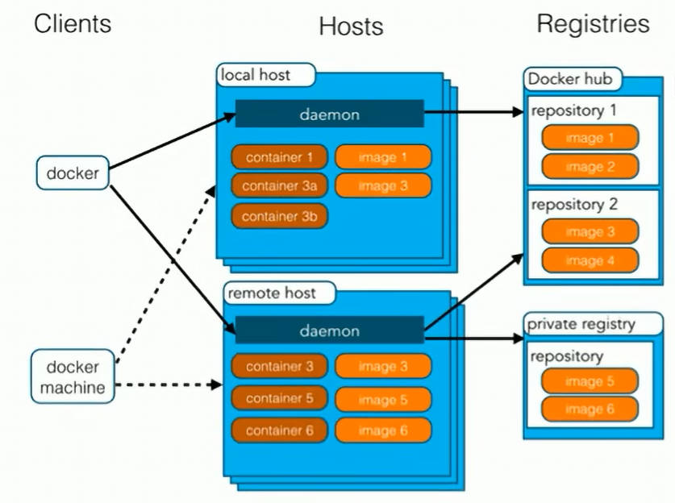
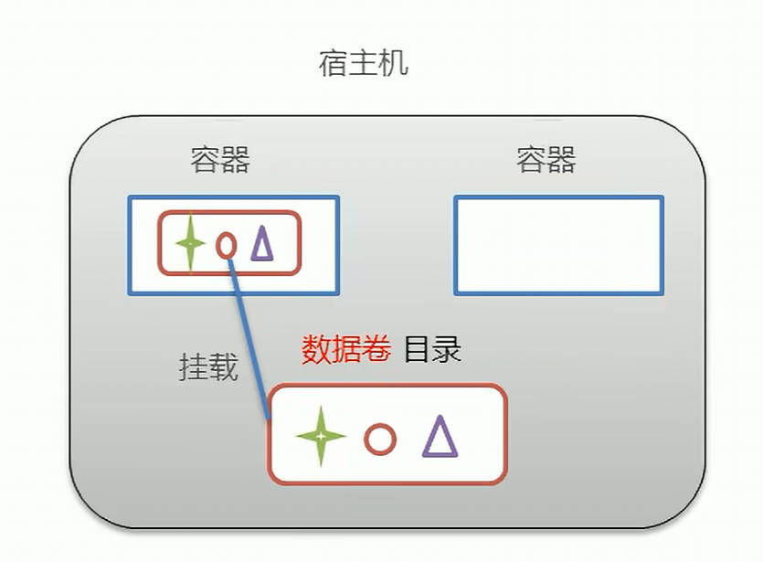
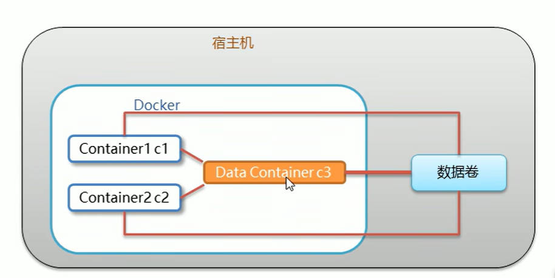
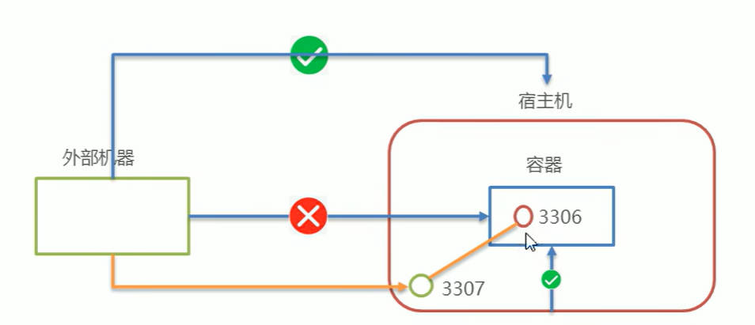

# Docker 学习笔记

## 初识

### 概述

> 在项目生命周期中，我们编写的代码会接触几个环境：开发环境、测试环境和生产环境。当软件跨环境迁移运行时，可能会出现`代码水土不服`。

- Docker 是一个开源的`应用容器引擎`；
- 诞生于 2013 年，基于 `Go 语言`实现，dotCloud 公司出品（后改名为 Docker Inc.）
- Docker 可以让开发者打包他们的应用以及依赖包到一个`轻量级、可移植的`容器中，然后发布到任何流行的 Linux 机器上；
- 容器时完全使用`沙箱机制`，且`互相隔离`；
- 容器性能`开销极低`。
- Docker 从 17.03 版本之后分为 CE(Community Edition: 社区版)和 EE(Enterprise Edition: 企业版)

`Docker 是一种容器技术，解决软件跨环境迁移的问题。`

### 安装

Docker 可以运行在 MAC、Linux、Windows 等操作系统上。（视频教程将于 CentOS 7 进行演示）

```bash
# 1 yum 包更新到最新
yum update

# 2 安装需要的软件包
# yum-util 提供 yum-config-manager 命令，
# device-mapper-persistent-data 和 lvm2 是 devicemapper 驱动依赖
yum install -y yum-utils vice-mapper-persistent-data lvm2

# 3 设置 yum 源
yum-config-manager --add-repo http://download.docker.com/docker-ce/linux/centos/docker-ce.repo

# 4 安装 docker，出现输入的界面都按 y
yum install -y docker-ce

# 5 查看 docker 版本，验证是否安装成功
docker -v
```

### 架构



- 镜像（Image）： Docker 镜像，相当于是一个 root 文件系统。比如官方镜像 ubuntu:16.04 就包含了完整的 一套 Ubuntu16.04 最小系统的 root 文件系统。
- 容器（Container）：镜像和容器的关系，就像是面向对象程序设计中的类和对象一样，镜像是静态的定义，容器时镜像运行时的实体。容器可以被创建、启动、停止、删除、暂停等。
- 仓库（Repository）：仓库可以看成是一个代码控制中心，用来保存镜像。

### 配置镜像加速

默认情况下：从 [Docker Hub](https://hub.docker.com/)上下载 docker 镜像比较慢。一般都会配置镜像加速器。

- USTC 中科大镜像加速器：https://docker.mirrors.ustc.edu.cn/
- 阿里云：略。[查询 👉](https://cr.console.aliyun.com/cn-hangzhou/instances/mirrors)
- 网易云：略
- 腾讯云：略

## 命令

### 安装相关

:::tip
跳到 [安装](./docker#安装)。
:::

### 服务相关

- **启动**
- **停止**
- **重启**
- **查看状态**
- **开机启动**

```bash
# 启动 docker
systemctl start docker

# 停止 docker
systemctl stop docker

# 重启 docker
systemctl restart docker

# 查看 docker 状态
systemctl status docker

# 开机启动 docker
systemctl enable docker
```

:::tip 系统命令

1. ubuntu - server
2. mac - launchctl
3. centos - systemctl

:::

### 镜像相关

**查看镜像**：查看本地所有的镜像

```bash
# 查看所有镜像
docker images

# 查看所有镜像id
docker images -q
```

**搜索镜像**：从网络中查找需要的镜像

```bash
# 搜索镜像
docker search [镜像名]
```

**拉取镜像**：从 Docker 仓库下载镜像到本地，镜像名称格式为 `名称:版本号`，如果版本号不指定则是`最新的版本（latest）`。如果不知道镜像版本，可以去 `docker hub` 上查看。

```bash
# 拉取镜像
docker pull [镜像名]

# 拉取镜像，指定版本号
docker pull [镜像名]:[版本号]
```

**删除镜像**：删除本地镜像

```bash
# 删除指定本地镜像，方式一
docker rmi [镜像名]:[版本号]
# 删除指定本地镜像，方式二
docker rmi [镜像id]

# 删除所有本地镜像
docker rmi `docker images -q`
```

### 容器相关

**查看容器**

```bash
# 查看正在运行的容器
docker ps

# 查看所有容器
# STATUS：镜像状态，UP：正在运行，Exited：已经退出
docker ps -a
```

**创建容器**

```bash
docker run [参数]
```

:::tip 参数说明

**-i**：保持容器运行。同城与 `-t` 同时使用。加入 it 这两个参数后，容器创建后会自动进入容器中，`退出容器后，容器会自动关闭`。

**-t**：为容器重新分配一个伪输入终端，通常与 `-i` 同时使用。

**-d**：以守护（后台）模式运行容器。创建一个容器在后台运行，需要使用 docker exec 进入容器。`退出容器后，不会关闭`。

**-it** 和 **-id** 的区别： `-it` 创建的容器一般称为`交互式容器`， `-id` 创建的容器一般称为`守护式容器`。

**--name**：为创建的容器命名。

```bash
# 示例：
docker run -it --name:c1 centos:7 # 创建一个 centos 版本为 7 的交互式容器，并命名为 c1

docker run -id --name:c2 centos:7 # 创建一个 centos 版本为 7 的守护式容器，并命名为 c2
```

:::

**进入和退出容器**

```bash
# 进入容器
docker exec -it [容器名] bash

# 退出容器
exit
```

**停止容器**

```bash
docker stop [容器名]|[容器id]
```

**启动容器**

```bash
docker start [容器名]|[容器id]
```

**删除容器**：如果容器是运行状态则删除失败，需要停止容器后才能删除。

```bash
docker rm [容器名]|[容器id]
```

:::tip

```bash
# 查看所有容器的id
docker ps -a -q

# 删除全部容器
docker rm `docker ps -a -q`
```

:::

**查看容器信息**

```bash
docker inspect [容器名]|[容器id]
```

## 容器的数据卷

### 数据卷概念及作用

:::warning 思考

Docker 容器删除后，在容器中产生的数据也会随之销毁吗？

Docker 容器和外部机器可以直接交换文件吗？

容器之间如何进行数据交互？

:::

数据卷：

- 是宿主机中的一个目录或文件。
- 当容器目录和数据卷目录绑定后，对方的修改会立即同步。
- 一个数据卷可以被多个容器同时挂载。
- 一个容器也可以被挂载多个数据卷。

数据卷作用：

- 容器数据持久化。
- 外部机器和容器间接通讯。
- 容器之间数据交换。



### 配置数据卷

创建启动容器时，使用 -v 参数来配置数据卷。

```bash
docker run -[参数] --name:[容器名] [镜像名]:[镜像版本] -v [宿主机目录(文件)]:[容器内目录(文件)]
```

:::warning 注意事项

1. 目录必须是绝对路径。
2. 如果目录不存在，将会自动创建。
3. 可以挂载多个数据卷。

:::

:::tip 示例

```bash
# 配置一个数据卷
docker run -it --name:c1 centos:7 -v /root/data:/root/data

# 配置多个数据卷
docker run -it --name:c2 centos:7 -v /root/data2:/root/data2 -v /root/data3:/root/data3


# 一个数据卷，挂载给不同的容器
docker run -it --name:c3 centos:7 -v /root/data:/root/data -v /root/data:/root/data
docker run -it --name:c4 centos:7 -v /root/data:/root/data -v /root/data:/root/data
```

:::

### 配置数据卷容器

多容器进行数据交换的方式：

1. 多个容器挂载同一个数据卷
2. `数据卷容器`



```bash
# 1. 创建启动 c3 数据卷容器，使用 -v 参数，设置数据卷
docker run -it --name:c3 centos:7 -v /volume

# 2. 创建启动 c1 c2 容器，使用 --volumes-form 参数，设置数据卷
docker run -it --name:c1 centos:7 --volumes-from c3
docker run -it --name:c2 centos:7 --volumes-from c3
```

:::tip 小结

1. 数据卷概念：宿主机的一个目录或文件。
2. 数据卷作用：
   - 容器数据持久化。
   - 客户端和容器数据交换。
   - 容器间数据交换。
3. 数据卷容器：
   - 创建一个容器，挂载一个目录，让其他容器继承自该容器（--volumes-from）。
   - 通过简单方式实现数据卷配置。
   - **作用**：`实现解构，快速复制容器的数据卷配置`

:::

## 应用部署

### mysql

> MySQL 是一个开源的关系型数据库管理系统（RDBMS）。简单点说，就是一种用来存储、管理和查询数据的软件。

需求：在 Docker 容器中部署 MySQL，并通过外部 mysql 客户端操作 MySQL Server。

实现步骤：

1. 搜索 mysql 镜像
2. 拉去 mysql 镜像
3. 创建容器
4. 操作容器中的 mysql

[详细操作实现 👉](https://www.bilibili.com/video/BV1CJ411T7BK/)

:::warning 注意事项



- 容器内的网络服务和外部机器不能直接通讯。
- 外部机器和宿主机可以直接通讯。
- 宿主机和容器可以直接通讯。
- 当容器中的网络服务需要被外部机器访问时，可以将容器中提供服务的端口映射到宿主机的端口号上。外部机器访问宿主机的该端口，从而间接访问容器的服务。
- 这种操作称为：`端口映射`。

:::

### tomcat

> Tomcat 是一个轻量级的 Web 服务器 + Servlet 容器，主要是用来运行 Java Web 应用的。

略

### nginx

> Nginx 是一个高性能的 Web 服务器、反向代理服务器和负载均衡器。

略

### redis

> Redis 是一个开源的、基于内存的、高性能键值（key-value）数据库。

略

## Dockerfile

## 服务编排

## 私有仓库

## 相关概念

## 参考

- [Docker 官方文档 👉](https://www.docker.com/)
- [黑马程序员 Docker 容器化技术，从零学会 Docker 教程 - 黑马程序员 👉](https://www.bilibili.com/video/BV1CJ411T7BK/)
