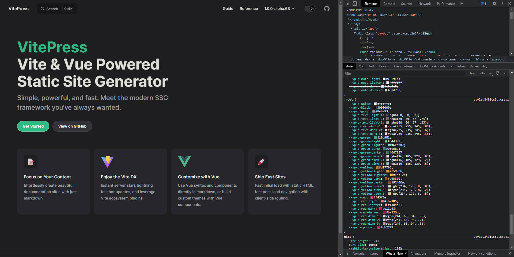
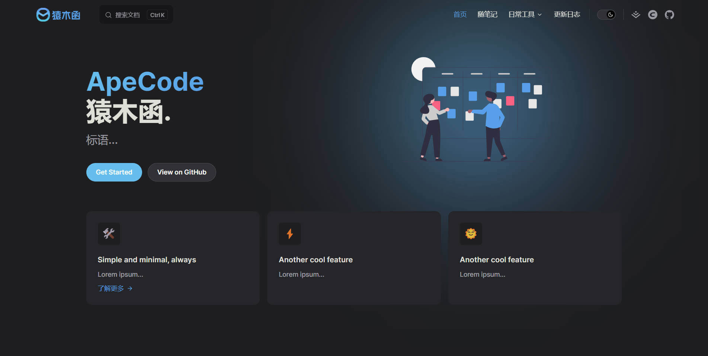
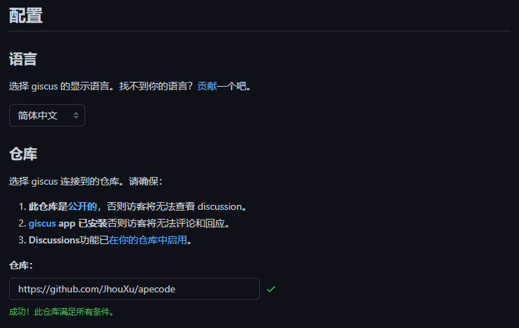
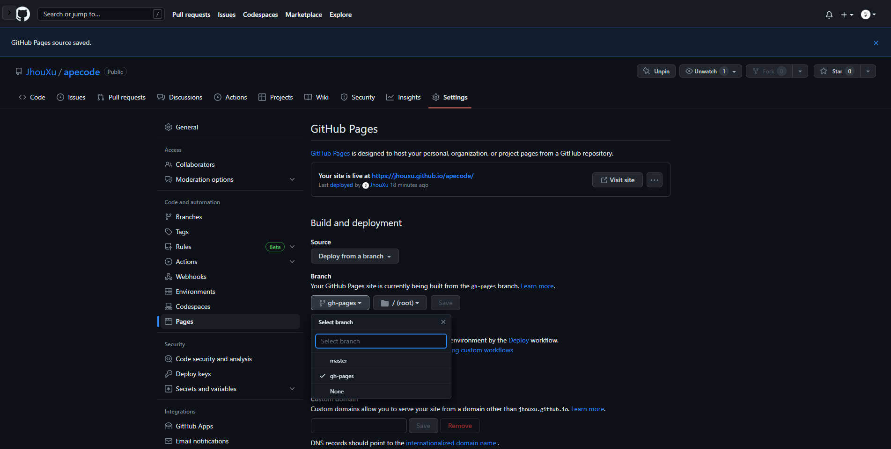
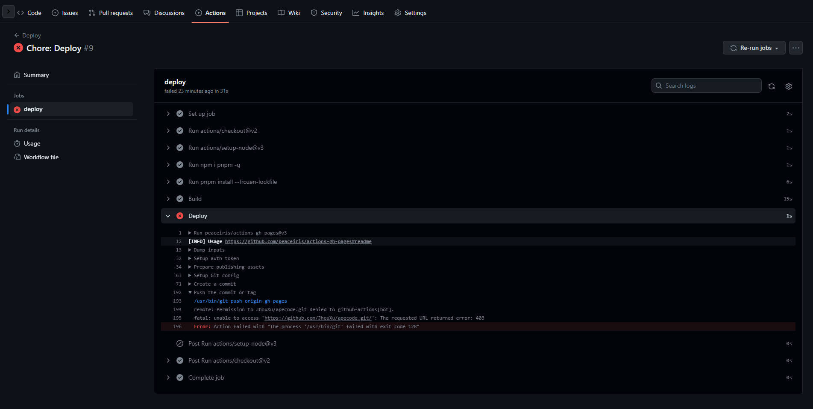
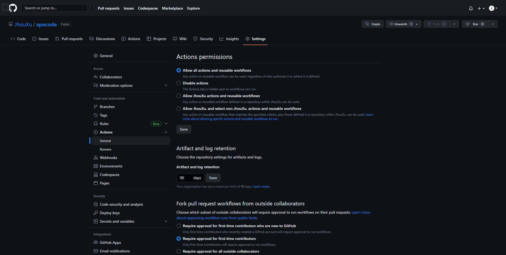
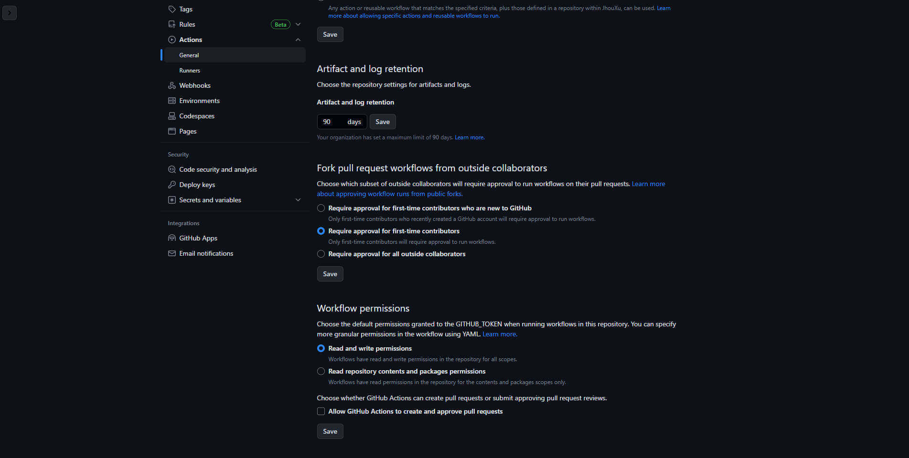
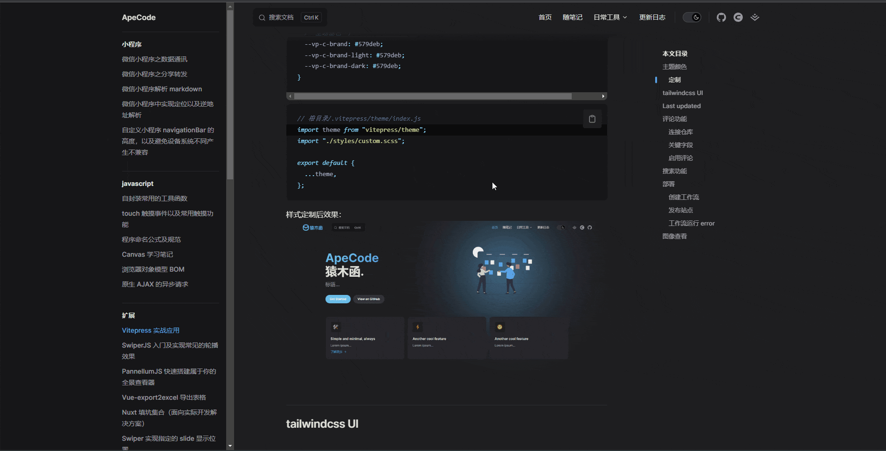
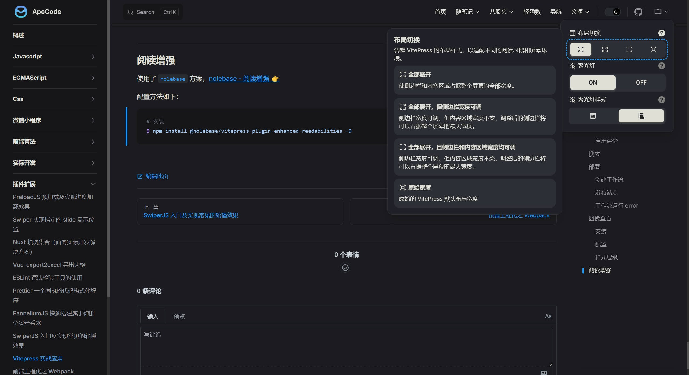

# Vitepress 实战应用

## 主题颜色

vitepress 是基于原生 css+css 变量开发的，为此想要修改主题颜色，可以通过修改全局变量的方式。默认主题颜色是：`#10b981 （vue 绿）`



### 定制

- 首先找到需要定制的变量名，并在 custom.scss :root 中设置需要的颜色值；
- 然后在 index.js 中覆盖。

具体操作如下：

```scss
// 根目录/.vitepress/theme/styles/custom.scss
:root {
  /* 标题 */
  --vp-home-hero-name-color: transparent;
  --vp-home-hero-name-background: linear-gradient(135deg, #62bbee 10%, #579deb 100%);

  /* 图标背景 */
  --vp-home-hero-image-background-image: linear-gradient(135deg, #62bbee 10%, #579deb 100%);
  --vp-home-hero-image-filter: blur(150px);

  /* brand按钮 */
  --vp-button-brand-border: #62bbee;
  --vp-button-brand-text: #fff;
  --vp-button-brand-bg: #62bbee;

  --vp-button-brand-hover-border: #62bbee;
  --vp-button-brand-hover-text: #fff;
  --vp-button-brand-hover-bg: #579deb;

  --vp-button-brand-active-border: #62bbee;

  /* 主题基色 */
  --vp-c-brand: #579deb;
  --vp-c-brand-light: #579deb;
  --vp-c-brand-dark: #579deb;
}
```

```js{2}
// 根目录/.vitepress/theme/index.js
import theme from "vitepress/theme";
import "./styles/custom.scss";

export default {
  ...theme,
};
```

样式定制后效果：


## Last updated

直译：最后一次更新。

如需开启，配置如下：

```js
// 根目录/.vitepress/config.js
module.exports = {
  lastUpdated: true, // 开启显示
  themeConfig: {
    lastUpdatedText: "最后更新", // 替换文本，默认显示 'Last updated'
  },
};
```

## 评论功能

由于项目是部署在 github 上的，因此使用 [giscus](https://giscus.app/zh-CN) 来实现评论功能。

### 连接仓库

选择 giscus 连接到的仓库。请确保：

1. 此仓库是[公开的](https://docs.github.com/en/repositories/managing-your-repositorys-settings-and-features/managing-repository-settings/setting-repository-visibility#making-a-repository-public)，否则访客将无法查看 discussion。
2. [giscus](https://docs.github.com/en/repositories/managing-your-repositorys-settings-and-features/managing-repository-settings/setting-repository-visibility#making-a-repository-public) app 已安装否则访客将无法评论和回应。
3. Discussions 功能已[在你的仓库中启用](https://docs.github.com/en/repositories/managing-your-repositorys-settings-and-features/enabling-features-for-your-repository/enabling-or-disabling-github-discussions-for-a-repository)。

验证方式： `官方文档 - 配置 - 仓库 - 仓库`



### 关键字段

Discussion 分类下拉选择 '📣Announcements'

完成上述步骤后，在 `配置 - 启用 giscus` 处看到一些配置，如下：

```html{3-7}
<script
  src="https://giscus.app/client.js"
  data-repo="xxxxx/xxxxx"
  data-repo-id="x_xxxxxx"
  data-category="Announcements"
  data-category-id="xxx_xxxxxxxxx-x"
  data-mapping="pathname"
  data-strict="0"
  data-reactions-enabled="1"
  data-emit-metadata="0"
  data-input-position="bottom"
  data-theme="preferred_color_scheme"
  data-lang="zh-CN"
  crossorigin="anonymous"
  async
></script>
```

`data-repo` `data-repo-id` `data-category` `data-category-id` `data-mapping` 为必要值，进行备份存储，后面需要使用。
其它则为可选值，可按项目要求进行增删。

### 启用评论

首先安装相关依赖包。

```shell
# ^1.1.1
npm install -D vitepress-plugin-comment-with-giscus

# ^2.2.8
npm install -D @giscus/vue
```

最后，进行配置，并重新运行项目即可在 `layout: doc` 布局看到评论组件。

```js
// 根目录/.vitepress/theme/index.js
import { useData, useRoute } from "vitepress";
import giscusTalk from "vitepress-plugin-comment-with-giscus";

export default {
  enhanceApp(ctx) {
    theme.enhanceApp(ctx);
  },
  setup() {
    // 获取前言和路由
    const { frontmatter } = useData();
    const route = useRoute();
    // 评论组件
    giscusTalk(
      {
        // 填写上述备份好的字段
        repo: "xxxxx/xxxxx",
        repoId: "x_xxxxxx",
        category: "Announcements",
        categoryId: "xxx_xxxxxxxxx-x",
        mapping: "pathname",
      },
      {
        frontmatter,
        route,
      }
    );
  },
};
```

## 搜索

基于 `minisearch` 实现。

```javascript
import { defineConfig } from "vitepress";

export default defineConfig({
  themeConfig: {
    search: {
      provider: "local",
    },
  },
});
```

[VitePress - 搜索 - 本地搜索 👉](https://vitepress.dev/zh/reference/default-theme-search#local-search)

## 部署

采用 `github Actions` + `github Pages` 的方式，当仓库发生 push 时，会执行 action 将打包最新文件，并部署在 gh-pages 分支上，然后设置 pages 在 gh-pages 分支上就可以实现自动部署。

### 创建工作流

创建一个这样的文件，`.github/workflows/deploy.yml`

```yml
# .github/workflows/deploy.yml
name: Deploy

on:
  push:
    branches:
      - master # 需要打包的分支名

jobs:
  deploy:
    runs-on: ubuntu-latest
    steps:
      - uses: actions/checkout@v2
      - uses: actions/setup-node@v3
        with:
          node-version: 16
      - run: npm i pnpm -g
      - run: pnpm install --frozen-lockfile

      - name: Build
        run: pnpm docs:build

      - name: Deploy
        uses: peaceiris/actions-gh-pages@v3
        with:
          github_token: ${{ secrets.GITHUB_TOKEN }}
          publish_dir: docs/.vitepress/dist
```

然后 push 到远程仓库中，在 Actions 面板可以看到刚创建的任务 `Deploy`，执行它。

### 发布站点

完成工作流之后，需初始化 github pages.

前往 `Settings 面板` -> `Actions 选项` -> `Pages 选项`

在 `Build and deployment` `Branch` 选择 `gh-pages` 分支即可



### 工作流运行 error

首次运行工作流的时候，可能会出现以下错误：`Error: Action failed with "The process '/usr/bin/git' failed with exit code 128"`



解决方法：前往 `Settings 面板` -> `Actions 选项` -> `General 选项`



滚动到底部，`Workflow permissions` 选择 `Read and write permissions` 选项保存，重新运行工作流



## 图像查看

默认 vitepress 设置了文章图像之后，是无法点击放大查看的，这样就会出现尺寸大的图像看不请求的问题。为此，可以使用 `medium-zoom` 来实现。



### 安装

```shall
npm install medium-zoom
```

### 配置

```javascript
// docs\.vitepress\theme\index.js
import { onMounted, watch, nextTick } from "vue";
import { useData, useRoute } from "vitepress";

import mediumZoom from "medium-zoom";

import theme from "vitepress/theme";
import "./styles/custom.scss";

export default {
  ...theme,
  setup() {
    const route = useRoute();

    // medium-zoom
    const initZoom = () => {
      mediumZoom(".main img", { background: "#1e1e2099" });
    };
    onMounted(() => {
      initZoom();
    });
    watch(
      () => route.path,
      () => nextTick(() => initZoom())
    );
  },
};
```

### 样式层级

为避免图像放大查看时，被导航栏、侧边栏遮挡，最好添加以下样式。

```css
/* docs/.vitepress/theme/global.css 默认文件 */
/* 图片点击放大优先级调整 */
.medium-zoom-overlay {
  z-index: 999 !important;
}

.medium-zoom-image {
  z-index: 999 !important;
}
```

## 阅读增强



使用了 `nolebase` 方案，[nolebase - 阅读增强 👉](https://nolebase-integrations.ayaka.io/pages/zh-CN/integrations/vitepress-plugin-enhanced-readabilities/)

配置如下：

1. 安装依赖包

```shell
npm install @nolebase/vitepress-plugin-enhanced-readabilities -D
```

2.  配置 SSR，在 build 的过程中用到

```javascript
/* /.vitepress/config.mts */
export default defineConfig({
  vite: {
    optimizeDeps: {
      exclude: ["@nolebase/vitepress-plugin-enhanced-readabilities/client", "vitepress", "@nolebase/ui"], // [!code ++]
    },
    ssr: {
      noExternal: [
        // 如果还有别的依赖需要添加的话，并排填写和配置到这里即可 //
        "@nolebase/vitepress-plugin-enhanced-readabilities", // [!code ++]
        "@nolebase/ui", // [!code ++]
      ],
    },
  },

  // 其他配置 …
});
```

3. 导入`阅读增强`按钮

```javascript
/* /.vitepress/theme/index.js */
import DefaultTheme from "vitepress/theme"; // [!code ++]

import {
  NolebaseEnhancedReadabilitiesMenu,
  NolebaseEnhancedReadabilitiesScreenMenu,
} from "@nolebase/vitepress-plugin-enhanced-readabilities/client"; // [!code ++]
import "@nolebase/vitepress-plugin-enhanced-readabilities/client/style.css"; // [!code ++]

export default {
  Layout: () => {
    return h(DefaultTheme.Layout, null, {
      // 为较宽的屏幕的导航栏添加阅读增强菜单
      "nav-bar-content-after": () => h(NolebaseEnhancedReadabilitiesMenu), // [!code ++]
      // 为较窄的屏幕（通常是小于 iPad Mini）添加阅读增强菜单
      "nav-screen-content-after": () => h(NolebaseEnhancedReadabilitiesScreenMenu), // [!code ++]
    });
  },

  // 其他配置 …
};
```

:::warning VitePress 导航栏样式异常？
【问题】在配置了社交链接的情况下发现在集成了导航栏组件之后导航栏的样式有些许的不对齐。

```scss
/* /.vitepress/theme/styles/style.scss */
:root {
  .VPSocialLinks.VPNavBarSocialLinks.social-links {
    margin-right: 0;
  }

  // 其他样式 …
}
```

:::

## 阅读增强 2

在使用 nolebase 的阅读增强方案时，`每当页面切换`都会触发元素的入场动画，会有疲劳。

为此本节将只对 `css` 进行调整，不涉及框架。

```scss
/* /.vitepress/theme/styles/theme.scss */
:root {
  /* 宽度调整 - 文章页 */
  .VPDoc.has-aside .content-container {
    max-width: 100%;
  }
  /* 宽度调整 - 导航单页 */
  .VPDoc:not(.has-sidebar) .container {
    max-width: 1580px;
  }
  .VPDoc:not(.has-sidebar) .content {
    max-width: 100%;
  }
}
```

## LastUpdated 异常

在使用 GitHub Actions 部署的时候，发现博客中文章`均显示同一时间`（仓库最后更新时间），`理应显示当前文章的最后更新时间`。

在 GitHub Actions 中，actions/checkout 是一个常用的步骤，用于检出仓库的代码。默认情况下，为了加快速度，它`可能会执行浅克隆`（即只拉取最近的一次提交）。因此需要禁用浅克隆，设置 fetch-depth 参数为 0，这样会获取完整的提交历史。

```yml
name: Deploy

on:
  push:
    branches:
      - master

jobs:
  deploy:
    runs-on: ubuntu-latest
    steps:
      - uses: actions/checkout@v2
        with: # [!code ++]
          fetch-depth: 0 # 禁用浅克隆 [!code ++]
      - uses: actions/setup-node@v3
        with:
          node-version: 18
      - run: npm i pnpm@6 -g
      - run: pnpm install --no-frozen-lockfile

      - name: Build
        run: pnpm build

      - name: Deploy
        uses: peaceiris/actions-gh-pages@v3
        with:
          github_token: ${{ secrets.GITHUB_TOKEN }}
          publish_dir: .vitepress/dist
```
