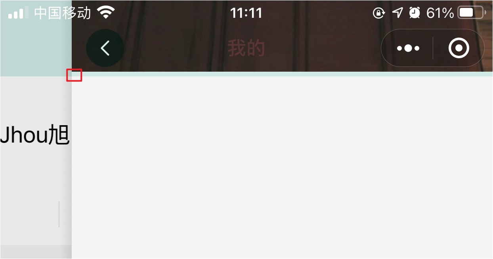

# 自定义小程序 navigationBar 的高度，以及避免设备系统不同产生不兼容

## 项目场景：

在小程序中通过 navigationStyle: custom; 属性，自定 navigationBar 的时候。


自定 navigationBar 实现思路：

- 通过 wx.getSystemInfo() 获取到当前设备的状态栏高度（statusBarHeight）。
- 然后通过 wx.getMenuButtonBoundingClientRect() 获取到胶囊的高度信息（height）。
- 需要注意的是在胶囊和状态栏之间的间距，计算方式是用胶囊的 top 值减去设备状态栏高度即可。

```js
// 大致的计算方式
// 这里之所以乘2，是因为还要算上胶囊底部的距离
let navigationBar = statusBarHeight + (top - statusBarHeight) * 2;
```

## 问题描述：

通过上述方式，实现了 navigationBar，但是发现在 iPhone 设备上，却和系统默认的高度不同。（如图所示，前面图层是自动的 navigationBar，后面图层则是系统默认的 navigationBar，可以清晰看出默认的 navigationBar 在 iPhone 设备上会`大于` 上述计算方式。）


## 原因分析：

主要的原因还是 iPhone 和 Android 的不兼容。

## 解决方案：

经过测试，iPhone 的胶囊底部高度刚好是胶囊顶部到 statusBar 的两倍，所以需要增加一个设备的判断。

```js
let { statusBarHeight } = wx.getSystemInfoSync(); // 当前设备信息
let { height, top } = wx.getMenuButtonBoundingClientRect(); // 胶囊状态信息

// 判断是否为iPhone设备，是：比值为3，否：比值为2
let isIOSRatio = model.match(/iPhone/) ? 3 : 2; // 比值

// 自定义标题栏的高度 =
// 状态栏的高度 +
// 状态栏与标题栏之间的缝隙（根据设备不同乘上对应的比值） +
// 胶囊的高度
let navigationBarHeight = statusBarHeight + (top - statusBarHeight) * isIOSRatio + height);
```
