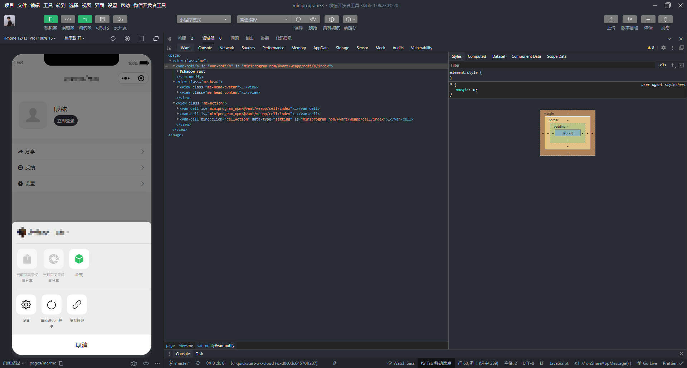

# 微信小程序之分享转发

## 前言

在小程序开发的过程中，需要涉及分享转发功能的开发，因此进行记录。

其中，开发步骤主要分为`配置`和`触发`。

## 配置



默认情况下，小程序是禁用分享这一操作的，需要手动配置开启。

配置有以下三种方式，可任选一种：

- `app.json` <span style="color: red; font-size: 12px;">已无法使用</span>
- `wx.showShareMenu`
- `生命周期函数`

### app.js

全局统一默认配置。

```json
// app.json
{
  "window": {
    "defaultShareAppMessage": {
      "title": "欢迎使用我的小程序", // 指定分享标题
      "path": "/pages/index/index", // 指定分享地址
      "imageUrl": "https://example.com/images/logo.png" // 指定分享封面图
    }
  }
}
```

### wx.showShareMenu

[wx.showShareMenu(Object object)](https://developers.weixin.qq.com/miniprogram/dev/api/share/wx.showShareMenu.html)

**功能描述**
显示当前页面的转发按钮

**注意事项**

- "shareAppMessage"表示“发送给朋友”按钮，"shareTimeline"表示“分享到朋友圈”按钮
- 显示“分享到朋友圈”按钮时必须同时显示“发送给朋友”按钮，显示“发送给朋友”按钮时则允许不显示“分享到朋友圈”按钮

**示例代码**

```javascript
// 需转发分享页面.js
Page({
  onLoad() {
    wx.showShareMenu({
      withShareTicket: true,
      menus: ["shareAppMessage", "shareTimeline"],
    });
  },
});
```

### 生命周期函数

- onShareAppMessage - 开启好友转发
- onShareTimeline - 开启朋友圈分享

```javascript
// 需转发分享页面.js
Page({
  // 开启好友转发
  onShareAppMessage() {
    return {
      title: "欢迎使用我的小程序",
      path: "/pages/index/index",
      imageUrl: "https://example.com/images/logo.png",
    };
  },

  // 开启朋友圈分享
  onShareTimeline() {
    return {
      title: "欢迎使用我的小程序",
      path: "/pages/index/index",
      imageUrl: "https://example.com/images/logo.png",
    };
  },
});
```

### 对比

| 对比 |            app.js            |      wx.showShareMenu      |                                   生命周期函数                                   |
| :--: | :--------------------------: | :------------------------: | :------------------------------------------------------------------------------: |
| 优点 |  统一开启全局的转发分享功能  | 可指定页面开启分享转发功能 |                   可指定页面开启分享转发功能，且可传递页面参数                   |
| 缺点 | 不允许页面参数传递，`已弃用` |     不允许页面参数传递     | 如需要配置多个页面时，会存在代码冗余问题，建议根据实际项目需求封装函数统一处理。 |

## 触发

完成前面的任意一配置之后，就可通过 `右上角胶囊菜单分享按钮` 或 `button open-type="share"` 的方式，进行转发或分享操作了。

## 判断

有时候我们需要对不同的触发条件进行区分处理。

**场景模拟**：在一个聊天的场景中，需要点击胶囊菜单分享小程序，需要点击 button 分享聊天信息。

```javascript
Page({
  onShareAppMessage(event) {
    const { from } = event; // 转发事件来源
    // 转发事件来源。
    // button：页面内转发按钮；
    // menu：右上角转发菜单
    if (from === "button") {
      // button
    } else if (from === "menu") {
      // 胶囊菜单
    }
  },
});
```

## 参数处理

本节主要记录转发分享时，需要传递参数应该如何处理。示例将均使用 index 页面演示。

```javascript{10,20}
// index.js
Page({
  data: {
    userId: "98751568-d827-4ff9-931b-fc4527a572cb",
  },

  onLoad(options) {
    if (options.userId) {
      // 接收到分享者id
      console.log(options.userId)
    }
  },

  onShareAppMessage() {
    // 开启好友转发
    const { userId } = this.data;

    return {
      title: "欢迎使用我的小程序",
      path: `/pages/index/index?userId=${userId}`,
      imageUrl: "https://example.com/images/logo.png",
    };
  },

  onShareTimeline() {
    // 开启朋友圈分享，同理
  },
});
```
