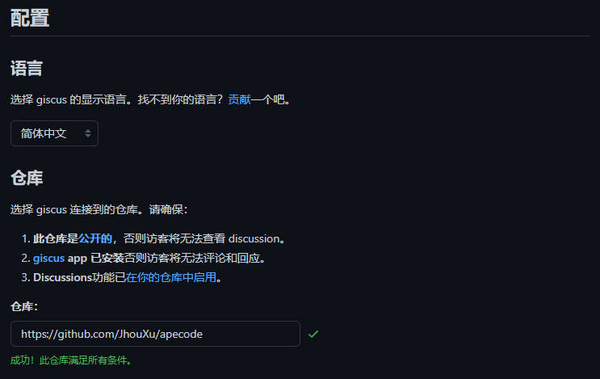

# Vitepress

## 评论功能

由于项目是部署在 github 上的，因此使用 [giscus](https://giscus.app/zh-CN) 来实现评论功能。

### 一、 连接仓库

选择 giscus 连接到的仓库。请确保：

1. 此仓库是[公开的](https://docs.github.com/en/repositories/managing-your-repositorys-settings-and-features/managing-repository-settings/setting-repository-visibility#making-a-repository-public)，否则访客将无法查看 discussion。
2. [giscus](https://docs.github.com/en/repositories/managing-your-repositorys-settings-and-features/managing-repository-settings/setting-repository-visibility#making-a-repository-public) app 已安装否则访客将无法评论和回应。
3. Discussions 功能已[在你的仓库中启用](https://docs.github.com/en/repositories/managing-your-repositorys-settings-and-features/enabling-features-for-your-repository/enabling-or-disabling-github-discussions-for-a-repository)。

验证方式： `官方文档 - 配置 - 仓库 - 仓库`



### 二、其它配置

Discussion 分类下拉选择 '📣Announcements'

完成上述步骤后，在 `配置 - 启用 giscus` 处看到一些配置，如下：

```html{3-7}
<script
  src="https://giscus.app/client.js"
  data-repo="xxxxx/xxxxx"
  data-repo-id="R_xxxxxx"
  data-category="Announcements"
  data-category-id="DIC_xxxxxxxxx-J"
  data-mapping="pathname"
  data-strict="0"
  data-reactions-enabled="1"
  data-emit-metadata="0"
  data-input-position="bottom"
  data-theme="preferred_color_scheme"
  data-lang="zh-CN"
  crossorigin="anonymous"
  async
></script>
```

对 `data-repo` `data-repo-id` `data-category` `data-category-id` `data-mapping` 等备份存储，等后续会使用。
